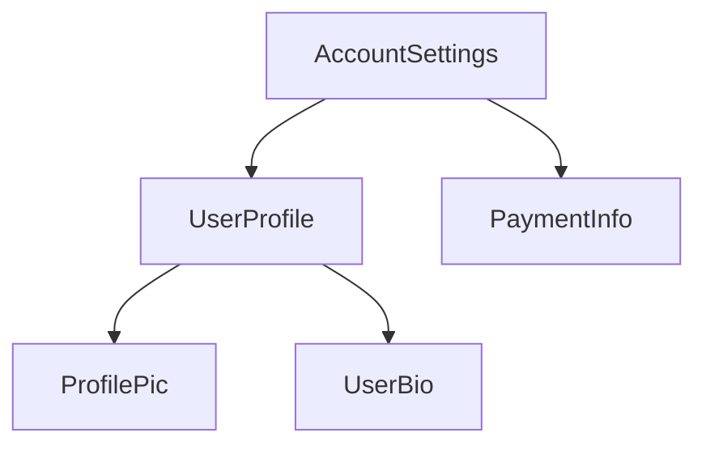

# Устройство компонента {: #anatomy-of-a-component}

:date: 30.09.2026

!!! tip ""

    Этот материал предполагает, что вы уже прочитали [руководство по основам](../essentials/overview.md). Если Angular для вас в новинку, начните с него.

У каждого компонента есть:

-   Класс TypeScript с _поведением_: обработка ввода пользователя, запросы данных с сервера.
-   HTML-шаблон, который определяет, что попадёт в DOM.
-   [CSS-селектор](https://developer.mozilla.org/docs/Learn/CSS/Building_blocks/Selectors), который задаёт, как компонент используется в HTML.

Сведения, специфичные для Angular, задаются [декоратором](https://www.typescriptlang.org/docs/handbook/decorators.html) `@Component` над классом TypeScript:

```ts
@Component({
  selector: 'profile-photo',
  template: ``,
})
export class ProfilePhoto {}
```

Как писать шаблоны Angular, включая привязку данных, обработку событий и управление потоком, описано в [руководстве по шаблонам](../templates/overview.md).

Объект, который передаётся в декоратор `@Component`, называется **метаданными** компонента. Сюда входят `selector`, `template` и другие свойства, которые разбираются дальше в этом руководстве.

Компонент может дополнительно задать список CSS-стилей, которые применяются к его DOM:

```ts
@Component({
  selector: 'profile-photo',
  template: ``,
  styles: `
    img {
      border-radius: 50%;
    }
  `,
})
export class ProfilePhoto {}
```

По умолчанию стили компонента затрагивают только элементы из его шаблона. Подробнее о подходе Angular к стилям см. в [Стили компонентов](styling.md).

Шаблон и стили можно вынести в отдельные файлы:

```ts
@Component({
  selector: 'profile-photo',
  templateUrl: 'profile-photo.html',
  styleUrl: 'profile-photo.css',
})
export class ProfilePhoto {}
```

Так проще разделить _представление_ и _поведение_. Один и тот же подход можно принять для всего проекта или выбирать его для каждого компонента отдельно.

И `templateUrl`, и `styleUrl` задаются относительно каталога, в котором лежит компонент.

## Использование компонентов {: #using-components}

### Импорты в декораторе `@Component` {: #imports-in-the-component-decorator}

Чтобы использовать компонент, [директиву](../directives/overview.md) или [пайп](../templates/pipes.md), его нужно добавить в массив `imports` декоратора `@Component`:

```ts
import {ProfilePhoto} from './profile-photo';

@Component({
  // Import the `ProfilePhoto` component in
  // order to use it in this component's template.
  imports: [ProfilePhoto],
  /* ... */
})
export class UserProfile {}
```

По умолчанию компоненты Angular _автономные_: их можно напрямую добавлять в массив `imports` других компонентов. Компоненты, созданные в более ранней версии Angular, могут указывать `standalone: false` в декораторе `@Component`. Для таких компонентов импортируется `NgModule`, в котором компонент объявлен. Подробности в полном [руководстве по `NgModule`](../ngmodules/overview.md).

!!! warning ""

    В версиях Angular до 19.0.0 параметр `standalone` по умолчанию равен `false`.

### Показ компонента в шаблоне {: #showing-components-in-a-template}

Каждый компонент задаёт [CSS-селектор](https://developer.mozilla.org/docs/Learn/CSS/Building_blocks/Selectors):

```ts
@Component({
  selector: 'profile-photo',
  ...
})
export class ProfilePhoto { }
```

Какие селекторы поддерживает Angular и как выбрать селектор, описано в [Селекторы компонентов](selectors.md).

Компонент показывают, создавая подходящий HTML-элемент в шаблоне _других_ компонентов:

```ts
@Component({
  selector: 'profile-photo',
})
export class ProfilePhoto {}

@Component({
  imports: [ProfilePhoto],
  template: `<profile-photo />`,
})
export class UserProfile {}
```

Angular создаёт экземпляр компонента для каждого подходящего HTML-элемента. DOM-элемент, который совпал с селектором компонента, называется его **элементом-хостом**. Содержимое шаблона отрисовывается внутри элемента-хоста.

DOM, который отрисовал компонент по своему шаблону, называется **представлением** этого компонента.

Собранное таким образом приложение Angular удобно представлять как **дерево компонентов**.



Дерево важно для других понятий Angular, в том числе для [инъекции зависимостей](../di/overview.md) и [дочерних запросов](https://angular.dev/guide/components/queries).

---

Источник: [https://angular.dev/guide/components](https://angular.dev/guide/components)
