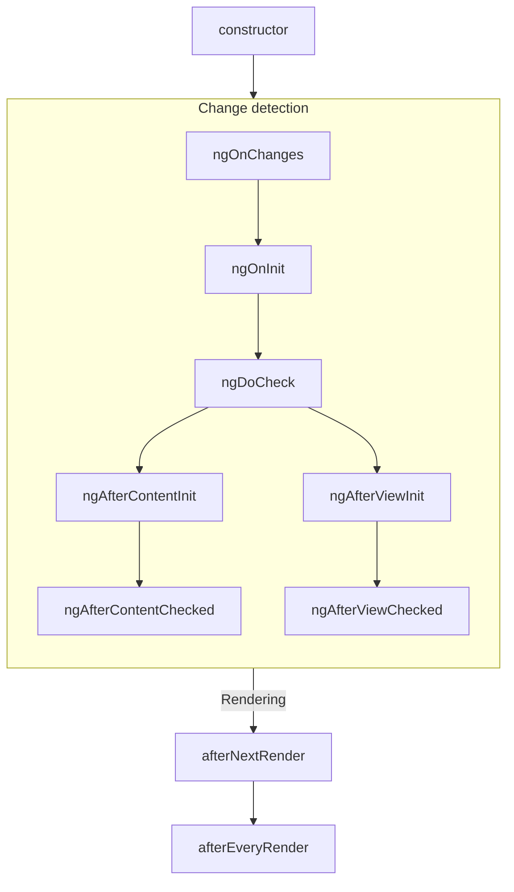
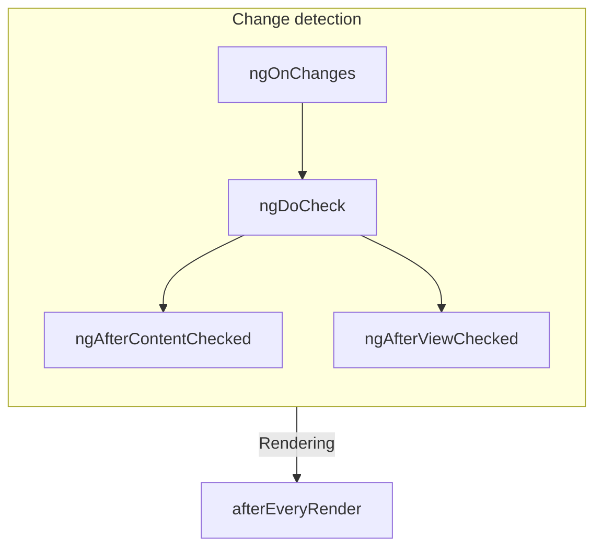

# Жизненный цикл компонента {: #component-lifecycle}

:date: 30.09.2026

!!! tip ""

    Этот материал предполагает, что вы уже прочитали [руководство по основам](../essentials/overview.md). Если Angular для вас в новинку, начните с него.

**Жизненный цикл** компонента — последовательность шагов от создания до уничтожения. Каждый шаг — отдельная часть того, как Angular отрисовывает компоненты и проверяет их на обновления.

На этих шагах свой код запускают **хуки жизненного цикла**. Хуки конкретного экземпляра — это методы класса компонента. Хуки всего приложения Angular — функции, которые принимают колбэк.

Жизненный цикл тесно связан с тем, как Angular со временем проверяет компоненты на изменения. Чтобы понять цикл, достаточно знать: Angular обходит дерево приложения сверху вниз и сверяет привязки шаблона. Хуки ниже выполняются во время этого обхода. Каждый компонент посещается ровно один раз, поэтому посреди обхода не стоит менять состояние дальше.

## Сводка {: #summary}

<table>
  <tr>
    <td><strong>Фаза</strong></td>
    <td><strong>Метод</strong></td>
    <td><strong>Кратко</strong></td>
  </tr>
  <tr>
    <td>Создание</td>
    <td><code>constructor</code></td>
    <td>
      <a href="https://developer.mozilla.org/docs/Web/JavaScript/Reference/Classes/constructor" target="_blank">
        Обычный конструктор класса JavaScript
      </a>. Выполняется, когда Angular создаёт экземпляр компонента.
    </td>
  </tr>
  <tr>
    <td rowspan="7">Обнаружение изменений</td>
    <td><code>ngOnInit</code></td>
    <td>Выполняется один раз после того, как Angular инициализировал все входные свойства компонента.</td>
  </tr>
  <tr>
    <td><code>ngOnChanges</code></td>
    <td>Выполняется каждый раз, когда изменились входные свойства компонента.</td>
  </tr>
  <tr>
    <td><code>ngDoCheck</code></td>
    <td>Выполняется каждый раз, когда этот компонент проверяется на изменения.</td>
  </tr>
  <tr>
    <td><code>ngAfterContentInit</code></td>
    <td>Выполняется один раз после инициализации <em>содержимого</em> компонента.</td>
  </tr>
  <tr>
    <td><code>ngAfterContentChecked</code></td>
    <td>Выполняется каждый раз, когда содержимое этого компонента проверено на изменения.</td>
  </tr>
  <tr>
    <td><code>ngAfterViewInit</code></td>
    <td>Выполняется один раз после инициализации <em>представления</em> компонента.</td>
  </tr>
  <tr>
    <td><code>ngAfterViewChecked</code></td>
    <td>Выполняется каждый раз, когда представление компонента проверено на изменения.</td>
  </tr>
  <tr>
    <td rowspan="2">Отрисовка</td>
    <td><code>afterNextRender</code></td>
    <td>Выполняется один раз, когда <strong>все</strong> компоненты в следующий раз отрисованы в DOM.</td>
  </tr>
  <tr>
    <td><code>afterEveryRender</code></td>
    <td>Выполняется каждый раз, когда <strong>все</strong> компоненты отрисованы в DOM.</td>
  </tr>
  <tr>
    <td>Уничтожение</td>
    <td><code>ngOnDestroy</code></td>
    <td>Выполняется один раз перед уничтожением компонента.</td>
  </tr>
</table>

### ngOnInit {: #ngoninit}

Метод `ngOnInit` выполняется после того, как Angular записал во все входные свойства компонента начальные значения. У компонента `ngOnInit` выполняется ровно один раз.

Шаг происходит _до_ инициализации собственного шаблона компонента. Состояние можно обновить по начальным значениям входных свойств.

### ngOnChanges {: #ngonchanges}

Метод `ngOnChanges` выполняется после изменения любых входных свойств компонента.

Шаг происходит _до_ проверки собственного шаблона компонента. Состояние можно обновить по начальным значениям входных свойств.

При инициализации первый `ngOnChanges` выполняется раньше `ngOnInit`.

#### Просмотр изменений {: #inspecting-changes}

Метод `ngOnChanges` принимает один аргумент `SimpleChanges`. Это объект-[`Record`](https://www.typescriptlang.org/docs/handbook/utility-types.html#recordkeys-type): имя каждого входного свойства сопоставлено с объектом `SimpleChange`. В `SimpleChange` лежат предыдущее значение, текущее значение и признак того, что входное свойство изменилось впервые.

Для более строгой проверки типов первым аргументом обобщения можно передать текущий класс или `this`.

```ts
@Component({/* ... */})
export class UserProfile {
  name = input('');

  ngOnChanges(changes: SimpleChanges<UserProfile>) {
    if (changes.name) {
      console.log(`Previous: ${changes.name.previousValue}`);
      console.log(`Current: ${changes.name.currentValue}`);
      console.log(`Is first ${changes.name.firstChange}`);
    }
  }
}
```

Если у входного свойства задан `alias`, ключом в `Record` `SimpleChanges` остаётся имя свойства TypeScript, а не псевдоним.

### ngOnDestroy {: #ngondestroy}

Метод `ngOnDestroy` выполняется один раз непосредственно перед уничтожением компонента. Angular уничтожает компонент, когда тот больше не показан на странице: его скрыл `@if` или произошёл переход на другую страницу.

#### DestroyRef {: #destroyref}

Вместо метода `ngOnDestroy` можно внедрить экземпляр `DestroyRef`. Колбэк на уничтожение компонента регистрируют методом `onDestroy` у `DestroyRef`.

```ts
@Component({/* ... */})
export class UserProfile {
  constructor() {
    inject(DestroyRef).onDestroy(() => {
      console.log('UserProfile destruction');
    });
  }
}
```

Экземпляр `DestroyRef` можно передать функциям и классам вне компонента. Так делают, если очистку при уничтожении компонента должен выполнить другой код.

`DestroyRef` также позволяет держать код настройки рядом с кодом очистки, а не собирать всю очистку в методе `ngOnDestroy`.

##### Проверка, уничтожен ли экземпляр {: #detecting-instance-destruction}

У `DestroyRef` есть свойство `destroyed`: по нему видно, уничтожен ли уже данный экземпляр. Это помогает не трогать уничтоженные компоненты, особенно в отложенной и асинхронной логике.

Проверка `destroyRef.destroyed` не даёт выполнить код после очистки экземпляра и уберегает от ошибок вроде `NG0911: View has already been destroyed.`.

### ngDoCheck {: #ngdocheck}

Метод `ngDoCheck` выполняется каждый раз перед тем, как Angular проверит шаблон компонента на изменения.

Этим хуком вручную ищут изменения состояния вне обычного обнаружения изменений Angular и вручную обновляют состояние компонента.

Метод вызывается очень часто и может заметно замедлить страницу. Не объявляйте этот хук, пока нет другого выхода.

При инициализации первый `ngDoCheck` выполняется после `ngOnInit`.

### ngAfterContentInit {: #ngaftercontentinit}

Метод `ngAfterContentInit` выполняется один раз после инициализации всех потомков, вложенных в компонент (его _содержимого_).

Этим хуком читают результаты [запросов содержимого](https://angular.dev/guide/components/queries#content-queries). Инициализированное состояние запросов доступно, но любая смена состояния в этом методе приводит к [ExpressionChangedAfterItHasBeenCheckedError](https://angular.dev/errors/NG0100).

### ngAfterContentChecked {: #ngaftercontentchecked}

Метод `ngAfterContentChecked` выполняется каждый раз, когда потомки, вложенные в компонент (его _содержимое_), проверены на изменения.

Метод вызывается очень часто и может заметно замедлить страницу. Не объявляйте этот хук, пока нет другого выхода.

Обновлённое состояние [запросов содержимого](https://angular.dev/guide/components/queries#content-queries) здесь доступно, но любая смена состояния в этом методе приводит к [ExpressionChangedAfterItHasBeenCheckedError](https://angular.dev/errors/NG0100).

### ngAfterViewInit {: #ngafterviewinit}

Метод `ngAfterViewInit` выполняется один раз после инициализации всех потомков в шаблоне компонента (его _представления_).

Этим хуком читают результаты [запросов представления](https://angular.dev/guide/components/queries#view-queries). Инициализированное состояние запросов доступно, но любая смена состояния в этом методе приводит к [ExpressionChangedAfterItHasBeenCheckedError](https://angular.dev/errors/NG0100).

### ngAfterViewChecked {: #ngafterviewchecked}

Метод `ngAfterViewChecked` выполняется каждый раз, когда потомки в шаблоне компонента (его _представление_) проверены на изменения.

Метод вызывается очень часто и может заметно замедлить страницу. Не объявляйте этот хук, пока нет другого выхода.

Обновлённое состояние [запросов представления](https://angular.dev/guide/components/queries#view-queries) здесь доступно, но любая смена состояния в этом методе приводит к [ExpressionChangedAfterItHasBeenCheckedError](https://angular.dev/errors/NG0100).

### afterEveryRender и afterNextRender {: #aftereveryrender-and-afternextrender}

Функции `afterEveryRender` и `afterNextRender` регистрируют **колбэк отрисовки**. Он вызывается после того, как Angular закончил отрисовку _всех компонентов_ страницы в DOM.

Эти функции отличаются от остальных хуков в этом руководстве. Это не методы класса, а автономные функции, которые принимают колбэк. Колбэки отрисовки не привязаны к конкретному экземпляру компонента: это хук на всё приложение.

`afterEveryRender` и `afterNextRender` нужно вызывать в [контексте инъекции](https://angular.dev/guide/di/dependency-injection-context), обычно в конструкторе компонента.

Колбэками отрисовки делают ручные операции с DOM. Как работать с DOM в Angular, описано в [Использование DOM API](https://angular.dev/guide/components/dom-apis).

Колбэки отрисовки не выполняются при серверном рендеринге и при предварительном рендеринге на этапе сборки.

#### Фазы after\*Render {: #afterrender-phases}

У `afterEveryRender` и `afterNextRender` работу можно разбить на фазы. Фаза задаёт порядок операций с DOM: операции _записи_ ставят перед операциями _чтения_, чтобы не устраивать [лишние пересчёты макета](https://web.dev/avoid-large-complex-layouts-and-layout-thrashing). Чтобы передать данные между фазами, функция фазы может вернуть значение, которое прочитает следующая фаза.

```ts
import {Component, ElementRef, afterNextRender} from '@angular/core';

@Component(/* ... */)
export class UserProfile {
  private prevPadding = 0;
  private elementHeight = 0;

  constructor() {
    const elementRef = inject(ElementRef);
    const nativeElement = elementRef.nativeElement;

    afterNextRender({
      // Use the `Write` phase to write to a geometric property.
      write: () => {
        const padding = computePadding();
        const changed = padding !== this.prevPadding;
        if (changed) {
          nativeElement.style.padding = padding;
        }
        return changed; // Communicate whether anything changed to the read phase.
      },

      // Use the `Read` phase to read geometric properties after all writes have occurred.
      read: (didWrite) => {
        if (didWrite) {
          this.elementHeight = nativeElement.getBoundingClientRect().height;
        }
      },
    });
  }
}
```

Фаз четыре, они идут в таком порядке:

| Фаза             | Описание                                                                                                                                                              |
| ---------------- | --------------------------------------------------------------------------------------------------------------------------------------------------------------------- |
| `earlyRead`      | Читайте в этой фазе свойства и стили DOM, которые влияют на раскладку и строго нужны для последующего расчёта. По возможности обходите эту фазу и пользуйтесь фазами `write` и `read`. |
| `write`          | Пишите в этой фазе свойства и стили DOM, которые влияют на раскладку.                                                                                                 |
| `mixedReadWrite` | Фаза по умолчанию. Для операций, которым нужно и читать, и писать свойства и стили, влияющие на раскладку. По возможности обходите эту фазу и пользуйтесь явными фазами `write` и `read`. |
| `read`           | Читайте в этой фазе свойства DOM, которые влияют на раскладку.                                                                                                        |

## Интерфейсы жизненного цикла {: #lifecycle-interfaces}

Для каждого метода жизненного цикла в Angular есть интерфейс TypeScript. Интерфейсы можно импортировать и `implement`, чтобы опечатка в имени метода не прошла незамеченной.

Имя интерфейса совпадает с именем метода без префикса `ng`. Например, интерфейс для `ngOnInit` — `OnInit`.

```ts
@Component({/* ... */})
export class UserProfile implements OnInit {
  ngOnInit() {
    /* ... */
  }
}
```

## Порядок выполнения {: #execution-order}

На схемах ниже — порядок выполнения хуков жизненного цикла Angular.

### При инициализации {: #during-initialization}



### При последующих обновлениях {: #subsequent-updates}



### Порядок вместе с директивами {: #ordering-with-directives}

Если на один элемент с компонентом повешены одна или несколько директив — в шаблоне или через свойство `hostDirectives`, — фреймворк не гарантирует порядок одного и того же хука между компонентом и директивами на этом элементе. Не опирайтесь на порядок, который удалось наблюдать: в следующих версиях Angular он может измениться.

---

Источник: [https://angular.dev/guide/components/lifecycle](https://angular.dev/guide/components/lifecycle)
