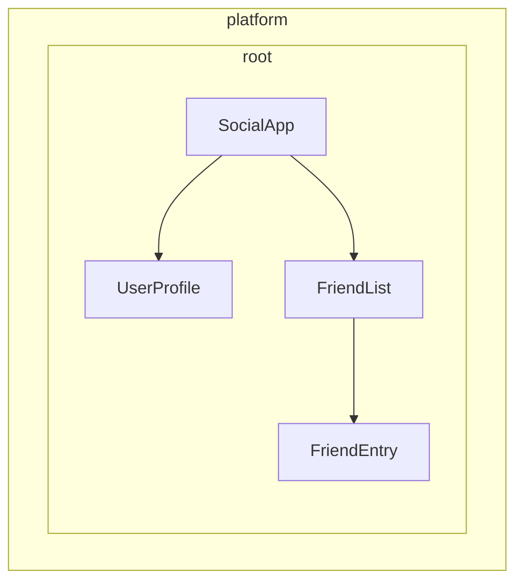

# Определение провайдеров зависимостей {: #defining-dependency-providers}

:date: 30.09.2026

Angular даёт два способа сделать сервисы доступными для инъекции:

1.  **Автоматическая регистрация** — через `providedIn` в декораторе `@Injectable`, декораторе [`@Service`](creating-and-using-services.md#using-the-service-vs-injectable-decorator) или фабрику в конфигурации `InjectionToken`
2.  **Ручная регистрация** — через массив `providers` в компонентах, директивах, маршрутах или конфигурации приложения

В [предыдущем руководстве](creating-and-using-services.md) разобрано, как создавать сервисы с `providedIn: 'root'`. Этого хватает в большинстве обычных случаев. Здесь — дополнительные схемы и автоматической, и ручной настройки провайдеров.

## Автоматическая регистрация зависимостей, которые не являются классами {: #automatic-provision-for-non-class-dependencies}

Декоратор `@Injectable` с `providedIn: 'root'` хорошо подходит для сервисов (классов). Иногда нужно глобально отдать значение другого типа: объект конфигурации, функцию или примитив. Для этого в Angular есть `InjectionToken`.

### Что такое InjectionToken? {: #what-is-an-injectiontoken}

`InjectionToken` — объект, по которому система инъекции зависимостей Angular однозначно находит значение для инъекции. Это особый ключ: через него в DI сохраняют и получают значение любого типа.

```ts
import {InjectionToken} from '@angular/core';

// Create a token for a string value
export const API_URL = new InjectionToken<string>('api.url');

// Create a token for a function
export const LOGGER = new InjectionToken<(msg: string) => void>('logger.function');

// Create a token for a complex type
export interface Config {
  apiUrl: string;
  timeout: number;
}
export const CONFIG_TOKEN = new InjectionToken<Config>('app.config');
```

!!! info ""

    Строковый параметр (например, `'api.url'`) — описание только для отладки. Angular опознаёт токены по ссылке на объект, а не по этой строке.

### InjectionToken с `providedIn: 'root'` {: #injectiontoken-with-providedin-root}

Если у `InjectionToken` задана `factory`, по умолчанию получается `providedIn: 'root'` (это можно переопределить свойством `providedIn`).

_/app/config.token.ts_

```ts
import {InjectionToken} from '@angular/core';

export interface AppConfig {
  apiUrl: string;
  version: string;
  features: Record<string, boolean>;
}

// Globally available configuration using providedIn
export const APP_CONFIG = new InjectionToken<AppConfig>('app.config', {
  providedIn: 'root',
  factory: () => ({
    apiUrl: 'https://api.example.com',
    version: '1.0.0',
    features: {
      darkMode: true,
      analytics: false,
    },
  }),
});

// No need to add to providers array - available everywhere!
@Component({
  selector: 'app-header',
  template: `<h1>Version: {{ config.version }}</h1>`,
})
export class Header {
  config = inject(APP_CONFIG); // Automatically available
}
```

### Когда использовать InjectionToken с фабричными функциями {: #when-to-use-injectiontoken-with-factory-functions}

`InjectionToken` с фабричной функцией удобен, когда класс не подходит, а зависимость всё равно нужно предоставить глобально.

_/app/logger.token.ts_

```ts
import {InjectionToken, inject} from '@angular/core';
import {APP_CONFIG} from './config.token';

// Logger function type
export type LoggerFn = (level: string, message: string) => void;

// Global logger function with dependencies
export const LOGGER_FN = new InjectionToken<LoggerFn>('logger.function', {
  providedIn: 'root',
  factory: () => {
    const config = inject(APP_CONFIG);

    return (level: string, message: string) => {
      if (config.features.logging !== false) {
        console[level](`[${new Date().toISOString()}] ${message}`);
      }
    };
  },
});
```

_/app/storage.token.ts_

```ts
// Providing browser APIs as tokens
export const LOCAL_STORAGE = new InjectionToken<Storage>('localStorage', {
  // providedIn: 'root' is configured as the default
  factory: () => window.localStorage,
});

export const SESSION_STORAGE = new InjectionToken<Storage>('sessionStorage', {
  providedIn: 'root',
  factory: () => window.sessionStorage,
});
```

_/app/feature-flags.token.ts_

```ts
// Complex configuration with runtime logic
export const FEATURE_FLAGS = new InjectionToken<Map<string, boolean>>('feature.flags', {
  providedIn: 'root',
  factory: () => {
    const flags = new Map<string, boolean>();

    // Parse from environment or URL params
    const urlParams = new URLSearchParams(window.location.search);
    const enableBeta = urlParams.get('beta') === 'true';

    flags.set('betaFeatures', enableBeta);
    flags.set('darkMode', true);
    flags.set('newDashboard', false);

    return flags;
  },
});
```

У такого подхода несколько преимуществ:

-   **Ручная настройка провайдера не нужна** — работает так же, как `providedIn: 'root'` у сервисов
-   **Участвует в tree-shaking** — в сборку попадает, только если реально используется
-   **Типобезопасность** — полная поддержка TypeScript для значений, которые не являются классами
-   **Можно внедрять другие зависимости** — фабричные функции вызывают `inject()`, чтобы получить другие сервисы

## Ручная настройка провайдера {: #understanding-manual-provider-configuration}

Когда контроля `providedIn: 'root'` не хватает, провайдеры задают вручную. Массив `providers` полезен в таких случаях:

1.  **У сервиса нет `providedIn`** — без автоматической регистрации его нужно предоставить вручную
2.  **Нужен новый экземпляр** — отдельный экземпляр на уровне компонента или директивы, а не общий
3.  **Настройка зависит от времени выполнения** — поведение сервиса определяется значениями, которые известны только при запуске
4.  **Предоставляются значения не из классов** — объекты конфигурации, функции или примитивы

### Пример: сервис без `providedIn` {: #example-service-without-providedin}

```ts
import {Injectable, Component, inject} from '@angular/core';

// Service without providedIn
@Injectable()
export class LocalDataStore {
  private data: string[] = [];

  addData(item: string) {
    this.data.push(item);
  }
}

// Component must provide it
@Component({
  selector: 'app-example',
  // A provider is required here because the `LocalDataStore` service has no providedIn.
  providers: [LocalDataStore],
  template: `...`,
})
export class Example {
  dataStore = inject(LocalDataStore);
}
```

### Пример: экземпляр на один компонент {: #example-creating-component-specific-instances}

Сервис с `providedIn: 'root'` можно переопределить на уровне компонента. Экземпляр тогда живёт столько же, сколько компонент. Когда компонент уничтожается, уничтожается и предоставленный сервис.

```ts
import {Injectable, Component, inject} from '@angular/core';

@Injectable({providedIn: 'root'})
export class DataStore {
  private data: ListItem[] = [];
}

// This component gets its own instance
@Component({
  selector: 'app-isolated',
  // Creates new instance of `DataStore` rather than using the root-provided instance.
  providers: [DataStore],
  template: `...`,
})
export class Isolated {
  dataStore = inject(DataStore); // Component-specific instance
}
```

## Иерархия инжекторов в Angular {: #injector-hierarchy-in-angular}

Система инъекции зависимостей Angular иерархическая. Когда компонент запрашивает зависимость, Angular начинает с инжектора этого компонента и поднимается по дереву, пока не найдёт провайдер. У каждого компонента в дереве приложения может быть свой инжектор, и эти инжекторы повторяют дерево компонентов.

Такая иерархия даёт следующее:

-   **Экземпляры с областью видимости.** Разные части приложения держат разные экземпляры одного сервиса
-   **Переопределение.** Дочерние компоненты переопределяют провайдеры родителей
-   **Экономия памяти.** Сервисы создаются только там, где они нужны

В Angular любой элемент с компонентом или директивой может предоставлять значения всем своим потомкам.



В примере выше:

1.  `SocialApp` может предоставлять значения для `UserProfile` и `FriendList`
2.  `FriendList` может предоставлять значения для инъекции в `FriendEntry`, но не в `UserProfile`: тот не входит в это дерево

## Объявление провайдера {: #declaring-a-provider}

Систему инъекции зависимостей Angular удобно представить как хеш-таблицу или словарь. Каждый объект конфигурации провайдера задаёт пару «ключ — значение»:

-   **Ключ (идентификатор провайдера).** Уникальный идентификатор, по которому запрашивают зависимость
-   **Значение.** То, что Angular возвращает, когда запрашивают этот токен

При ручной регистрации обычно встречается краткая запись:

```ts
import {Component} from '@angular/core';
import {LocalService} from './local-service';

@Component({
  selector: 'app-example',
  providers: [LocalService], // Service without providedIn
})
export class Example {}
```

Это сокращение более подробной конфигурации провайдера:

```ts
{
  // This is the shorthand version
  providers: [LocalService],

  // This is the full version
  providers: [
    { provide: LocalService, useClass: LocalService }
  ]
}
```

### Объект конфигурации провайдера {: #provider-configuration-object}

У каждого объекта конфигурации провайдера две основные части:

1.  **Идентификатор провайдера.** Уникальный ключ, по которому Angular получает зависимость (свойство `provide`)
2.  **Значение.** Сама зависимость, которую Angular должен вернуть. Ключ зависит от нужного типа:
    -   `useClass` — предоставляет класс JavaScript
    -   `useValue` — предоставляет статическое значение
    -   `useFactory` — предоставляет фабричную функцию, которая возвращает значение
    -   `useExisting` — предоставляет псевдоним уже существующего провайдера

### Идентификаторы провайдеров {: #provider-identifiers}

Идентификатор провайдера позволяет системе инъекции зависимостей (DI) найти зависимость по уникальному ID. Идентификаторы получают двумя способами:

1.  [Имена классов](#class-names)
2.  [Токены инъекции](#injection-tokens)

#### Имена классов {: #class-names}

Имя класса используют как идентификатор напрямую, через импортированный класс:

```ts
import {Component} from '@angular/core';
import {LocalService} from './local-service';

@Component({
  selector: 'app-example',
  providers: [{provide: LocalService, useClass: LocalService}],
})
export class Example {
  /* ... */
}
```

Класс служит и идентификатором, и реализацией. Поэтому Angular даёт краткую запись `providers: [LocalService]`.

#### Токены инъекции {: #injection-tokens}

В Angular есть встроенный класс [`InjectionToken`](https://angular.dev/api/core/InjectionToken). Он создаёт уникальную ссылку на объект для инжектируемых значений и для случая, когда у одного интерфейса несколько реализаций.

_/app/tokens.ts_

```ts
import {InjectionToken} from '@angular/core';
import {DataService} from './data-service.interface';

export const DATA_SERVICE_TOKEN = new InjectionToken<DataService>('DataService');
```

!!! info ""

    Строка `'DataService'` — описание только для отладки. Angular опознаёт токен по ссылке на объект, а не по этой строке.

Токен указывают в конфигурации провайдера:

```ts
import {Component, inject} from '@angular/core';
import {LocalDataService} from './local-data-service';
import {DATA_SERVICE_TOKEN} from './tokens';

@Component({
  selector: 'app-example',
  providers: [{provide: DATA_SERVICE_TOKEN, useClass: LocalDataService}],
})
export class Example {
  private dataService = inject(DATA_SERVICE_TOKEN);
}
```

#### Можно ли использовать интерфейсы TypeScript как идентификаторы для инъекции? {: #can-typescript-interfaces-be-identifiers-for-injection}

Интерфейсы TypeScript нельзя использовать для инъекции: во время выполнения их нет.

```ts
// ❌ This won't work!
interface DataService {
  getData(): string[];
}

// Interfaces disappear after TypeScript compilation
@Component({
  providers: [
    {provide: DataService, useClass: LocalDataService}, // Error!
  ],
})
export class Example {
  private dataService = inject(DataService); // Error!
}

// ✅ Use InjectionToken instead
export const DATA_SERVICE_TOKEN = new InjectionToken<DataService>('DataService');

@Component({
  providers: [{provide: DATA_SERVICE_TOKEN, useClass: LocalDataService}],
})
export class Example {
  private dataService = inject(DATA_SERVICE_TOKEN); // Works!
}
```

`InjectionToken` даёт значение времени выполнения, с которым работает DI Angular, и сохраняет типобезопасность через параметр обобщённого типа TypeScript.

### Типы значений провайдера {: #provider-value-types}

#### useClass {: #useclass}

`useClass` предоставляет класс JavaScript как зависимость. Это вариант по умолчанию в краткой записи:

```ts
// Shorthand
providers: [DataService];

// Full syntax
providers: [{provide: DataService, useClass: DataService}];

// Different implementation
providers: [{provide: DataService, useClass: MockDataService}];

// Conditional implementation
providers: [
  {
    provide: StorageService,
    useClass: environment.production ? CloudStorageService : LocalStorageService,
  },
];
```

#### Практический пример: подмена логгера {: #practical-example-logger-substitution}

Реализации подменяют, чтобы расширить поведение:

```ts
import {Injectable, Component, inject} from '@angular/core';

// Base logger
@Injectable()
export class Logger {
  log(message: string) {
    console.log(message);
  }
}

// Enhanced logger with timestamp
@Injectable()
export class BetterLogger extends Logger {
  override log(message: string) {
    super.log(`[${new Date().toISOString()}] ${message}`);
  }
}

// Logger that includes user context
@Injectable()
export class EvenBetterLogger extends Logger {
  private userService = inject(UserService);

  override log(message: string) {
    const name = this.userService.user.name;
    super.log(`Message to ${name}: ${message}`);
  }
}

// In your component
@Component({
  selector: 'app-example',
  providers: [
    UserService, // EvenBetterLogger needs this
    {provide: Logger, useClass: EvenBetterLogger},
  ],
})
export class Example {
  private logger = inject(Logger); // Gets EvenBetterLogger instance
}
```

#### useValue {: #usevalue}

`useValue` предоставляет любой тип данных JavaScript как статическое значение:

```ts
providers: [
  {provide: API_URL_TOKEN, useValue: 'https://api.example.com'},
  {provide: MAX_RETRIES_TOKEN, useValue: 3},
  {provide: FEATURE_FLAGS_TOKEN, useValue: {darkMode: true, beta: false}},
];
```

!!! warning ""

    Типы и интерфейсы TypeScript не могут быть значениями зависимостей. Они существуют только на этапе компиляции.

#### Практический пример: конфигурация приложения {: #practical-example-application-configuration}

Частый случай для `useValue` — конфигурация приложения:

```ts
// Define configuration interface
export interface AppConfig {
  apiUrl: string;
  appTitle: string;
  features: {
    darkMode: boolean;
    analytics: boolean;
  };
}

// Create injection token
export const APP_CONFIG = new InjectionToken<AppConfig>('app.config');

// Define configuration
const appConfig: AppConfig = {
  apiUrl: 'https://api.example.com',
  appTitle: 'My Application',
  features: {
    darkMode: true,
    analytics: false,
  },
};

// Provide in bootstrap
bootstrapApplication(AppComponent, {
  providers: [{provide: APP_CONFIG, useValue: appConfig}],
});

// Use in component
@Component({
  selector: 'app-header',
  template: `<h1>{{ title }}</h1>`,
})
export class Header {
  private config = inject(APP_CONFIG);
  title = this.config.appTitle;
}
```

#### useFactory {: #usefactory}

`useFactory` предоставляет функцию, которая создаёт новое значение для инъекции:

```ts
export const loggerFactory = (config: AppConfig) => {
  return new LoggerService(config.logLevel, config.endpoint);
};

providers: [
  {
    provide: LoggerService,
    useFactory: loggerFactory,
    deps: [APP_CONFIG], // Dependencies for the factory function
  },
];
```

Зависимости фабрики можно пометить как необязательные:

```ts
import {Optional} from '@angular/core';

providers: [
  {
    provide: MyService,
    useFactory: (required: RequiredService, optional?: OptionalService) => {
      return new MyService(required, optional || new DefaultService());
    },
    deps: [RequiredService, [new Optional(), OptionalService]],
  },
];
```

#### Практический пример: API-клиент по конфигурации {: #practical-example-configuration-based-api-client}

Полный пример: фабрика создаёт сервис с настройкой, известной только при запуске.

```ts
// Service that needs runtime configuration
class ApiClient {
  constructor(
    private http: HttpClient,
    private baseUrl: string,
    private rateLimitMs: number,
  ) {}

  async fetchData(endpoint: string) {
    // Apply rate limiting based on user tier
    await this.applyRateLimit();
    return this.http.get(`${this.baseUrl}/${endpoint}`);
  }

  private async applyRateLimit() {
    // Simplified example - real implementation would track request timing
    return new Promise((resolve) => setTimeout(resolve, this.rateLimitMs));
  }
}

// Factory function that configures based on user tier
import {inject} from '@angular/core';
import {HttpClient} from '@angular/common/http';
const apiClientFactory = () => {
  const http = inject(HttpClient);
  const userService = inject(UserService);

  // Assuming userService provides these values
  const baseUrl = userService.getApiBaseUrl();
  const rateLimitMs = userService.getRateLimit();

  return new ApiClient(http, baseUrl, rateLimitMs);
};

// Provider configuration
export const apiClientProvider = {
  provide: ApiClient,
  useFactory: apiClientFactory,
};

// Usage in component
@Component({
  selector: 'app-dashboard',
  providers: [apiClientProvider],
})
export class Dashboard {
  private apiClient = inject(ApiClient);
}
```

#### useExisting {: #useexisting}

`useExisting` создаёт псевдоним для провайдера, который уже определён. Оба токена возвращают один и тот же экземпляр:

```ts
providers: [
  NewLogger, // The actual service
  {provide: OldLogger, useExisting: NewLogger}, // The alias
];
```

!!! warning ""

    Не путайте `useExisting` с `useClass`. `useClass` создаёт отдельные экземпляры, а `useExisting` возвращает тот же единственный экземпляр.

### Несколько провайдеров {: #multiple-providers}

Флаг `multi: true` нужен, когда несколько провайдеров добавляют значения к одному токену:

```ts
export const INTERCEPTOR_TOKEN = new InjectionToken<Interceptor[]>('interceptors');

providers: [
  {provide: INTERCEPTOR_TOKEN, useClass: AuthInterceptor, multi: true},
  {provide: INTERCEPTOR_TOKEN, useClass: LoggingInterceptor, multi: true},
  {provide: INTERCEPTOR_TOKEN, useClass: RetryInterceptor, multi: true},
];
```

При инъекции `INTERCEPTOR_TOKEN` приходит массив с экземплярами всех трёх перехватчиков.

## Где указывают провайдеры? {: #where-can-you-specify-providers}

Провайдеры регистрируют на нескольких уровнях. У каждого свои область видимости, жизненный цикл и влияние на производительность:

-   [**Запуск приложения**](#application-bootstrap) — глобальные единственные экземпляры, доступные везде
-   [**На элементе (компонент или директива)**](#component-or-directive-providers) — изолированные экземпляры для конкретного дерева компонентов
-   [**Маршрут**](#route-providers) — сервисы конкретной возможности для лениво загружаемых модулей

### Запуск приложения {: #application-bootstrap}

Провайдеры уровня приложения в `bootstrapApplication` уместны, когда:

-   **Сервис нужен в нескольких частях приложения** — HTTP-клиенты, журналирование, аутентификация и всё, без чего не обходятся разные участки
-   **Нужен настоящий единственный экземпляр** — один экземпляр на всё приложение
-   **У сервиса нет настройки под конкретный компонент** — утилиты общего назначения, которые везде работают одинаково
-   **Задаётся глобальная конфигурация** — адреса API, флаги функций, параметры окружения

_main.ts_

```ts
bootstrapApplication(App, {
  providers: [
    {provide: API_BASE_URL, useValue: 'https://api.example.com'},
    {provide: INTERCEPTOR_TOKEN, useClass: AuthInterceptor, multi: true},
    LoggingService, // Used throughout the app
    {provide: ErrorHandler, useClass: GlobalErrorHandler},
  ],
});
```

**Преимущества:**

-   Один экземпляр снижает расход памяти
-   Доступен везде без дополнительной настройки
-   Глобальным состоянием проще управлять

**Недостатки:**

-   Всегда попадает в бандл JavaScript, даже если значение нигде не инжектируют
-   Сложно настроить по-разному для разных частей приложения
-   Труднее тестировать отдельные компоненты изолированно

#### Зачем предоставлять при запуске, если есть `providedIn: 'root'`? {: #why-provide-during-bootstrap-instead-of-using-providedin-root}

Провайдер при запуске нужен, когда:

-   У провайдера есть побочные эффекты (например, установка клиентского маршрутизатора)
-   Провайдеру нужна конфигурация (например, маршруты)
-   Используется схема Angular `provideSomething` (например, `provideRouter`, `provideHttpClient`)

### Провайдеры компонента или директивы {: #component-or-directive-providers}

Провайдеры компонента или директивы уместны, когда:

-   **У сервиса состояние конкретного компонента** — валидаторы форм, кэш компонента, менеджеры состояния интерфейса
-   **Нужны изолированные экземпляры** — каждому компоненту своя копия сервиса
-   **Сервис нужен только одному дереву компонентов** — специализированные сервисы без глобального доступа
-   **Делается переиспользуемый компонент** — он должен работать сам по себе, со своими сервисами

```ts
// Specialized form component with its own validation service
@Component({
  selector: 'app-advanced-form',
  providers: [
    FormValidationService, // Each form gets its own validator
    {provide: FORM_CONFIG, useValue: {strictMode: true}},
  ],
})
export class AdvancedForm {}

// Modal component with isolated state management
@Component({
  selector: 'app-modal',
  providers: [
    ModalStateService, // Each modal manages its own state
  ],
})
export class Modal {}
```

**Преимущества:**

-   Лучше инкапсуляция и изоляция
-   Проще тестировать компоненты по отдельности
-   Несколько экземпляров живут рядом с разной конфигурацией

**Недостатки:**

-   Новый экземпляр на каждый компонент (выше расход памяти)
-   Общего состояния между компонентами нет
-   Провайдер нужно указывать везде, где сервис нужен
-   Всегда попадает в тот же бандл JavaScript, что и компонент или директива, даже если значение нигде не инжектируют

!!! info ""

    Если несколько директив на одном элементе предоставляют один и тот же токен, победит одна из них, но какая именно — не определено.

### Провайдеры маршрута {: #route-providers}

Провайдеры уровня маршрута уместны для следующего:

-   **Сервисы конкретной возможности** — нужны только определённым маршрутам или модулям возможностей
-   **Зависимости лениво загружаемого модуля** — подгружаются только вместе с конкретной возможностью
-   **Конфигурация конкретного маршрута** — настройки, которые меняются от области приложения

_routes.ts_

```ts
export const routes: Routes = [
  {
    path: 'admin',
    providers: [
      AdminService, // Only loaded with admin routes
      {provide: FEATURE_FLAGS, useValue: {adminMode: true}},
    ],
    loadChildren: () => import('./admin/admin.routes'),
  },
  {
    path: 'shop',
    providers: [
      ShoppingCartService, // Isolated shopping state
      PaymentService,
    ],
    loadChildren: () => import('./shop/shop.routes'),
  },
];
```

Сервисы, предоставленные на уровне маршрута, доступны всем компонентам и директивам этого маршрута, а также его охранникам и резолверам.

Эти сервисы создаются независимо от компонентов маршрута, поэтому прямого доступа к данным конкретного маршрута у них нет.

## Схемы для авторов библиотек {: #library-author-patterns}

В библиотеках Angular часто нужна гибкая настройка для потребителей и при этом чистый API. Собственные библиотеки Angular показывают рабочие схемы.

### Схема `provide` {: #the-provide-pattern}

Вместо того чтобы заставлять пользователя собирать сложные провайдеры вручную, автор библиотеки экспортирует функции, которые возвращают конфигурацию провайдеров.

_/libs/analytics/src/providers.ts_

```ts
import {InjectionToken, Provider, inject} from '@angular/core';

// Configuration interface
export interface AnalyticsConfig {
  trackingId: string;
  enableDebugMode?: boolean;
  anonymizeIp?: boolean;
}

// Internal token for configuration
const ANALYTICS_CONFIG = new InjectionToken<AnalyticsConfig>('analytics.config');

// Main service that uses the configuration
export class AnalyticsService {
  private config = inject(ANALYTICS_CONFIG);

  track(event: string, properties?: any) {
    // Implementation using config
  }
}

// Provider function for consumers
export function provideAnalytics(config: AnalyticsConfig): Provider[] {
  return [{provide: ANALYTICS_CONFIG, useValue: config}, AnalyticsService];
}
```

_main.ts_

```ts
// Usage in consumer app
bootstrapApplication(App, {
  providers: [
    provideAnalytics({
      trackingId: 'GA-12345',
      enableDebugMode: !environment.production,
    }),
  ],
});
```

### Сложные схемы провайдеров с параметрами {: #advanced-provider-patterns-with-options}

В более сложных случаях несколько способов настройки сочетают.

_/libs/http-client/src/provider.ts_

```ts
import {Provider, InjectionToken, inject} from '@angular/core';

// Feature flags for optional functionality
export enum HttpFeatures {
  Interceptors = 'interceptors',
  Caching = 'caching',
  Retry = 'retry',
}

// Configuration interfaces
export interface HttpConfig {
  baseUrl?: string;
  timeout?: number;
  headers?: Record<string, string>;
}

export interface RetryConfig {
  maxAttempts: number;
  delayMs: number;
}

// Internal tokens
const HTTP_CONFIG = new InjectionToken<HttpConfig>('http.config');
const RETRY_CONFIG = new InjectionToken<RetryConfig>('retry.config');
const HTTP_FEATURES = new InjectionToken<Set<HttpFeatures>>('http.features');

// Core service
class HttpClientService {
  private config = inject(HTTP_CONFIG, {optional: true});
  private features = inject(HTTP_FEATURES);

  get(url: string) {
    // Use config and check features
  }
}

// Feature services
class RetryInterceptor {
  private config = inject(RETRY_CONFIG);
  // Retry logic
}

class CacheInterceptor {
  // Caching logic
}

// Main provider function
export function provideHttpClient(config?: HttpConfig, ...features: HttpFeature[]): Provider[] {
  const providers: Provider[] = [
    {provide: HTTP_CONFIG, useValue: config || {}},
    {provide: HTTP_FEATURES, useValue: new Set(features.map((f) => f.kind))},
    HttpClientService,
  ];

  // Add feature-specific providers
  features.forEach((feature) => {
    providers.push(...feature.providers);
  });

  return providers;
}

// Feature configuration functions
export interface HttpFeature {
  kind: HttpFeatures;
  providers: Provider[];
}

export function withInterceptors(...interceptors: any[]): HttpFeature {
  return {
    kind: HttpFeatures.Interceptors,
    providers: interceptors.map((interceptor) => ({
      provide: INTERCEPTOR_TOKEN,
      useClass: interceptor,
      multi: true,
    })),
  };
}

export function withCaching(): HttpFeature {
  return {
    kind: HttpFeatures.Caching,
    providers: [CacheInterceptor],
  };
}

export function withRetry(config: RetryConfig): HttpFeature {
  return {
    kind: HttpFeatures.Retry,
    providers: [{provide: RETRY_CONFIG, useValue: config}, RetryInterceptor],
  };
}

// Consumer usage with multiple features
bootstrapApplication(App, {
  providers: [
    provideHttpClient(
      {baseUrl: 'https://api.example.com'},
      withInterceptors(AuthInterceptor, LoggingInterceptor),
      withCaching(),
      withRetry({maxAttempts: 3, delayMs: 1000}),
    ),
  ],
});
```

### Зачем функции-провайдеры вместо прямой конфигурации? {: #why-use-provider-functions-instead-of-direct-configuration}

Функции-провайдеры дают авторам библиотек несколько преимуществ:

1.  **Инкапсуляция** — внутренние токены и детали реализации остаются закрытыми
2.  **Типобезопасность** — TypeScript проверяет конфигурацию на этапе компиляции
3.  **Гибкость** — возможности легко собирать схемой `with*`
4.  **Запас на изменения** — внутреннюю реализацию меняют, не ломая код потребителей
5.  **Единый стиль** — совпадает со схемами самого Angular (`provideRouter`, `provideHttpClient` и другие)

Эта схема широко используется в библиотеках Angular и считается хорошей практикой для авторов, которым нужно отдавать настраиваемые сервисы.

---

Источник: [https://angular.dev/guide/di/defining-dependency-providers](https://angular.dev/guide/di/defining-dependency-providers)
