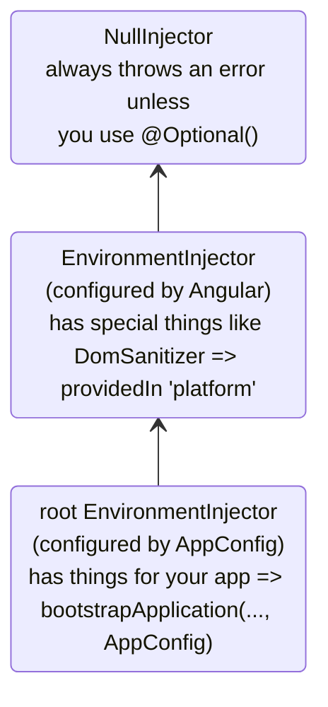
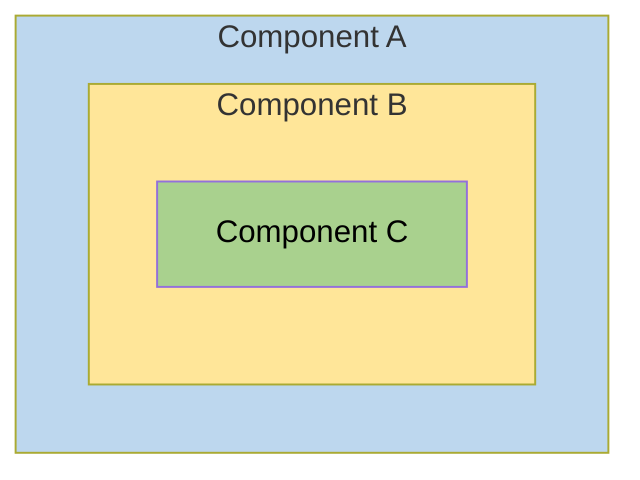
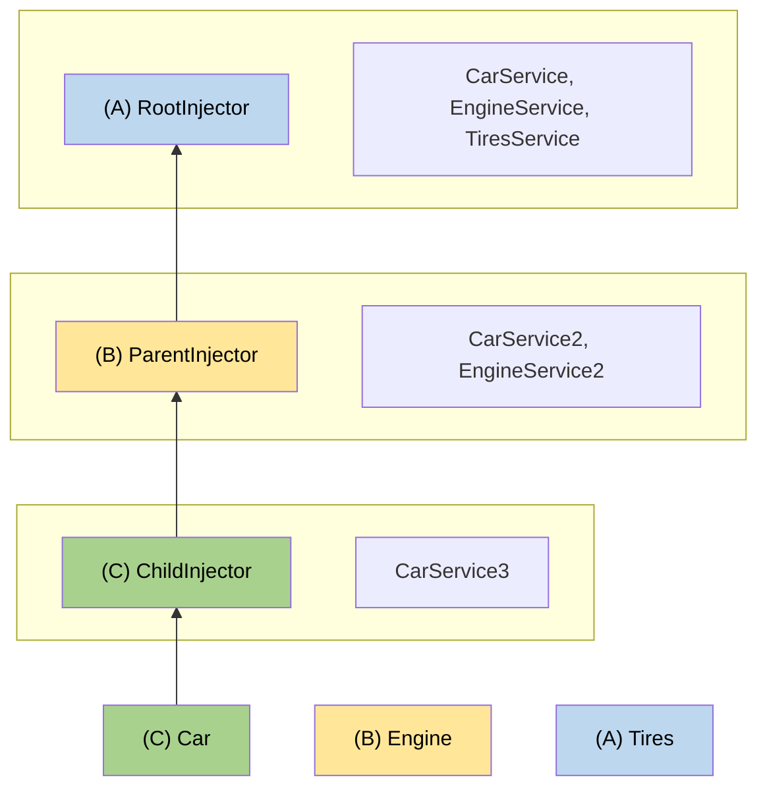

# Иерархические инжекторы {: #hierarchical-injectors}

:date: 30.09.2026

В этом руководстве подробно разобрана иерархическая система инъекции зависимостей Angular: правила разрешения, модификаторы и продвинутые схемы.

!!! info ""

    Базовые понятия иерархии инжекторов и области видимости провайдеров — в [руководстве по определению провайдеров зависимостей](defining-dependency-providers.md#injector-hierarchy-in-angular).

## Виды иерархий инжекторов {: #types-of-injector-hierarchies}

В Angular две иерархии инжекторов:

| Иерархии инжекторов | Подробности |
| :------------------------------ | :------------------------------------------------------------------------------------------------------------------------------------------------------------------------ |
| Иерархия `EnvironmentInjector` | `EnvironmentInjector` в этой иерархии настраивают через `@Service()` или массив `providers` в `ApplicationConfig`. |
| Иерархия `ElementInjector` | Создаётся неявно у каждого элемента DOM. По умолчанию `ElementInjector` пуст, пока его не настроят в свойстве `providers` у `@Directive()` или `@Component()`. |

!!! info "Приложения на NgModule"

    В приложениях на `NgModule` зависимости предоставляют через иерархию `ModuleInjector` с помощью аннотаций `@NgModule()` или `@Injectable()`.

### `EnvironmentInjector` {: #environmentinjector}

`EnvironmentInjector` настраивают одним из двух способов:

-   декоратором `@Service()`
-   массивом `providers` в `ApplicationConfig`

!!! info "Tree-shaking и @Service()"

    Декоратор `@Service()` предпочтительнее массива `providers` в `ApplicationConfig`. С `@Service` инструменты оптимизации делают tree-shaking и удаляют сервисы, которыми приложение не пользуется. Сборка получается меньше.

    Tree-shaking особенно полезен для библиотеки: приложению, которое её подключает, этот сервис может быть не нужен.

`EnvironmentInjector` настраивается через `ApplicationConfig.providers`.

Сервис предоставляют через `@Service()` так:

```ts
import {Service} from '@angular/core';

@Service() // <--provides this service in the root EnvironmentInjector
export class ItemService {
  name = 'telephone';
}
```

Декораторы `@Service()` и `@Injectable()` помечают класс сервиса.

### ModuleInjector {: #moduleinjector}

В приложениях на `NgModule` инжектор `ModuleInjector` настраивают одним из двух способов:

-   декоратором `@Service()`
-   свойством `providedIn` у `@Injectable()`, со значением `root` или `platform`
-   массивом `providers` у `@NgModule()`

`ModuleInjector` настраивается свойствами `@NgModule.providers` и `NgModule.imports`. `ModuleInjector` — это плоский список всех массивов провайдеров, до которых можно дойти, рекурсивно следуя по `NgModule.imports`.

Дочерние иерархии `ModuleInjector` появляются при ленивой загрузке других `@NgModule`.

### Платформенный инжектор {: #platform-injector}

Выше `root` есть ещё два инжектора: дополнительный `EnvironmentInjector` и `NullInjector()`.

Посмотрите, как Angular запускает приложение в `main.ts`:

```ts
bootstrapApplication(App, appConfig);
```

Метод `bootstrapApplication()` создаёт дочерний инжектор платформенного инжектора. Его настраивает экземпляр `ApplicationConfig`. Это корневой `EnvironmentInjector`.

Метод `platformBrowserDynamic()` создаёт инжектор, настроенный модулем `PlatformModule`. В нём зависимости, специфичные для платформы. Так несколько приложений делят одну платформенную конфигурацию. Например, в браузере одна адресная строка, сколько бы приложений ни было запущено. Дополнительные платформенные провайдеры задают на уровне платформы: в функцию `platformBrowser()` передают `extraProviders`.

Следующий родитель в иерархии — `NullInjector()`, вершина дерева. Если поиск дошёл до сервиса в `NullInjector()`, будет ошибка, если не указан `@Optional()`. Дерево заканчивается на `NullInjector()`: без `@Optional()` он возвращает ошибку, с `@Optional()` — `null`. Подробнее об `@Optional()` — в [разделе `@Optional()`](#optional) этого руководства.

Схема ниже показывает связь корневого `ModuleInjector` с родительскими инжекторами, как описано выше.



Имя `root` — особый псевдоним. У остальных иерархий `EnvironmentInjector` псевдонимов нет. Иерархию `EnvironmentInjector` можно создать в момент появления динамически загружаемого компонента. Так делает маршрутизатор: он создаёт дочерние иерархии `EnvironmentInjector`.

Все запросы поднимаются к корневому инжектору. Неважно, настроен ли он экземпляром `ApplicationConfig`, переданным в `bootstrapApplication()`, или все провайдеры зарегистрированы с `root` в собственных сервисах.

!!! info "@Injectable() и ApplicationConfig"

    Если провайдер на всё приложение задан в `ApplicationConfig` у `bootstrapApplication`, он перекрывает провайдер, настроенный для `root` в метаданных `@Injectable()`. Так задают нестандартный провайдер сервиса, общего для нескольких приложений.

    Пример: конфигурация маршрутизатора компонентов подключает нестандартную [стратегию расположения](https://angular.dev/guide/routing/common-router-tasks#locationstrategy-and-browser-url-styles). Её провайдер указан в списке `providers` у `ApplicationConfig`.

    ```ts
    providers: [{provide: LocationStrategy, useClass: HashLocationStrategy}];
    ```

    В приложениях на `NgModule` провайдеры на всё приложение задают в `providers` модуля `AppModule`.

### `ElementInjector` {: #elementinjector}

Angular неявно создаёт иерархии `ElementInjector` для каждого элемента DOM.

Сервис в декораторе `@Component()`, в свойстве `providers` или `viewProviders`, настраивает `ElementInjector`. Например, `TestComponent` настраивает `ElementInjector` так:

```ts
@Component({
  /* … */
  providers: [{ provide: ItemService, useValue: { name: 'lamp' } }]
})
export class TestComponent
```

!!! tip ""

    Связь дерева `EnvironmentInjector`, `ModuleInjector` и дерева `ElementInjector` разобрана в разделе [правил разрешения](#resolution-rules).

Сервис, предоставленный в компоненте, доступен через `ElementInjector` этого экземпляра компонента. По правилам видимости из раздела [правил разрешения](#resolution-rules) он может быть виден и дочерним компонентам и директивам.

Когда экземпляр компонента уничтожается, уничтожается и экземпляр этого сервиса.

#### `@Directive()` и `@Component()` {: #directive-and-component}

Компонент — частный случай директивы. У `@Directive()` есть свойство `providers`, и у `@Component()` оно тоже есть. И директивы, и компоненты настраивают провайдеры через `providers`. Провайдер, заданный в `providers` компонента или директивы, принадлежит `ElementInjector` этого компонента или директивы. Компоненты и директивы на одном элементе делят один инжектор.

## Правила разрешения {: #resolution-rules}

Когда токен разрешается для компонента или директивы, Angular делает это в два этапа:

1.  По родителям в иерархии `ElementInjector`.
2.  По родителям в иерархии `EnvironmentInjector`.

Когда компонент объявляет зависимость, Angular сначала пытается удовлетворить её собственным `ElementInjector` компонента. Если у инжектора компонента нет провайдера, запрос уходит к `ElementInjector` родительского компонента.

Запросы поднимаются, пока Angular не найдёт инжектор, который может обработать запрос, или пока не кончатся предки в иерархиях `ElementInjector`.

Если провайдера нет ни в одной иерархии `ElementInjector`, Angular возвращается к элементу, откуда пришёл запрос, и ищет в иерархии `EnvironmentInjector`. Если провайдера нет и там, выбрасывается ошибка.

Если провайдер одного и того же DI-токена зарегистрирован на разных уровнях, Angular берёт первый, который встретит. Например, если провайдер зарегистрирован локально в компоненте, которому нужен сервис, Angular не ищет другой провайдер того же сервиса.

!!! tip ""

    В приложениях на `NgModule` Angular ищет в иерархии `ModuleInjector`, если провайдер не найден в иерархиях `ElementInjector`.

## Модификаторы разрешения {: #resolution-modifiers}

Поведение разрешения меняют флаги `optional`, `self`, `skipSelf` и `host`. Каждый импортируют из `@angular/core` и передают в конфигурацию [`inject`](https://angular.dev/api/core/inject) в момент инъекции сервиса.

### Виды модификаторов {: #types-of-modifiers}

Модификаторы разрешения делятся на три группы:

-   Что делать, если Angular не нашёл нужное: `optional`
-   Откуда начинать поиск: `skipSelf`
-   Где поиск останавливать: `host` и `self`

По умолчанию Angular всегда начинает с текущего `Injector` и идёт вверх до конца. Модификаторы меняют начальную точку, то есть _self_, и конечную.

Модификаторы можно сочетать все, кроме таких пар:

-   `host` и `self`
-   `skipSelf` и `self`

### `optional` {: #optional}

`optional` помечает инжектируемый сервис как необязательный. Если во время выполнения его нельзя разрешить, Angular подставляет `null`, а не выбрасывает ошибку. В примере ниже сервис `OptionalService` не предоставлен ни в сервисе, ни в `ApplicationConfig`, ни в `@NgModule()`, ни в классе компонента, поэтому в приложении его нет нигде.

_src/app/optional/optional.ts_

```ts
export class Optional {
  public optional? = inject(OptionalService, {optional: true});
}
```

### `self` {: #self}

`self` заставляет Angular смотреть только в `ElementInjector` текущего компонента или директивы.

Хороший случай для `self` — внедрить сервис, только если он есть на текущем элементе-хосте. Чтобы в этой ситуации не было ошибки, `self` сочетают с `optional`.

В `SelfNoData` ниже обратите внимание на внедрённый `LeafService` как на свойство.

```ts
@Component({
  selector: 'app-self-no-data',
  templateUrl: './self-no-data.html',
  styleUrls: ['./self-no-data.css'],
})
export class SelfNoData {
  public leaf = inject(LeafService, {optional: true, self: true});
}
```

В этом примере родительский провайдер есть, и обычная инъекция сервиса вернёт значение. Инъекция с `self` и `optional` вернёт `null`: `self` говорит инжектору остановить поиск на текущем элементе-хосте.

Другой пример — класс компонента с провайдером `FlowerService`. Инжектор не идёт дальше текущего `ElementInjector`: он находит `FlowerService` и возвращает тюльпан 🌷.

_src/app/self/self.ts_

```ts
@Component({
  selector: 'app-self',
  templateUrl: './self.html',
  styleUrls: ['./self.css'],
  providers: [{provide: FlowerService, useValue: {emoji: '🌷'}}],
})
export class Self {
  public flower = inject(FlowerService, {self: true});
}
```

### `skipSelf` {: #skipself}

`skipSelf` — противоположность `self`. С `skipSelf` Angular начинает поиск сервиса в родительском `ElementInjector`, а не в текущем. Если родительский `ElementInjector` использует для `emoji` значение папоротника <code>🌿</code>, а в массиве `providers` компонента лежит кленовый лист <code>🍁</code>, Angular проигнорирует кленовый лист <code>🍁</code> и возьмёт папоротник <code>🌿</code>.

В коде это выглядит так. Пусть родительский компонент использует такое значение `emoji` из сервиса:

```ts
export class LeafService {
  emoji = '🌿';
}
```

В дочернем компоненте другое значение, кленовый лист 🍁, но нужно значение родителя. Здесь и нужен `skipSelf`.

_skipself.ts_

```ts
@Component({
  selector: 'app-skipself',
  templateUrl: './skipself.html',
  styleUrls: ['./skipself.css'],
  // Angular would ignore this LeafService instance
  providers: [{provide: LeafService, useValue: {emoji: '🍁'}}],
})
export class Skipself {
  // Use skipSelf as inject option
  public leaf = inject(LeafService, {skipSelf: true});
}
```

В этом случае значение `emoji` будет папоротником <code>🌿</code>, а не кленовым листом <code>🍁</code>.

#### Параметр `skipSelf` вместе с `optional` {: #skipself-option-with-optional}

`skipSelf` вместе с `optional` не даёт ошибке возникнуть, если значение равно `null`.

В примере ниже сервис `Person` внедряется при инициализации свойства. `skipSelf` говорит Angular пропустить текущий инжектор, а `optional` не даст ошибке возникнуть, если сервиса `Person` нет и значение равно `null`.

```ts
class Person {
  parent = inject(Person, {optional: true, skipSelf: true});
}
```

### `host` {: #host}

`host` назначает компонент последней остановкой в дереве инжекторов при поиске провайдеров.

Даже если экземпляр сервиса есть выше по дереву, Angular дальше не пойдёт. `host` используют так:

_host.ts_

```ts
@Component({
  selector: 'app-host',
  templateUrl: './host.html',
  styleUrls: ['./host.css'],
  // provide the service
  providers: [{provide: FlowerService, useValue: {emoji: '🌷'}}],
})
export class Host {
  // use host when injecting the service
  flower = inject(FlowerService, {host: true, optional: true});
}
```

У `Host` указан параметр `host`, поэтому какое бы значение `flower.emoji` ни было у родителя `Host`, сам `Host` возьмёт тюльпан <code>🌷</code>.

### Модификаторы при инъекции через конструктор {: #modifiers-with-constructor-injection}

Так же, как выше, поведение инъекции через конструктор меняют декораторы `@Optional()`, `@Self()`, `@SkipSelf()` и `@Host()`.

Каждый импортируют из `@angular/core` и ставят в конструкторе класса компонента в момент инъекции сервиса.

_self-no-data.ts_

```ts
export class SelfNoData {
  constructor(@Self() @Optional() public leaf?: LeafService) {}
}
```

## Логическая структура шаблона {: #logical-structure-of-the-template}

Сервисы, предоставленные в классе компонента, видны в дереве `ElementInjector` относительно того, где и как они предоставлены.

Логическая структура шаблона Angular — основа для настройки сервисов и управления их видимостью.

Компоненты используют в шаблонах, как в примере:

```html
<app-root> <app-child />; </app-root>
```

!!! tip ""

    Обычно компоненты и их шаблоны объявляют в разных файлах. Чтобы понять, как работает инъекция, полезно смотреть на них как на одно логическое дерево. Слово _логическое_ отделяет его от дерева отрисовки — DOM-дерева приложения. Места, где лежат шаблоны компонентов, в этом руководстве помечены псевдоэлементом `<#VIEW>`. В дереве отрисовки его нет, он нужен только как мысленная модель.

Пример того, как деревья представлений `<app-root>` и `<app-child>` складываются в одно логическое дерево:

```html
<app-root>
  <#VIEW>
    <app-child>
     <#VIEW>
       …content goes here…
     </#VIEW>
    </app-child>
  </#VIEW>
</app-root>
```

Граница `<#VIEW>` особенно важна, когда сервисы настраивают в классе компонента.

## Пример: сервисы в `@Component()` {: #example-providing-services-in-component}

От того, как сервис предоставлен в декораторе `@Component()` (или `@Directive()`), зависит его видимость. Дальше показаны `providers` и `viewProviders`, а также `skipSelf` и `host`, которыми видимость меняют.

Класс компонента предоставляет сервисы двумя способами:

| Массивы | Подробности |
| :--------------------------- | :--------------------------------------------- |
| Массив `providers` | `@Component({ providers: [SomeService] })` |
| Массив `viewProviders` | `@Component({ viewProviders: [SomeService] })` |

В примерах ниже — логическое дерево приложения Angular. Чтобы показать, как инжектор работает в шаблонах, логическое дерево изображает HTML-структуру приложения. Например, в нём `<child-component>` — прямой потомок `<parent-component>`.

В логическом дереве есть особые атрибуты: `@Provide`, `@Inject` и `@ApplicationConfig`. Это не настоящие атрибуты, они показывают, что происходит внутри.

| Атрибут сервиса Angular | Подробности |
| :------------------------ | :--------------------------------------------------------------------------------------- |
| `@Inject(Token)=>Value` | Если `Token` инжектируют в этом месте логического дерева, значением будет `Value`. |
| `@Provide(Token=Value)` | `Token` предоставлен значением `Value` в этом месте логического дерева. |
| `@ApplicationConfig` | В этом месте запасным инжектором служит `EnvironmentInjector`. |

### Структура примера {: #example-app-structure}

В примере `FlowerService` предоставлен в `root` со значением `emoji` — красный гибискус <code>🌺</code>.

_flower.service.ts_

```ts
@Service()
export class FlowerService {
  emoji = '🌺';
}
```

Возьмём приложение, где есть только `App` и `Child`. Самый простой отрисованный вид — вложенные HTML-элементы:

```html
<app-root>
  <!-- App selector -->
  <app-child> <!-- Child selector --> </app-child>
</app-root>
```

За кадром, когда разрешаются запросы инъекции, Angular использует логическое представление:

```html
<app-root> <!-- App selector -->
  <#VIEW>
    <app-child> <!-- Child selector -->
      <#VIEW>
      </#VIEW>
    </app-child>
  </#VIEW>
</app-root>
```

`<#VIEW>` здесь — экземпляр шаблона. У каждого компонента свой `<#VIEW>`.

Эта структура подсказывает, как предоставлять и внедрять сервисы, и даёт полный контроль над их видимостью.

Пусть `<app-root>` внедряет `FlowerService`:

```ts
export class App {
  flower = inject(FlowerService);
}
```

В шаблон `<app-root>` добавляют привязку, чтобы увидеть результат:

```html
<p>Emoji from FlowerService: {{flower.emoji}}</p>
```

В представлении будет:

```text
Emoji from FlowerService: 🌺
```

В логическом дереве это выглядит так:

```html
<app-root @ApplicationConfig
        @Inject(FlowerService) flower=>"🌺">
  <#VIEW>
    <p>Emoji from FlowerService: {{flower.emoji}} (🌺)</p>
    <app-child>
      <#VIEW>
      </#VIEW>
    </app-child>
  </#VIEW>
</app-root>
```

Когда `<app-root>` запрашивает `FlowerService`, инжектор должен разрешить токен `FlowerService`. Разрешение идёт в два этапа:

1.  Инжектор определяет в логическом дереве, откуда начинать поиск и где его заканчивать. Поиск идёт от начальной точки и проверяет токен на каждом уровне представления логического дерева. Если токен найден, он возвращается.

2.  Если токен не найден, инжектор ищет ближайший родительский `EnvironmentInjector` и передаёт запрос ему.

В этом примере ограничения такие:

1.  Начать с `<#VIEW>`, который принадлежит `<app-root>`, и закончить на `<app-root>`.

    -   Обычно поиск начинается в точке инъекции. Здесь `<app-root>` — компонент. У `@Component` есть ещё и собственные `viewProviders`, поэтому поиск начинается с `<#VIEW>`, который принадлежит `<app-root>`. Для директивы на том же месте это было бы не так.
    -   Конечная точка совпадает с самим компонентом: это самый верхний компонент приложения.

2.  `EnvironmentInjector` из `ApplicationConfig` служит запасным инжектором, если токен инъекции не найден в иерархиях `ElementInjector`.

### Массив `providers` {: #using-the-providers-array}

В классе `Child` добавляют провайдер `FlowerService`, чтобы в следующих разделах показать более сложные правила разрешения:

```ts
@Component({
  selector: 'app-child',
  templateUrl: './child.html',
  styleUrls: ['./child.css'],
  // use the providers array to provide a service
  providers: [{provide: FlowerService, useValue: {emoji: '🌻'}}],
})
export class Child {
  // inject the service
  flower = inject(FlowerService);
}
```

Теперь `FlowerService` предоставлен в декораторе `@Component()`. Когда `<app-child>` запрашивает сервис, инжектору достаточно дойти до `ElementInjector` в `<app-child>`. Дальше по дереву инжекторов искать не нужно.

Следующий шаг — привязка в шаблоне `Child`.

```html
<p>Emoji from FlowerService: {{flower.emoji}}</p>
```

Чтобы отрисовать новые значения, `<app-child>` добавляют в конец шаблона `App`. Тогда в представлении виден и подсолнух:

```text
Child Component
Emoji from FlowerService: 🌻
```

В логическом дереве это выглядит так:

```html
<app-root @ApplicationConfig
          @Inject(FlowerService) flower=>"🌺">
  <#VIEW>

  <p>Emoji from FlowerService: {{flower.emoji}} (🌺)</p>
  <app-child @Provide(FlowerService="🌻" )
             @Inject(FlowerService)=>"🌻"> <!-- search ends here -->
    <#VIEW> <!-- search starts here -->
    <h2>Child Component</h2>
    <p>Emoji from FlowerService: {{flower.emoji}} (🌻)</p>
  </
  #VIEW>
  </app-child>
</#VIEW>
</app-root>
```

Когда `<app-child>` запрашивает `FlowerService`, инжектор начинает поиск с `<#VIEW>`, который принадлежит `<app-child>` (`<#VIEW>` входит в поиск, потому что инъекция идёт из `@Component()`), и заканчивает на `<app-child>`. Здесь `FlowerService` разрешается в массиве `providers` компонента `<app-child>` значением подсолнуха <code>🌻</code>. Дальше по дереву инжекторов смотреть не нужно. Инжектор останавливается, как только находит `FlowerService`, и красный гибискус <code>🌺</code> не видит.

### Массив `viewProviders` {: #using-the-viewproviders-array}

Массив `viewProviders` — ещё один способ предоставить сервисы в декораторе `@Component()`. С `viewProviders` сервисы видны в `<#VIEW>`.

!!! tip ""

    Шаги те же, что для массива `providers`, только вместо него берут массив `viewProviders`.

Пошаговое продолжение — в этом разделе. Если пример уже собран самостоятельно, переходите к разделу [Изменение доступности сервиса](#visibility-of-provided-tokens).

Для демонстрации `viewProviders` собирают `AnimalService`. Сначала создают `AnimalService` со свойством `emoji` — кит <code>🐳</code>:

```ts
import {Service} from '@angular/core';

@Service()
export class AnimalService {
  emoji = '🐳';
}
```

По той же схеме, что и `FlowerService`, `AnimalService` внедряют в класс `App`:

```ts
export class App {
  public flower = inject(FlowerService);
  public animal = inject(AnimalService);
}
```

!!! tip ""

    Код, связанный с `FlowerService`, можно оставить: по нему удобно сравнивать с `AnimalService`.

В класс `<app-child>` тоже добавляют массив `viewProviders` и внедряют `AnimalService`, но `emoji` задают другое значение. Здесь это собака 🐶.

```ts
@Component({
  selector: 'app-child',
  templateUrl: './child.html',
  styleUrls: ['./child.css'],
  // provide services
  providers: [{provide: FlowerService, useValue: {emoji: '🌻'}}],
  viewProviders: [{provide: AnimalService, useValue: {emoji: '🐶'}}],
})
export class Child {
  // inject services
  flower = inject(FlowerService);
  animal = inject(AnimalService);
}
```

Привязки добавляют в шаблоны `Child` и `App`. В шаблон `Child`:

```html
<p>Emoji from AnimalService: {{animal.emoji}}</p>
```

То же самое — в шаблон `App`:

```html
<p>Emoji from AnimalService: {{animal.emoji}}</p>
```

В браузере видны оба значения:

```text
App
Emoji from AnimalService: 🐳

Child Component
Emoji from AnimalService: 🐶
```

Логическое дерево для этого примера с `viewProviders`:

```html
<app-root @ApplicationConfig
          @Inject(AnimalService) animal=>"🐳">
  <#VIEW>
  <app-child>
    <#VIEW @Provide(AnimalService="🐶")
    @Inject(AnimalService=>"🐶")>

    <!-- ^^using viewProviders means AnimalService is available in <#VIEW>-->
    <p>Emoji from AnimalService: {{animal.emoji}} (🐶)</p>
  </
  #VIEW>
  </app-child>
</#VIEW>
</app-root>
```

Как и в примере с `FlowerService`, `AnimalService` предоставлен в декораторе `@Component()` компонента `<app-child>`. Инжектор сначала смотрит в `ElementInjector` компонента и находит значение `AnimalService` — собаку <code>🐶</code>. Продолжать поиск по дереву `ElementInjector` не нужно, и в `ModuleInjector` тоже.

### `providers` и `viewProviders` {: #providers-vs-viewproviders}

Поле `viewProviders` по смыслу близко к `providers`, но есть важное отличие. Провайдеры из `viewProviders` видны только внутри собственного представления компонента. Содержимое, спроецированное в компонент через `<ng-content>`, их не видит.

Чтобы увидеть разницу между `providers` и `viewProviders`, в пример добавляют ещё один компонент и называют его `Inspector`. `Inspector` будет потомком `Child`. В `inspector.ts` при инициализации свойств внедряют `FlowerService` и `AnimalService`:

```ts
export class Inspector {
  flower = inject(FlowerService);
  animal = inject(AnimalService);
}
```

Массивы `providers` и `viewProviders` здесь не нужны. Дальше в `inspector.html` добавляют ту же разметку, что у предыдущих компонентов:

```html
<p>Emoji from FlowerService: {{flower.emoji}}</p>
<p>Emoji from AnimalService: {{animal.emoji}}</p>
```

`Inspector` нужно добавить в массив `imports` компонента `Child`.

```ts
@Component({
  ...
  imports: [Inspector]
})
```

Дальше в `child.html` добавляют следующее:

```html
...

<div class="container">
  <h3>Content projection</h3>
  <ng-content />
</div>
<h3>Inside the view</h3>

<app-inspector />
```

`<ng-content>` проецирует содержимое, а `<app-inspector>` внутри шаблона `Child` делает `Inspector` дочерним компонентом `Child`.

Чтобы воспользоваться проекцией содержимого, в `app.html` добавляют следующее:

```html
<app-child>
  <app-inspector />
</app-child>
```

Браузер отрисовывает следующее. Предыдущие примеры для краткости опущены:

```text
...
Content projection

Emoji from FlowerService: 🌻
Emoji from AnimalService: 🐳

Emoji from FlowerService: 🌻
Emoji from AnimalService: 🐶
```

Эти четыре привязки показывают разницу между `providers` и `viewProviders`. Собака <code>🐶</code> объявлена внутри `<#VIEW>` компонента `Child` и не видна спроецированному содержимому. Спроецированное содержимое видит кита <code>🐳</code>.

Спроецированный `<app-inspector>` всё ещё видит <code>🐳</code> из `viewProviders` компонента `App`. Для DI в Angular важно **место объявления** компонента. `<app-inspector>` живёт в шаблоне `App` — внутри `<#VIEW>` компонента `App`, — поэтому `viewProviders` компонента `App` ему доступны. Проекция в `Child` отрезает доступ к `viewProviders` компонента `Child` (<code>🐶</code>), но провайдеры `App` (<code>🐳</code>) по дереву по-прежнему достижимы.

В следующем фрагменте вывода `Inspector` — настоящий дочерний компонент `Child`. `Inspector` находится внутри `<#VIEW>`, поэтому при запросе `AnimalService` он видит собаку <code>🐶</code>.

`AnimalService` в логическом дереве выглядит так:

```html
<app-root @ApplicationConfig
          @Inject(AnimalService) animal=>"🐳">
  <#VIEW>
  <app-child>
    <#VIEW @Provide(AnimalService="🐶")
    @Inject(AnimalService=>"🐶")>

    <!-- ^^using viewProviders means AnimalService is available in <#VIEW>-->
    <p>Emoji from AnimalService: {{animal.emoji}} (🐶)</p>

    <div class="container">
      <h3>Content projection</h3>
      <app-inspector @Inject(AnimalService) animal=>"🐳">
        <p>Emoji from AnimalService: {{animal.emoji}} (🐳)</p>
      </app-inspector>
    </div>

    <app-inspector>
      <#VIEW @Inject(AnimalService) animal=>"🐶">
      <p>Emoji from AnimalService: {{animal.emoji}} (🐶)</p>
    </
    #VIEW>
    </app-inspector>
  </
  #VIEW>
  </app-child>

</#VIEW>
</app-root>
```

Спроецированный `<app-inspector>` получает <code>🐳</code>, потому что <code>🐶</code> принадлежит представлению `Child`, и спроецированное содержимое до него не дотягивается. <code>🐳</code> доступен, потому что `<app-inspector>` объявлен в шаблоне `App` и всё ещё может подняться к `viewProviders` компонента `App`.

`<app-inspector>`, который лежит прямо в шаблоне `Child` (не спроецирован), получает <code>🐶</code>: он внутри `<#VIEW>`, границы пересекать не нужно.

### Как дать спроецированному содержимому доступ к инжектору представления {: #giving-projected-content-access-to-a-view-injector}

Содержимое, спроецированное через `<ng-content>`, не видит `viewProviders` компонента: Angular разрешает инъекцию по инжектору того места, где содержимое объявлено, а не где оно отрисовано.

Если спроецированное содержимое должно достучаться до сервиса уровня представления — или до самого экземпляра проецирующего компонента — содержимое принимают как шаблон, а не через `<ng-content>`, и отрисовывают с явным инжектором.

`Child` обновляют: `AnimalService` предоставляют в `viewProviders`, запрашивают спроецированный шаблон и отрисовывают его через [`NgTemplateOutlet`](https://angular.dev/api/common/NgTemplateOutlet), а в `ngTemplateOutletInjector` передают инжектор, который этот сервис видит.

```ts
@Component({
  selector: 'app-child',
  viewProviders: [AnimalService],
  imports: [NgTemplateOutlet],
  template: `
    <ng-container [ngTemplateOutlet]="content()" [ngTemplateOutletInjector]="injector" />
  `,
})
export class Child {
  readonly content = contentChild.required(TemplateRef);
  readonly injector = inject(Injector);
}
```

Потребитель оборачивает проецируемую разметку в `<ng-template>`:

```html
<app-child>
  <ng-template>
    <app-inspector />
  </ng-template>
</app-child>
```

Теперь `Child` создаёт `<app-inspector>` через `NgTemplateOutlet` своим инжектором, поэтому `AnimalService` разрешается в собаку <code>🐶</code>, хотя разметка написана в шаблоне `App`. За это на обеих сторонах чуть больше разметки, чем у `<ng-content>`.

### Видимость предоставленных токенов {: #visibility-of-provided-tokens}

Декораторы видимости задают, где в логическом дереве начинается и заканчивается поиск токена инъекции. Настройку видимости ставят в точке инъекции, то есть при вызове `inject()`, а не в точке объявления.

Чтобы сдвинуть место, откуда инжектор ищет `FlowerService`, в вызов `inject()` у `<app-child>`, где внедряется `FlowerService`, добавляют `skipSelf`. Этот вызов — инициализатор свойства в `<app-child>`, как в `child.ts`:

```ts
flower = inject(FlowerService, {skipSelf: true});
```

С `skipSelf` инжектор `<app-child>` не ищет `FlowerService` у себя. Поиск начинается в `ElementInjector` компонента `<app-root>`, где ничего нет. Затем инжектор возвращается к `ModuleInjector` компонента `<app-child>` и находит красный гибискус <code>🌺</code>. Это значение доступно, потому что `<app-child>` и `<app-root>` делят один `ModuleInjector`. Интерфейс отрисовывает следующее:

```text
Emoji from FlowerService: 🌺
```

В логическом дереве та же идея выглядит так:

```html
<app-root @ApplicationConfig
          @Inject(FlowerService) flower=>"🌺">
  <#VIEW>
  <app-child @Provide(FlowerService="🌻" )>
    <#VIEW @Inject(FlowerService, SkipSelf)=>"🌺">

    <!-- With SkipSelf, the injector looks to the next injector up the tree (app-root) -->

  </
  #VIEW>
  </app-child>
</#VIEW>
</app-root>
```

Хотя `<app-child>` предоставляет подсолнух <code>🌻</code>, приложение отрисовывает красный гибискус <code>🌺</code>: `skipSelf` заставляет текущий инжектор (`app-child`) пропустить себя и смотреть в родителя.

Если теперь добавить `host` (вместе со `skipSelf`), результатом будет `null`. `host` ограничивает верхнюю границу поиска `<#VIEW>` компонента `app-child`. В логическом дереве это выглядит так:

```html
<app-root @ApplicationConfig
          @Inject(FlowerService) flower=>"🌺">
  <#VIEW> <!-- end search here with null-->
  <app-child @Provide(FlowerService="🌻" )> <!-- start search here -->
    <#VIEW inject(FlowerService, {skipSelf: true, host: true, optional:true})=>null>
  </
  #VIEW>
  </app-parent>
</#VIEW>
</app-root>
```

Сервисы и их значения те же, но `host` не даёт инжектору искать `FlowerService` дальше `<#VIEW>`. Токен не находится, и возвращается `null`.

### `skipSelf` и `viewProviders` {: #skipself-and-viewproviders}

Напомним: `<app-child>` предоставляет `AnimalService` в массиве `viewProviders` со значением собаки <code>🐶</code>. Инжектору достаточно посмотреть в `ElementInjector` компонента `<app-child>`, и кита <code>🐳</code> он не видит.

Как в примере с `FlowerService`, если добавить `skipSelf` к `inject()` для `AnimalService`, инжектор не будет искать `AnimalService` в `ElementInjector` текущего `<app-child>`. Поиск начнётся в `ElementInjector` компонента `<app-root>`.

```ts
@Component({
  selector: 'app-child',
  …
  viewProviders: [
    { provide: AnimalService, useValue: { emoji: '🐶' } },
  ],
})
```

Логическое дерево со `skipSelf` в `<app-child>`:

```html
<app-root @ApplicationConfig
          @Inject(AnimalService=>"🐳")>
  <#VIEW><!-- search begins here -->
  <app-child>
    <#VIEW @Provide(AnimalService="🐶")
    @Inject(AnimalService, SkipSelf=>"🐳")>

    <!--Add skipSelf -->

  </
  #VIEW>
  </app-child>
</#VIEW>
</app-root>
```

Со `skipSelf` в `<app-child>` инжектор начинает поиск `AnimalService` в `ElementInjector` компонента `<app-root>` и находит кита 🐳.

### `host` и `viewProviders` {: #host-and-viewproviders}

Если для инъекции `AnimalService` указать только `host`, результатом будет собака <code>🐶</code>: инжектор находит `AnimalService` в самом `<#VIEW>` компонента `<app-child>`. `Child` настраивает `viewProviders` так, что значением `AnimalService` служит эмодзи собаки. `host` виден и в `inject()`:

```ts
@Component({
  selector: 'app-child',
  …
  viewProviders: [
    { provide: AnimalService, useValue: { emoji: '🐶' } },
  ]
})
export class Child {
  animal = inject(AnimalService, { host: true })
}
```

`host: true` заставляет инжектор искать, пока он не дойдёт до края `<#VIEW>`.

```html
<app-root @ApplicationConfig
          @Inject(AnimalService=>"🐳")>
  <#VIEW>
  <app-child>
    <#VIEW @Provide(AnimalService="🐶")
    inject(AnimalService, {host: true}=>"🐶")> <!-- host stops search here -->
  </
  #VIEW>
  </app-child>
</#VIEW>
</app-root>
```

В метаданные `@Component()` файла `app.ts` добавляют массив `viewProviders` с третьим животным — ежом <code>🦔</code>:

```ts
@Component({
  selector: 'app-root',
  templateUrl: './app.html',
  styleUrls: [ './app.css' ],
  viewProviders: [
    { provide: AnimalService, useValue: { emoji: '🦔' } },
  ],
})
```

Дальше к `inject()` для `AnimalService` в `child.ts` добавляют `skipSelf` вместе с `host`. `host` и `skipSelf` в инициализации свойства `animal`:

```ts
export class Child {
  animal = inject(AnimalService, {host: true, skipSelf: true});
}
```

Когда `host` и `skipSelf` применили к `FlowerService` из массива `providers`, результатом был `null`: `skipSelf` начинает поиск в инжекторе `<app-child>`, а `host` останавливает его на `<#VIEW>`, где `FlowerService` нет. В логическом дереве `FlowerService` виден в `<app-child>`, а не в его `<#VIEW>`.

`AnimalService`, предоставленный в массиве `viewProviders` компонента `App`, при этом виден.

Почему так — видно по логическому дереву:

```html
<app-root @ApplicationConfig
          @Inject(AnimalService=>"🐳")>
  <#VIEW @Provide(AnimalService="🦔")
  @Inject(AnimalService, @Optional)=>"🦔">

  <!-- ^^skipSelf starts here,  host stops here^^ -->
  <app-child>
    <#VIEW @Provide(AnimalService="🐶")
    inject(AnimalService, {skipSelf:true, host: true, optional: true})=>"🦔">
    <!-- Add skipSelf ^^-->
  </
  #VIEW>
  </app-child>
</#VIEW>
</app-root>
```

`skipSelf` заставляет инжектор начать поиск `AnimalService` с `<app-root>`, а не с `<app-child>`, откуда пришёл запрос. `host` останавливает поиск на `<#VIEW>` компонента `<app-root>`. `AnimalService` предоставлен через массив `viewProviders`, поэтому инжектор находит ежа <code>🦔</code> в `<#VIEW>`.

## Пример: случаи для `ElementInjector` {: #example-elementinjector-use-cases}

Возможность настроить один или несколько провайдеров на разных уровнях открывает полезные схемы.

### Сценарий: изоляция сервиса {: #scenario-service-isolation}

По архитектурным причинам доступ к сервису ограничивают той областью приложения, к которой он относится. Например, `VillainsList` показывает список злодеев. Злодеев он получает из `VillainsService`.

Если предоставить `VillainsService` в корневом `AppModule`, сервис будет виден во всём приложении. Позже изменение `VillainsService` может сломать другие компоненты, которые начали от него зависеть случайно.

Вместо этого `VillainsService` предоставляют в метаданных `providers` компонента `VillainsList`:

```ts
@Component({
  selector: 'app-villains-list',
  templateUrl: './villains-list.html',
  providers: [VillainsService],
})
export class VillainsList {}
```

Если `VillainsService` предоставлен в метаданных `VillainsList` и больше нигде, сервис доступен только в `VillainsList` и его дереве подкомпонентов.

`VillainsService` — синглтон относительно `VillainsList`, потому что объявлен там. Пока `VillainsList` не уничтожен, это один и тот же экземпляр `VillainsService`. Если экземпляров `VillainsList` несколько, у каждого свой экземпляр `VillainsService`.

### Сценарий: несколько сеансов редактирования {: #scenario-multiple-edit-sessions}

Многие приложения позволяют работать с несколькими открытыми задачами одновременно. Например, в приложении для подготовки налоговых деклараций специалист ведёт несколько деклараций и в течение дня переключается между ними.

Чтобы показать этот сценарий, представьте `HeroList` со списком супергероев.

Чтобы открыть налоговую декларацию героя, специалист щёлкает по имени. Открывается компонент редактирования этой декларации. Каждая выбранная декларация открывается в своём компоненте, и несколько деклараций могут быть открыты сразу.

У каждого компонента декларации такие свойства:

-   Это отдельный сеанс редактирования налоговой декларации
-   Декларацию можно менять, не затрагивая декларацию в другом компоненте
-   Изменения своей декларации можно сохранить или отменить

Допустим, у `HeroTaxReturn` есть логика, которая ведёт изменения и откатывает их. Для одной налоговой декларации героя это простая задача. В реальном мире, с богатой моделью данных декларации, учёт изменений сложнее. Эту работу можно отдать вспомогательному сервису, как в примере.

`HeroTaxReturnService` кэширует одну декларацию `HeroTaxReturn`, следит за её изменениями и умеет сохранить или восстановить её. Он также делегирует общему для приложения синглтону `HeroService`, который получает через инъекцию.

```ts
import {inject, Service} from '@angular/core';
import {HeroTaxReturn} from './hero';
import {HeroesService} from './heroes.service';

@Service({autoProvided: false})
export class HeroTaxReturnService {
  private currentTaxReturn!: HeroTaxReturn;
  private originalTaxReturn!: HeroTaxReturn;

  private heroService = inject(HeroesService);

  set taxReturn(htr: HeroTaxReturn) {
    this.originalTaxReturn = htr;
    this.currentTaxReturn = htr.clone();
  }

  get taxReturn(): HeroTaxReturn {
    return this.currentTaxReturn;
  }

  restoreTaxReturn() {
    this.taxReturn = this.originalTaxReturn;
  }

  saveTaxReturn() {
    this.taxReturn = this.currentTaxReturn;
    this.heroService.saveTaxReturn(this.currentTaxReturn).subscribe();
  }
}
```

Вот `HeroTaxReturn`, который пользуется `HeroTaxReturnService`.

```ts
import {Component, input, output} from '@angular/core';
import {HeroTaxReturn} from './hero';
import {HeroTaxReturnService} from './hero-tax-return.service';

@Component({
  selector: 'app-hero-tax-return',
  templateUrl: './hero-tax-return.html',
  styleUrls: ['./hero-tax-return.css'],
  providers: [HeroTaxReturnService],
})
export class HeroTaxReturn {
  message = '';

  close = output<void>();

  get taxReturn(): HeroTaxReturn {
    return this.heroTaxReturnService.taxReturn;
  }

  taxReturn = input.required<HeroTaxReturn>();

  constructor() {
    effect(() => {
      this.heroTaxReturnService.taxReturn = this.taxReturn();
    });
  }

  private heroTaxReturnService = inject(HeroTaxReturnService);

  onCanceled() {
    this.flashMessage('Canceled');
    this.heroTaxReturnService.restoreTaxReturn();
  }

  onClose() {
    this.close.emit();
  }

  onSaved() {
    this.flashMessage('Saved');
    this.heroTaxReturnService.saveTaxReturn();
  }

  flashMessage(msg: string) {
    this.message = msg;
    setTimeout(() => (this.message = ''), 500);
  }
}
```

Декларация _tax-return-to-edit_ приходит через свойство `input`, реализованное геттером и сеттером. Сеттер инициализирует собственный экземпляр `HeroTaxReturnService` этого компонента входящей декларацией. Геттер всегда возвращает то, что сервис считает текущим состоянием героя. Компонент также просит сервис сохранить и восстановить эту декларацию.

Так не получится, если сервис — синглтон на всё приложение. Все компоненты делили бы один экземпляр сервиса, и каждый затирал бы декларацию другого героя.

Чтобы этого не было, инжектор уровня компонента `HeroTaxReturn` настраивают так, чтобы он предоставлял сервис. Для этого в метаданных компонента указывают свойство `providers`.

```ts
providers: [HeroTaxReturnService];
```

У `HeroTaxReturn` свой провайдер `HeroTaxReturnService`. У каждого _экземпляра_ компонента свой инжектор. Сервис на уровне компонента даёт _каждому_ экземпляру компонента собственный экземпляр сервиса. Тогда ни одна декларация не будет затёрта.

!!! tip ""

    Остальной код сценария опирается на другие возможности и приёмы Angular. О них — в других разделах документации.

### Сценарий: специализированные провайдеры {: #scenario-specialized-providers}

Ещё одна причина предоставить сервис заново на другом уровне — подставить _более специализированную_ реализацию глубже в дереве компонентов.

Например, компонент `Car` показывает сведения о шиномонтаже и зависит от других сервисов, которые дают подробности об автомобиле.

Корневой инжектор, помеченный как (A), использует _общие_ провайдеры сведений о `CarService` и `EngineService`.

1.  Компонент `Car` (A). Компонент (A) показывает данные шиномонтажа и задаёт общие сервисы, чтобы дать больше сведений об автомобиле.

2.  Дочерний компонент (B). Компонент (B) определяет собственные, _специализированные_ провайдеры `CarService` и `EngineService` с возможностями, которые подходят тому, что происходит в компоненте (B).

3.  Дочерний компонент (C) как потомок компонента (B). Компонент (C) определяет собственный, ещё _более специализированный_ провайдер `CarService`.



За кадром каждый компонент поднимает свой инжектор с нулём, одним или несколькими провайдерами, определёнными для самого компонента.

Когда экземпляр `Car` разрешают в самом глубоком компоненте (C), его инжектор даёт следующее:

-   Экземпляр `Car`, разрешённый инжектором (C)
-   `Engine`, разрешённый инжектором (B)
-   `Tires`, разрешённые корневым инжектором (A)



## Ещё об инъекции зависимостей {: #more-on-dependency-injection}

-   [Провайдеры DI](defining-dependency-providers.md)

---

Источник: [https://angular.dev/guide/di/hierarchical-dependency-injection](https://angular.dev/guide/di/hierarchical-dependency-injection)
