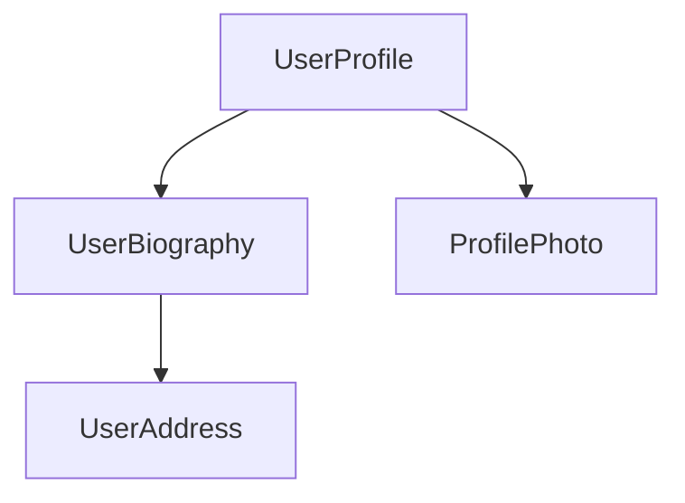

# Компоненты {: #components}

:date: 30.09.2026

Основной строительный блок приложений Angular.

Компоненты — главные строительные блоки приложений Angular. Каждый компонент — это часть большой веб-страницы. Разбиение приложения на компоненты задаёт структуру проекта: код разделён на части, которые проще сопровождать и наращивать.

## Определение компонента {: #defining-a-component}

У каждого компонента несколько главных частей:

1.  [Декоратор](https://www.typescriptlang.org/docs/handbook/decorators.html) `@Component` с конфигурацией, которой пользуется Angular.
2.  HTML-шаблон, который определяет, что попадёт в DOM.
3.  [CSS-селектор](https://developer.mozilla.org/docs/Learn/CSS/Building_blocks/Selectors), который задаёт, как компонент используют в HTML.
4.  Класс TypeScript с поведением: обработка ввода пользователя, запросы к серверу и тому подобное.

Ниже упрощённый пример компонента `UserProfile`.

_user-profile.ts_

```ts
@Component({
  selector: 'user-profile',
  template: `
    <h1>User profile</h1>
    <p>This is the user profile page</p>
  `,
})
export class UserProfile {
  /* Your component code goes here */
}
```

Декоратор `@Component` по желанию принимает свойство `styles` — CSS, который нужно применить к шаблону:

_user-profile.ts_

```ts
@Component({
  selector: 'user-profile',
  template: `
    <h1>User profile</h1>
    <p>This is the user profile page</p>
  `,
  styles: `
    h1 {
      font-size: 3em;
    }
  `,
})
export class UserProfile {
  /* Your component code goes here */
}
```

### HTML и CSS в отдельных файлах {: #separating-html-and-css-into-separate-files}

HTML и CSS компонента можно вынести в отдельные файлы через `templateUrl` и `styleUrl`:

_user-profile.ts_

```ts
@Component({
  selector: 'user-profile',
  templateUrl: 'user-profile.html',
  styleUrl: 'user-profile.css',
})
export class UserProfile {
  // Component behavior is defined in here
}
```

_user-profile.html_

```html
<h1>User profile</h1>
<p>This is the user profile page</p>
```

_user-profile.css_

```css
h1 {
  font-size: 3em;
}
```

## Использование компонентов {: #using-components}

Приложение собирают из нескольких компонентов. Страницу профиля, например, можно разложить так:



Здесь компонент `UserProfile` собирает итоговую страницу из нескольких других компонентов.

Чтобы импортировать компонент и использовать его, нужно:

1.  В файле TypeScript компонента добавить оператор `import` для нужного компонента.
2.  В декораторе `@Component` добавить этот компонент в массив `imports`.
3.  В шаблоне добавить элемент, который совпадает с селектором нужного компонента.

Пример: компонент `UserProfile` импортирует `ProfilePhoto`.

_user-profile.ts_

```ts
import {ProfilePhoto} from 'profile-photo.ts';

@Component({
  selector: 'user-profile',
  imports: [ProfilePhoto],
  template: `
    <h1>User profile</h1>
    <profile-photo />
    <p>This is the user profile page</p>
  `,
})
export class UserProfile {
  // Component behavior is defined in here
}
```

!!! tip ""

    Подробнее о компонентах Angular — в [подробном руководстве по компонентам](../components/anatomy-of-components.md).

## Следующий шаг {: #next-step}

С устройством компонентов всё ясно. Дальше — как добавлять динамические данные и управлять ими.

-   [Реактивность с сигналами](signals.md)
-   [Подробное руководство по компонентам](../components/anatomy-of-components.md)


---

Источник: [https://angular.dev/essentials/components](https://angular.dev/essentials/components)
