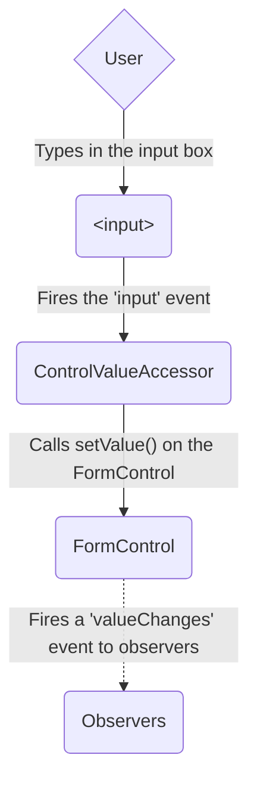
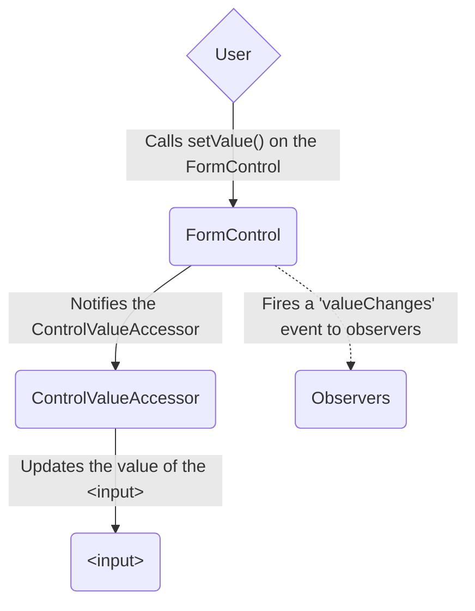
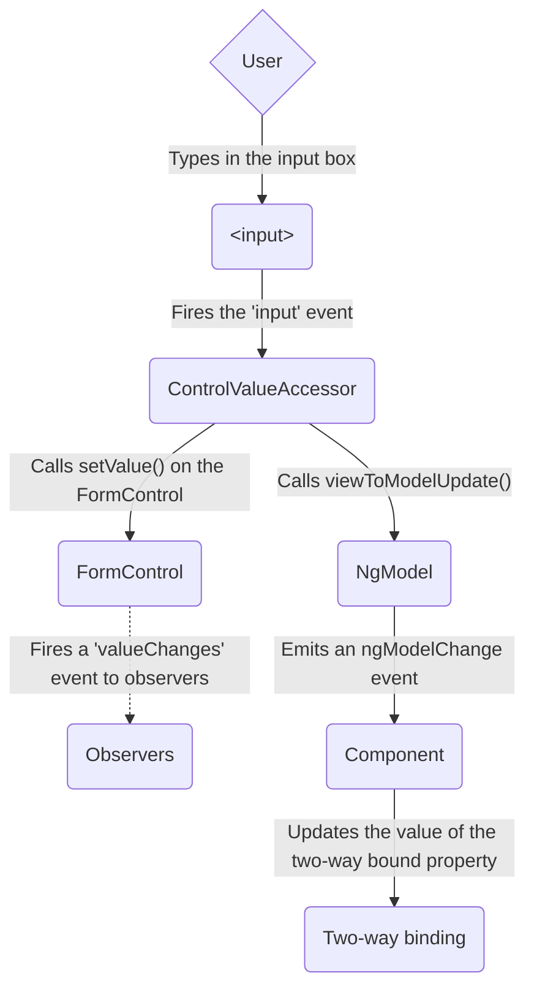
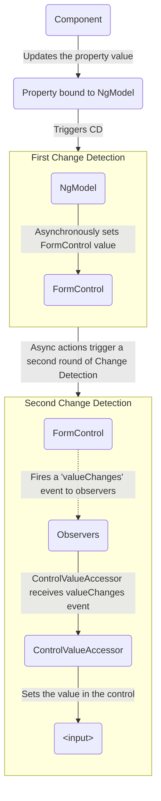

# Формы в Angular {: #forms-in-angular}

:date: 30.09.2026

Обработка пользовательского ввода формами лежит в основе многих обычных приложений.

Через формы пользователь входит в систему, обновляет профиль, вводит конфиденциальные данные и выполняет другие задачи ввода.

Angular даёт два подхода к вводу через формы: реактивные и шаблонные.

Оба перехватывают события ввода из представления, проверяют значения, создают модель формы и модель данных и дают способ отслеживать изменения.

!!! tip ""

    Если нужны новые сигнальные формы, смотрите [краткое руководство по сигнальным формам](../essentials/signal-forms.md).

Это руководство помогает выбрать тип формы под задачу.
В нём собраны общие строительные блоки обоих подходов.
Здесь же кратко разобраны ключевые различия и показано, как они проявляются при настройке, в потоке данных и в тестах.

## Выбор подхода {: #choosing-an-approach}

Реактивные и шаблонные формы по-разному обрабатывают данные формы и управляют ими.
У каждого подхода свои преимущества.

| Формы             | Подробности                                                                                                                                                                                                                                                                                                                                                                                                             |
| :-------------------- | :------------------------------------------------------------------------------------------------------------------------------------------------------------------------------------------------------------------------------------------------------------------------------------------------------------------------------------------------------------------------------------------------------------------ |
| Реактивные формы        | Дают прямой и явный доступ к объектной модели формы. По сравнению с шаблонными формами они надёжнее: лучше масштабируются, их проще переиспользовать и тестировать. Если формы — важная часть приложения или приложение уже строится на реактивных приёмах, берите реактивные формы.                                                                                            |
| Шаблонные формы | Опираются на директивы в шаблоне, которые создают объектную модель и работают с ней. Удобны, когда в приложение нужно добавить простую форму, например подписку на рассылку. Их легко подключить, но масштабируются они хуже реактивных. Если требования к форме совсем простые и логика целиком умещается в шаблоне, шаблонные формы подойдут. |

### Ключевые различия {: #key-differences}

В таблице ниже — основные различия реактивных и шаблонных форм.

|                                                   | Реактивные                             | Шаблонные                 |
| :------------------------------------------------ | :----------------------------------- | :------------------------------ |
| [Настройка модели формы](#setting-up-the-form-model) | Явная, создаётся в классе компонента | Неявная, создаётся директивами |
| [Модель данных](#mutability-of-the-data-model)       | Структурированная и неизменяемая             | Неструктурированная и изменяемая        |
| [Поток данных](#data-flow-in-forms)                  | Синхронный                          | Асинхронный                    |
| [Проверка формы](#form-validation)               | Функции                            | Директивы                      |

### Масштабируемость {: #scalability}

Если формы занимают центральное место в приложении, масштабируемость особенно важна.
Модель формы должна переиспользоваться между компонентами.

Реактивные формы масштабируются лучше шаблонных.
Они дают прямой доступ к API формы и используют [синхронный поток данных](#data-flow-in-reactive-forms) между представлением и моделью данных, поэтому крупные формы собирать проще.
Для тестов нужно меньше подготовки, и чтобы проверить обновление формы и валидацию, не требуется глубоко разбираться в обнаружении изменений.

Шаблонные формы рассчитаны на простые сценарии, и переиспользовать их сложнее.
Они скрывают API формы и используют [асинхронный поток данных](#data-flow-in-template-driven-forms) между представлением и моделью данных.
Эта абстракция сказывается и на тестах.
Тесты сильно зависят от ручного запуска обнаружения изменений и требуют больше подготовки.

## Настройка модели формы {: #setting-up-the-form-model}

И реактивные, и шаблонные формы отслеживают изменения значений между полями, с которыми работает пользователь, и данными формы в модели компонента.
Общие строительные блоки у них одни, а создавать экземпляры элементов управления и управлять ими приходится по-разному.

### Общие базовые классы формы {: #common-form-foundation-classes}

И реактивные, и шаблонные формы строятся на следующих базовых классах.

| Базовые классы           | Подробности                                                                             |
| :--------------------- | :---------------------------------------------------------------------------------- |
| `FormControl`          | Отслеживает значение и статус проверки отдельного элемента управления.               |
| `FormGroup`            | Отслеживает те же значения и статус для набора элементов управления.                |
| `FormArray`            | Отслеживает те же значения и статус для массива элементов управления.                    |
| `ControlValueAccessor` | Связывает экземпляры Angular `FormControl` со встроенными элементами DOM. |

### Настройка в реактивных формах {: #setup-in-reactive-forms}

В реактивных формах модель формы задаётся прямо в классе компонента.
Директива `[formControl]` связывает явно созданный экземпляр `FormControl` с конкретным элементом формы в представлении через внутренний аксессор значения.

Следующий компонент реализует одно поле ввода на реактивных формах.
В этом примере модель формы — экземпляр `FormControl`.

_favorite-color.component.ts_

```ts
import {Component} from '@angular/core';
import {FormControl, ReactiveFormsModule} from '@angular/forms';

@Component({
  selector: 'app-reactive-favorite-color',
  template: ` Favorite Color: <input type="text" [formControl]="favoriteColorControl" /> `,
  imports: [ReactiveFormsModule],
})
export class FavoriteColorReactive {
  favoriteColorControl = new FormControl('');
}
```

!!! warning ""

    В реактивных формах источник истины — модель формы: через директиву `[formControl]` на элементе `<input>` она в любой момент отдаёт значение и статус элемента.

### Настройка в шаблонных формах {: #setup-in-template-driven-forms}

В шаблонных формах модель формы неявная.
Директива `NgModel` создаёт экземпляр `FormControl` для элемента формы и управляет им.

Тот же компонент с одним полем, но уже на шаблонных формах.

_favorite-color.component.ts_

```ts
import {Component, signal} from '@angular/core';
import {FormsModule} from '@angular/forms';

@Component({
  selector: 'app-template-favorite-color',
  template: ` Favorite Color: <input type="text" [(ngModel)]="favoriteColor" /> `,
  imports: [FormsModule],
})
export class FavoriteColorTemplate {
  favoriteColor = signal('');
}
```

!!! warning ""

    В шаблонной форме источник истины — шаблон. Директива `NgModel` сама ведёт экземпляр `FormControl`.

## Поток данных в формах {: #data-flow-in-forms}

Если в приложении есть форма, Angular держит представление в согласии с моделью компонента, а модель компонента — с представлением.
Когда пользователь меняет значения и делает выбор в представлении, новые значения должны попасть в модель данных.
И наоборот: если логика программы меняет модель данных, представление должно это отразить.

Реактивные и шаблонные формы по-разному проводят данные от пользователя и от программных изменений.
На схемах ниже — оба направления потока для каждого типа формы на примере поля любимого цвета.

### Поток данных в реактивных формах {: #data-flow-in-reactive-forms}

В реактивных формах каждый элемент формы в представлении напрямую связан с моделью формы (экземпляром `FormControl`).
Обновления из представления в модель и из модели в представление идут синхронно и не зависят от того, как отрисован интерфейс.

Схема «представление → модель» показывает, как данные идут, когда значение поля меняется в представлении:

1.  Пользователь вводит значение в поле, в этом примере любимый цвет _Blue_.
1.  Элемент ввода формы порождает событие «input» с последним значением.
1.  `ControlValueAccessor`, который слушает события элемента, сразу передаёт новое значение экземпляру `FormControl`.
1.  Экземпляр `FormControl` отдаёт новое значение через observable `valueChanges`.
1.  Все подписчики `valueChanges` получают новое значение.



Схема «модель → представление» показывает, как программное изменение модели доходит до представления.

1.  Вызывается метод `favoriteColorControl.setValue()`, и он обновляет значение `FormControl`.
1.  Экземпляр `FormControl` отдаёт новое значение через observable `valueChanges`.
1.  Все подписчики `valueChanges` получают новое значение.
1.  Аксессор значения на элементе ввода записывает в элемент новое значение.



### Поток данных в шаблонных формах {: #data-flow-in-template-driven-forms}

В шаблонных формах каждый элемент формы связан с директивой, которая ведёт модель формы внутри себя.

Схема «представление → модель» показывает, как данные идут, когда значение поля меняется в представлении.

1.  Пользователь вводит в поле _Blue_.
1.  Элемент ввода порождает событие «input» со значением _Blue_.
1.  Аксессор значения на поле вызывает метод `setValue()` у экземпляра `FormControl`.
1.  Экземпляр `FormControl` отдаёт новое значение через observable `valueChanges`.
1.  Все подписчики `valueChanges` получают новое значение.
1.  Аксессор значения также вызывает метод `NgModel.viewToModelUpdate()`, который порождает событие `ngModelChange`.
1.  Поскольку в шаблоне компонента для свойства `favoriteColor` задана двусторонняя привязка, свойство `favoriteColor` в компоненте принимает значение из события `ngModelChange` \(_Blue_\).



Схема «модель → представление» показывает, как данные идут из модели в представление, когда `favoriteColor` меняется с _Blue_ на _Red_:

1.  В компоненте обновляется значение `favoriteColor`.
1.  Начинается обнаружение изменений.
1.  Во время обнаружения изменений у экземпляра директивы `NgModel` вызывается хук жизненного цикла `ngOnChanges`, потому что изменилось значение одного из её входов.
1.  Метод `ngOnChanges()` ставит в очередь асинхронную задачу, которая записывает значение во внутренний экземпляр `FormControl`.
1.  Обнаружение изменений завершается.
1.  На следующем тике выполняется задача записи значения в экземпляр `FormControl`.
1.  Экземпляр `FormControl` отдаёт последнее значение через observable `valueChanges`.
1.  Все подписчики `valueChanges` получают новое значение.
1.  Аксессор значения записывает в поле формы в представлении последнее значение `favoriteColor`.



!!! info ""

    `NgModel` запускает второе обнаружение изменений, чтобы избежать ошибки `ExpressionChangedAfterItHasBeenChecked`: изменение значения приходит из привязки входа.

### Изменяемость модели данных {: #mutability-of-the-data-model}

Способ отслеживания изменений влияет на эффективность приложения.

| Формы                 | Подробности                                                                                                                                                                                                                                                                                                                                                                                                                                                                                                                                  |
| :-------------------- | :--------------------------------------------------------------------------------------------------------------------------------------------------------------------------------------------------------------------------------------------------------------------------------------------------------------------------------------------------------------------------------------------------------------------------------------------------------------------------------------------------------------------------------------- |
| Реактивные формы        | Держат модель данных чистой и отдают её как неизменяемую структуру. При каждом изменении экземпляр `FormControl` возвращает новую модель данных, а не правит существующую. Уникальные изменения модели можно отслеживать через observable элемента управления. Обнаружение изменений работает эффективнее: обновление нужно только при уникальных изменениях. Поскольку обновления идут по реактивным правилам, данные можно преобразовывать операторами observable. |
| Шаблонные формы | Опираются на изменяемость и двустороннюю привязку: модель данных в компоненте обновляется по мере изменений в шаблоне. При двусторонней привязке у модели нет уникальных изменений, которые можно отследить, поэтому обнаружение изменений хуже понимает, когда обновление действительно нужно.                                                                                                                                                                                                                                 |

Разница видна на предыдущих примерах с полем любимого цвета.

-   В реактивных формах **экземпляр `FormControl`** при обновлении значения элемента управления всегда возвращает новое значение
-   В шаблонных формах **свойство любимого цвета** всегда изменяется на новое значение

## Проверка формы {: #form-validation}

Проверка — неотъемлемая часть работы с любым набором форм.
Нужно ли проверить обязательные поля или спросить внешний API, занято ли имя пользователя, Angular даёт набор встроенных валидаторов и возможность писать свои.

| Формы                 | Подробности                                                                                                      |
| :-------------------- | :----------------------------------------------------------------------------------------------------------- |
| Реактивные формы        | Свои валидаторы задаются **функциями**, которые получают элемент управления для проверки                                 |
| Шаблонные формы | Привязаны к **директивам** шаблона: свой валидатор оформляется директивой, которая оборачивает функцию проверки |

Подробнее в разделе [Проверка формы](https://angular.dev/guide/forms/form-validation#validating-input-in-reactive-forms).

## Тестирование {: #testing}

В сложных приложениях тесты занимают большое место.
Простая стратегия тестирования помогает убедиться, что формы работают правильно.
Реактивные и шаблонные формы в разной степени зависят от отрисовки интерфейса, когда проверки строятся на изменениях элемента управления и поля.
В примерах ниже — как тестировать реактивные и шаблонные формы.

### Тестирование реактивных форм {: #testing-reactive-forms}

У реактивных форм относительно прямой путь к тестам: доступ к модели формы и модели данных синхронный, и интерфейс для проверки рисовать не нужно.
В таких тестах статус и данные читают и меняют через элемент управления, не входя в цикл обнаружения изменений.

Следующие тесты берут компоненты любимого цвета из предыдущих примеров и проверяют потоки «представление → модель» и «модель → представление» для реактивной формы.

#### Проверка потока данных из представления в модель {: #verifying-view-to-model-data-flow}

Первый пример проверяет поток из представления в модель так:

1.  Найти в представлении элемент ввода формы и создать для теста собственное событие «input».
1.  Записать в поле новое значение _Red_ и отправить событие «input» на элемент ввода.
1.  Убедиться, что значение `favoriteColorControl` компонента совпадает со значением из поля.

_Favorite color test - view to model_

```ts
import {ComponentFixture, TestBed, waitForAsync} from '@angular/core/testing';

import {createNewEvent} from '../../shared/utils';
import {FavoriteColorReactive} from './favorite-color.component';

describe('Favorite Color Component', () => {
  let component: FavoriteColorReactive;
  let fixture: ComponentFixture<FavoriteColorReactive>;

  beforeEach(async () => {
    fixture = TestBed.createComponent(FavoriteColorReactive);
    component = fixture.componentInstance;
    await fixture.whenStable();
  });

  it('should create', () => {
    expect(component).toBeTruthy();
  });

  // #docregion view-to-model
  it('should update the value of the input field', () => {
    const input = fixture.nativeElement.querySelector('input');
    const event = createNewEvent('input');

    input.value = 'Red';
    input.dispatchEvent(event);

    expect(fixture.componentInstance.favoriteColorControl.value).toEqual('Red');
  });
  // #enddocregion view-to-model

  // #docregion model-to-view
  it('should update the value in the control', () => {
    component.favoriteColorControl.setValue('Blue');

    const input = fixture.nativeElement.querySelector('input');

    expect(input.value).toBe('Blue');
  });
  // #enddocregion model-to-view
});
```

Следующий пример проверяет поток из модели в представление так:

1.  Через `favoriteColorControl`, экземпляр `FormControl`, задать новое значение.
1.  Найти в представлении элемент ввода формы.
1.  Убедиться, что новое значение элемента управления совпадает со значением в поле.

_Favorite color test - model to view_

```ts
import {ComponentFixture, TestBed, waitForAsync} from '@angular/core/testing';

import {createNewEvent} from '../../shared/utils';
import {FavoriteColorReactive} from './favorite-color.component';

describe('Favorite Color Component', () => {
  let component: FavoriteColorReactive;
  let fixture: ComponentFixture<FavoriteColorReactive>;

  beforeEach(async () => {
    fixture = TestBed.createComponent(FavoriteColorReactive);
    component = fixture.componentInstance;
    await fixture.whenStable();
  });

  it('should create', () => {
    expect(component).toBeTruthy();
  });

  // #docregion view-to-model
  it('should update the value of the input field', () => {
    const input = fixture.nativeElement.querySelector('input');
    const event = createNewEvent('input');

    input.value = 'Red';
    input.dispatchEvent(event);

    expect(fixture.componentInstance.favoriteColorControl.value).toEqual('Red');
  });
  // #enddocregion view-to-model

  // #docregion model-to-view
  it('should update the value in the control', () => {
    component.favoriteColorControl.setValue('Blue');

    const input = fixture.nativeElement.querySelector('input');

    expect(input.value).toBe('Blue');
  });
  // #enddocregion model-to-view
});
```

### Тестирование шаблонных форм {: #testing-template-driven-forms}

Тесты шаблонных форм требуют хорошо понимать процесс обнаружения изменений и то, как директивы отрабатывают на каждом цикле: элементы нужно запрашивать, проверять и менять в нужный момент.

Следующие тесты берут те же компоненты любимого цвета и проверяют потоки из представления в модель и из модели в представление для шаблонной формы.

Следующий тест проверяет поток данных из представления в модель.

_Favorite color test - view to model_

```ts
import {ComponentFixture, TestBed} from '@angular/core/testing';

import {createNewEvent} from '../../shared/utils';
import {FavoriteColorTemplate} from './favorite-color.component';

describe('FavoriteColorComponent', () => {
  let component: FavoriteColorTemplate;
  let fixture: ComponentFixture<FavoriteColorTemplate>;

  beforeEach(async () => {
    fixture = TestBed.createComponent(FavoriteColorTemplate);
    component = fixture.componentInstance;
    await fixture.whenStable();
  });

  it('should create', () => {
    expect(component).toBeTruthy();
  });

  // #docregion model-to-view
  it('should update the favorite color on the input field', async () => {
    component.favoriteColor.set('Blue');

    await fixture.whenStable();

    const input = fixture.nativeElement.querySelector('input');
    expect(input.value).toBe('Blue');
  });
  // #enddocregion model-to-view

  // #docregion view-to-model
  it('should update the favorite color in the component', async () => {
    const input = fixture.nativeElement.querySelector('input');
    const event = createNewEvent('input');

    input.value = 'Red';
    input.dispatchEvent(event);

    await fixture.whenStable();

    expect(component.favoriteColor()).toEqual('Red');
  });
  // #enddocregion view-to-model
});
```

Шаги теста «представление → модель»:

1.  Найти в представлении элемент ввода формы и создать для теста собственное событие «input».
1.  Записать в поле новое значение _Red_ и отправить событие «input» на элемент ввода.
1.  Запустить обнаружение изменений через тестовую фикстуру.
1.  Убедиться, что значение свойства `favoriteColor` компонента совпадает со значением из поля.

Следующий тест проверяет поток данных из модели в представление.

_Favorite color test - model to view_

```ts
import {ComponentFixture, TestBed} from '@angular/core/testing';

import {createNewEvent} from '../../shared/utils';
import {FavoriteColorTemplate} from './favorite-color.component';

describe('FavoriteColorComponent', () => {
  let component: FavoriteColorTemplate;
  let fixture: ComponentFixture<FavoriteColorTemplate>;

  beforeEach(async () => {
    fixture = TestBed.createComponent(FavoriteColorTemplate);
    component = fixture.componentInstance;
    await fixture.whenStable();
  });

  it('should create', () => {
    expect(component).toBeTruthy();
  });

  // #docregion model-to-view
  it('should update the favorite color on the input field', async () => {
    component.favoriteColor.set('Blue');

    await fixture.whenStable();

    const input = fixture.nativeElement.querySelector('input');
    expect(input.value).toBe('Blue');
  });
  // #enddocregion model-to-view

  // #docregion view-to-model
  it('should update the favorite color in the component', async () => {
    const input = fixture.nativeElement.querySelector('input');
    const event = createNewEvent('input');

    input.value = 'Red';
    input.dispatchEvent(event);

    await fixture.whenStable();

    expect(component.favoriteColor()).toEqual('Red');
  });
  // #enddocregion view-to-model
});
```

Шаги теста «модель → представление»:

1.  Через экземпляр компонента задать значение свойства `favoriteColor`.
1.  Запустить обнаружение изменений через тестовую фикстуру.
1.  Дождаться следующей отрисовки через `await fixture.whenStable()`.
1.  Найти в представлении элемент ввода формы.
1.  Убедиться, что значение поля совпадает со значением свойства `favoriteColor` в экземпляре компонента.

## Что дальше {: #next-steps}

Подробнее о реактивных формах:

-   [Реактивные формы](reactive-forms.md)
-   [Проверка формы](https://angular.dev/guide/forms/form-validation#validating-input-in-reactive-forms)
-   [Динамические формы](https://angular.dev/guide/forms/dynamic-forms)

Подробнее о шаблонных формах:

-   [Учебник по шаблонным формам](https://angular.dev/guide/forms/template-driven-forms)
-   [Проверка формы](https://angular.dev/guide/forms/form-validation#validating-input-in-template-driven-forms)
-   [Справочник API директивы NgForm](https://angular.dev/api/forms/NgForm)


---

Источник: [https://angular.dev/guide/forms](https://angular.dev/guide/forms)
