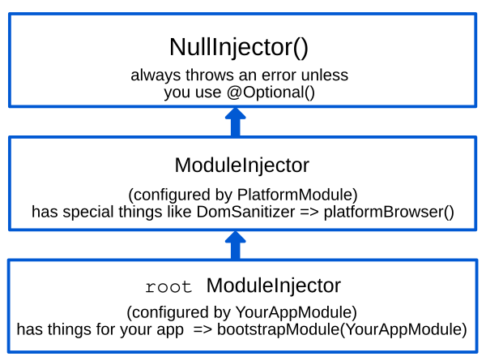
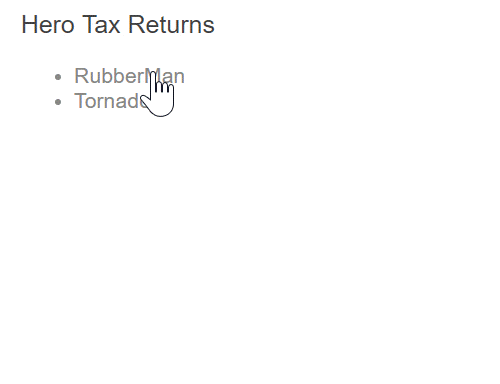
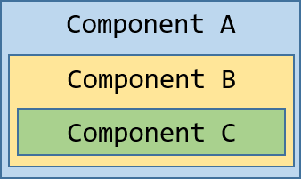
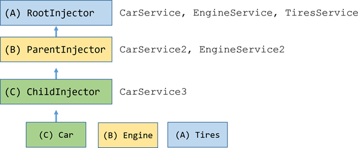

# Иерархические инжекторы

:date: 28.02.2022

Инжекторы в Angular имеют правила, которые вы можете использовать для достижения желаемой видимости инжекторов в ваших приложениях. Понимая эти правила, вы можете определить, в каком `NgModule`, `Component` или `Directive` вам следует объявить провайдер.

!!!note ""

    В этой теме используются следующие пиктограммы.

    | html entities | pictographs         |
    | :------------ | :------------------ |
    | `&#x1F33A;`   | red hibiscus (`🌺`) |
    | `&#x1F33B;`   | sunflower (`🌻`)    |
    | `&#x1F337;`   | tulip (`🌷`)        |
    | `&#x1F33F;`   | fern (`🌿`)         |
    | `&#x1F341;`   | maple leaf (`🍁`)   |
    | `&#x1F433;`   | whale (`🐳`)        |
    | `&#x1F436;`   | dog (`🐶`)          |
    | `&#x1F994;`   | hedgehog (`🦔`)     |

Приложения, которые вы создаете с помощью Angular, могут стать довольно большими, и одним из способов управления этой сложностью является разделение приложения на множество небольших хорошо инкапсулированных модулей, которые сами по себе разделены на четко определенное дерево компонентов.

На вашей странице могут быть разделы, которые работают совершенно независимо от остальной части приложения, со своими локальными копиями служб и других зависимостей, которые им необходимы. Некоторые из сервисов, которые используют эти разделы приложения, могут быть общими с другими частями приложения или с родительскими компонентами, которые находятся дальше по дереву компонентов, в то время как другие зависимости должны быть частными.

С помощью **иерархической инъекции зависимостей** вы можете изолировать разделы приложения и предоставить им свои собственные частные зависимости, не разделяемые с остальной частью приложения, или заставить родительские компоненты разделять определенные зависимости только с дочерними компонентами, но не с остальной частью дерева компонентов, и так далее. Иерархическая инъекция зависимостей позволяет вам обмениваться зависимостями между различными частями приложения только тогда, когда и если это необходимо.

## Типы иерархий инжекторов

Инжекторы в Angular имеют правила, которые вы можете использовать для достижения желаемой видимости инжекторов в ваших приложениях.

Понимая эти правила, вы можете определить, в каком `NgModule`, `Component` или `Directive` вы должны объявить провайдер.

Angular имеет две иерархии инжекторов:

| Иерархии инжекторов        | Подробности                                                                                                                                                       |
| :------------------------- | :---------------------------------------------------------------------------------------------------------------------------------------------------------------- |
| Иерархия `ModuleInjector`  | Настройте `ModuleInjector` в этой иерархии, используя аннотацию `@NgModule()` или `@Injectable()`.                                                                |
| Иерархия `ElementInjector` | Создается неявно в каждом элементе DOM. По умолчанию `ElementInjector` пуст, если вы не настроили его в свойстве `providers` в `@Directive()` или `@Component()`. |

### ModuleInjector

Инжектор модулей можно настроить одним из двух способов, используя:

-   Свойство `@Injectable()` `providedIn` для ссылки на `@NgModule()`, или `root`.
-   Массив `@NgModule()` `providers`.

!!!note "Tree-shaking и `@Injectable()`"

    Использование свойства `@Injectable()` `providedIn` предпочтительнее, чем использование массива `@NgModule()` `providers`. Используя `@Injectable()` `providedIn`, инструменты оптимизации могут выполнять древовидную встряску, которая удаляет сервисы, не используемые вашим приложением. Это приводит к уменьшению размера пакета.

    Tree-shaking особенно полезен для библиотеки, поскольку приложение, использующее библиотеку, может не иметь необходимости в ее инжектировании. Подробнее о [tree-shakable providers](architecture-services.md#providing-services) читайте в [Введение в сервисы и инъекцию зависимостей](architecture-services.md).

`ModuleInjector` конфигурируется свойствами `@NgModule.providers` и `NgModule.imports`. `ModuleInjector` — это уплощение всех массивов провайдеров, которые можно получить, рекурсивно следуя за `NgModule.imports`.

Дочерние иерархии `ModuleInjector` создаются при ленивой загрузке других `@NgModules`.

Предоставляйте сервисы с помощью свойства `providedIn` из `@Injectable()` следующим образом:

```ts
import { Injectable } from '@angular/core';

@Injectable({
    providedIn: 'root', // <--provides this service in the root ModuleInjector
})
export class ItemService {
    name = 'telephone';
}
```

Декоратор `@Injectable()` идентифицирует класс сервиса. Свойство `providedIn` настраивает определенный `ModuleInjector`, здесь `root`, что делает сервис доступным в `root` `ModuleInjector`.

#### Инжектор платформы

Есть еще два инжектора над `root`, дополнительный `ModuleInjector` и `NullInjector()`.

Рассмотрим, как Angular загружает приложение, используя следующее в файле `main.ts`:

```ts
platformBrowserDynamic().bootstrapModule(AppModule).then(ref => {…})
```

Метод `bootstrapModule()` создает дочерний инжектор инжектора платформы, который конфигурируется `AppModule`. Это `корневой` `ModuleInjector`.

Метод `platformBrowserDynamic()` создает инжектор, настроенный `PlatformModule`, который содержит специфические для платформы зависимости. Это позволяет нескольким приложениям совместно использовать конфигурацию платформы.

Например, браузер имеет только одну строку URL, независимо от того, сколько приложений у вас запущено.

Вы можете настроить дополнительные провайдеры на уровне платформы, предоставив `extraProviders` с помощью функции `platformBrowser()`.

Следующим родительским инжектором в иерархии является `NullInjector()`, который является вершиной дерева. Если вы забрались так далеко вверх по дереву, что ищете сервис в `NullInjector()`, вы получите ошибку, если только не использовали `@Optional()`, потому что в конечном итоге все заканчивается на `NullInjector()` и он возвращает ошибку или, в случае `@Optional()`, `null`.

Более подробную информацию о `@Optional()` смотрите в разделе [`@Optional()`](hierarchical-dependency-injection.md#optional) этого руководства.

Следующая диаграмма представляет отношения между `корневым` `ModuleInjector` и его родительскими инжекторами, как описано в предыдущих параграфах.



Хотя имя `root` является специальным псевдонимом, другие иерархии `ModuleInjector` не имеют псевдонимов. У вас есть возможность создавать иерархии `ModuleInjector` всякий раз, когда создается динамически загружаемый компонент, например, Router, который будет создавать дочерние иерархии `ModuleInjector`.

Все запросы направляются к корневому инжектору, независимо от того, настроили ли вы его с помощью метода `bootstrapModule()` или зарегистрировали все провайдеры с `root` в своих собственных сервисах.

!!!note "`@Injectable()` vs. `@NgModule()`"

    Если вы настраиваете провайдера для всего приложения в `@NgModule()` из `AppModule`, он переопределяет провайдера, настроенного для `root` в метаданных `@Injectable()`. Вы можете сделать это, чтобы сконфигурировать провайдера не по умолчанию для сервиса, который совместно используется несколькими приложениями.

    Вот пример случая, когда в конфигурацию маршрутизатора компонента включена стратегия размещения не по умолчанию [location strategy](router.md#location-strategy) путем перечисления его провайдера в списке `providers` модуля `AppModule`.

    ```ts
    providers: [
    	{
    		provide: LocationStrategy,
    		useClass: HashLocationStrategy,
    	},
    ];
    ```

### ElementInjector

Angular создает иерархии `ElementInjector` неявно для каждого элемента DOM.

Предоставление сервиса в декораторе `@Component()` с помощью свойства `providers` или `viewProviders` настраивает `ElementInjector`. Например, следующий `TestComponent` конфигурирует `ElementInjector`, предоставляя сервис следующим образом:

```ts
@Component({
  // …
  providers: [{ provide: ItemService, useValue: { name: 'lamp' } }]
})
export class TestComponent
```

!!!note ""

    Смотрите раздел [правила разрешения](hierarchical-dependency-injection.md#resolution-rules), чтобы понять взаимосвязь между деревом `ModuleInjector` и деревом `ElementInjector`.

Когда вы предоставляете услуги в компоненте, эта услуга доступна через `ElementInjector` в данном экземпляре компонента. Он также может быть виден в дочерних компонентах/директивах на основании правил видимости, описанных в разделе [Правила разрешения](hierarchical-dependency-injection.md#resolution-rules).

Когда экземпляр компонента уничтожается, уничтожается и экземпляр сервиса.

#### `@Directive()` и `@Component()`.

Компонент — это особый тип директивы, а это значит, что так же, как `@Directive()` имеет свойство `providers`, `@Component()` тоже имеет его. Это означает, что директивы, как и компоненты, могут настраивать провайдеров, используя свойство `providers`.

Когда вы настраиваете провайдера для компонента или директивы с помощью свойства `providers`, этот провайдер принадлежит `ElementInjector` этого компонента или директивы.

Компоненты и директивы на одном и том же элементе имеют общий инжектор.

## Правила разрешения {: #resolution-rules}

При разрешении токена для компонента/директивы, Angular разрешает его в два этапа:

1.  По отношению к родителям в иерархии `ElementInjector`.
2.  По отношению к родителям в иерархии `ModuleInjector`.

Когда компонент объявляет зависимость, Angular пытается удовлетворить эту зависимость с помощью собственного `ElementInjector`. Если инжектору компонента не хватает провайдера, он передает запрос вверх к `ElementInjector` своего родительского компонента.

Запросы продолжают передаваться до тех пор, пока Angular не найдет инжектор, способный обработать запрос, или пока не закончатся иерархии предков `ElementInjector`.

Если Angular не находит провайдера ни в одной иерархии `ElementInjector`, он возвращается к элементу, откуда пришел запрос, и ищет его в иерархии `ModuleInjector`. Если Angular все еще не находит провайдера, он выдает ошибку.

Если вы зарегистрировали провайдера для одного и того же DI-токена на разных уровнях, то для разрешения зависимости Angular использует первый встреченный провайдер. Если, например, провайдер зарегистрирован локально в компоненте, которому нужен сервис,

Angular не будет искать другого провайдера той же услуги.

## Модификаторы разрешения

Поведение Angular при разрешении может быть изменено с помощью `@Optional()`, `@Self()`, `@SkipSelf()` и `@Host()`. Импортируйте каждый из них из `@angular/core` и используйте каждый в конструкторе класса компонента, когда вы внедряете свой сервис.

Рабочее приложение, демонстрирующее модификаторы разрешения, которые рассматриваются в этом разделе, смотрите в [примере модификаторов разрешения](https://angular.io/generated/live-examples/resolution-modifiers/stackblitz.html).

### Типы модификаторов

Модификаторы разрешения делятся на три категории:

-   Что делать, если Angular не находит то, что вы ищете, то есть `@Optional()`.
-   Где начать поиск, то есть `@SkipSelf()`.
-   Где остановить поиск, `@Host()` и `@Self()`.

По умолчанию Angular всегда начинает с текущего `Injector` и продолжает поиск по всему пути вверх. Модификаторы позволяют изменять начальное, или _self_, местоположение и конечное местоположение.

Кроме того, вы можете комбинировать все модификаторы, кроме `@Host()` и `@Self()` и, конечно, `@SkipSelf()` и `@Self()`.

### @Optional()

`@Optional()` позволяет Angular считать сервис, который вы вводите, необязательным. Таким образом, если он не может быть разрешен во время выполнения, Angular разрешает его как `null`, а не выдает ошибку.

В следующем примере сервис `OptionalService` не предоставляется ни в сервисе, ни в `@NgModule()`, ни в классе компонента, поэтому он недоступен нигде в приложении.

```ts
export class OptionalComponent {
    constructor(
        @Optional() public optional?: OptionalService
    ) {}
}
```

### @Self()

Используйте `@Self()`, чтобы Angular просматривал `ElementInjector` только для текущего компонента или директивы.

Хорошим вариантом использования `@Self()` является внедрение сервиса, но только если он доступен для текущего элемента хоста. Чтобы избежать ошибок в этой ситуации, комбинируйте `@Self()` с `@Optional()`.

Например, в следующем `SelfComponent` обратите внимание на инжектированный `LeafService` в конструкторе.

```ts
@Component({
    selector: 'app-self-no-data',
    templateUrl: './self-no-data.component.html',
    styleUrls: ['./self-no-data.component.css'],
})
export class SelfNoDataComponent {
    constructor(
        @Self() @Optional() public leaf?: LeafService
    ) {}
}
```

В этом примере есть родительский провайдер, и инжектирование сервиса вернет значение, однако инжектирование сервиса с `@Self()` и `@Optional()` вернет `null`, поскольку `@Self()` говорит инжектору прекратить поиск в текущем хост-элементе.

Другой пример показывает класс компонента с провайдером для `FlowerService`. В этом случае инжектор не смотрит дальше текущего `ElementInjector`, потому что он находит `FlowerService` и возвращает тюльпан &#x1F337;.

```ts
@Component({
    selector: 'app-self',
    templateUrl: './self.component.html',
    styleUrls: ['./self.component.css'],
    providers: [
        {
            provide: FlowerService,
            useValue: { emoji: '🌷' },
        },
    ],
})
export class SelfComponent {
    constructor(@Self() public flower: FlowerService) {}
}
```

### @SkipSelf()

`@SkipSelf()` является противоположностью `@Self()`. При использовании `@SkipSelf()`, Angular начинает поиск сервиса в родительском `ElementInjector`, а не в текущем.

Так, если родительский `ElementInjector` использует значение fern &#x1F33F; для `emoji`, но у вас есть maple leaf &#x1F341; в массиве `providers` компонента, Angular будет игнорировать maple leaf &#x1F341; и использовать fern &#x1F33F;.

Чтобы увидеть это в коде, предположим, что следующее значение для `emoji` — это то, что использовал родительский компонент, как в этом сервисе:

```ts
export class LeafService {
    emoji = '🌿';
}
```

Представьте, что в дочернем компоненте у вас есть другое значение, maple leaf &#x1F341; но вы хотите использовать значение родительского компонента. В этом случае вы используете `@SkipSelf()`:

```ts
@Component({
    selector: 'app-skipself',
    templateUrl: './skipself.component.html',
    styleUrls: ['./skipself.component.css'],
    // Angular would ignore this LeafService instance
    providers: [
        { provide: LeafService, useValue: { emoji: '🍁' } },
    ],
})
export class SkipselfComponent {
    // Use @SkipSelf() in the constructor
    constructor(@SkipSelf() public leaf: LeafService) {}
}
```

В этом случае значение, которое вы получите для `emoji`, будет папоротник &#x1F33F;, а не кленовый лист &#x1F341;.

#### @SkipSelf() с @Optional()

Используйте `@SkipSelf()` с `@Optional()` для предотвращения ошибки, если значение равно `null`. В следующем примере сервис `Person` инжектируется в конструкторе.

`@SkipSelf()` указывает Angular пропустить текущий инжектор, а `@Optional()` предотвратит ошибку, если сервис `Person` окажется `null`.

```ts
class Person {
    constructor(@Optional() @SkipSelf() parent?: Person) {}
}
```

### @Host()

`@Host()` позволяет вам назначить компонент последней остановкой в дереве инжекторов при поиске провайдеров. Даже если есть экземпляр сервиса дальше по дереву, Angular не будет продолжать поиск.

Используйте `@Host()` следующим образом:

```ts
@Component({
    selector: 'app-host',
    templateUrl: './host.component.html',
    styleUrls: ['./host.component.css'],
    //  provide the service
    providers: [
        {
            provide: FlowerService,
            useValue: { emoji: '🌷' },
        },
    ],
})
export class HostComponent {
    // use @Host() in the constructor when injecting the service
    constructor(
        @Host() @Optional() public flower?: FlowerService
    ) {}
}
```

Поскольку `HostComponent` имеет `@Host()` в своем конструкторе, независимо от того, что родитель `HostComponent` может иметь в качестве значения `flower.emoji`, `HostComponent` будет использовать тюльпан &#x1F337;.

## Логическая структура шаблона

Когда вы предоставляете сервисы в классе компонента, сервисы становятся видимыми в дереве `ElementInjector` относительно того, где и как вы предоставляете эти сервисы.

Понимание основной логической структуры шаблона Angular даст вам основу для настройки сервисов и, в свою очередь, управления их видимостью.

Компоненты используются в ваших шаблонах, как в следующем примере:

```html
<app-root>
    <app-child></app-child>
</app-root>
```

!!!note ""

    Обычно компоненты и их шаблоны объявляются в отдельных файлах.
    Для понимания того, как работает система инъекций, полезно рассмотреть их с точки зрения объединенного логического дерева.

    Термин _логическое_ отличает его от дерева рендеринга, которое является DOM-деревом вашего приложения.

    Для обозначения мест расположения шаблонов компонентов в данном руководстве используется псевдоэлемент `<#VIEW>`, который на самом деле не существует в дереве рендеринга и присутствует только в целях ментальной модели.

Ниже приведен пример того, как деревья представлений `<app-root>` и `<app-child>` объединяются в одно логическое дерево:

```html
<app-root>
  <#VIEW>
    <app-child>
     <#VIEW>
       …content goes here…
     </#VIEW>
    </app-child>
  </#VIEW>
</app-root>
```

Понимание идеи демаркации `<#VIEW>` особенно важно, когда вы настраиваете сервисы в классе компонента.

## Предоставление сервисов в `@Компонент()`

То, как вы предоставляете сервисы с помощью декоратора `@Component()`\ (или `@Directive()`\), определяет их видимость. В следующих разделах демонстрируются `providers` и `viewProviders`, а также способы изменения видимости сервисов с помощью `@SkipSelf()` и `@Host()`.

Класс компонента может предоставлять услуги двумя способами:

=== "С помощью массива `providers`"

    ```ts
    @Component({
      …
      providers: [
        {provide: FlowerService, useValue: {emoji: '🌺'}}
      ]
    })
    ```

=== "С массивом `viewProviders`"

    ```ts
    @Component({
      …
     viewProviders: [
        {provide: AnimalService, useValue: {emoji: '🐶'}}
      ]
    })
    ```

Чтобы понять, как `providers` и `viewProviders` по-разному влияют на видимость сервиса, в следующих разделах шаг за шагом строится [пример](https://angular.io/generated/live-examples/providers-viewproviders/stackblitz.html) и сравнивается использование `providers` и `viewProviders` в коде и логическом дереве.

!!!note ""

    В логическом дереве вы увидите `@Provide`, `@Inject` и `@NgModule`, которые не являются настоящими атрибутами HTML, но находятся здесь для демонстрации того, что происходит под капотом.

    | Атрибут службы Angular  | Подробности                                                                                                         |
    | :---------------------- | :------------------------------------------------------------------------------------------------------------------ |
    | `@Inject(Token)=>Value` | Демонстрирует, что если `Token` внедрить в это место логического дерева, то его значением будет `Value`.            |
    | `@Provide(Token=Value)` | Демонстрирует, что в данном месте логического дерева существует объявление провайдера `Token` со значением `Value`. |
    | `@NgModule(Token)`      | Демонстрирует, что в этом месте должен использоваться инжектор `NgModule`.                                          |

### Пример структуры приложения

В примере приложения есть `FlowerService`, предоставленный в `root` со значением `emoji` красного гибискуса &#x1F33A;.

```ts
@Injectable({
    providedIn: 'root',
})
export class FlowerService {
    emoji = '🌺';
}
```

Рассмотрим приложение, в котором есть только `AppComponent` и `ChildComponent`. Самый базовый визуализированный вид будет выглядеть как вложенные HTML-элементы, как показано ниже:

```html
<app-root>
    <!-- AppComponent selector -->
    <app-child>
        <!-- ChildComponent selector -->
    </app-child>
</app-root>
```

Однако за кулисами Angular использует логическое представление представления следующим образом при разрешении инъекционных запросов:

```html
<app-root> <!-- AppComponent selector -->
    <#VIEW>
        <app-child> <!-- ChildComponent selector -->
            <#VIEW>
            </#VIEW>
        </app-child>
    </#VIEW>
</app-root>
```

Здесь `<#VIEW>` представляет собой экземпляр шаблона. Обратите внимание, что каждый компонент имеет свой собственный `<#VIEW>`.

Знание этой структуры может помочь вам понять, как вы предоставляете и внедряете свои службы, и дать вам полный контроль над видимостью служб.

Теперь рассмотрим, что `<app-root>` инжектирует `FlowerService`:

```ts
export class AppComponent {
    constructor(public flower: FlowerService) {}
}
```

Добавьте привязку к шаблону `<app-root>` для визуализации результата:

```html
<p>Emoji from FlowerService: {{flower.emoji}}</p>
```

Вывод в представлении будет следующим:

```shell
Emoji от FlowerService: &#x1F33A;
```

В логическом дереве это будет представлено следующим образом:

```html
<app-root @NgModule(AppModule)
        @Inject(FlowerService) flower=>"🌺">
  <#VIEW>
    <p>Emoji from FlowerService: {{flower.emoji}} (🌺)</p>
    <app-child>
      <#VIEW>
      </#VIEW>
    </app-child>
  </#VIEW>
</app-root>
```

Когда `<app-root>` запрашивает `FlowerService`, задача инжектора — разрешить токен `FlowerService`. Разрешение токена происходит в два этапа:

1.  Инжектор определяет начальное местоположение в логическом дереве и конечное местоположение поиска.

    Инжектор начинает с начального места и ищет токен на каждом уровне логического дерева.

    Если маркер найден, он возвращается.

2.  Если токен не найден, инжектор ищет ближайшего родителя `@NgModule()` для передачи запроса.

В примере ограничения следующие:

1.  Начинается с `<#VIEW>`, принадлежащего `<app-root>` и заканчивается `<app-root>`.

    -   Обычно начальная точка поиска находится в точке внедрения.

        Однако в данном случае `<app-root>` `@Component` являются особенными, поскольку они также включают свои собственные `viewProviders`, поэтому поиск начинается с `<#VIEW>`, принадлежащего `<app-root>`.

        Это не относится к директиве, сопоставленной в том же месте.

    -   Конечное местоположение совпадает с местоположением самого компонента, поскольку он является самым верхним компонентом в этом приложении.

2.  Модуль `AppModule` действует как запасной инжектор, когда инжектируемый токен не может быть найден в иерархии `ElementInjector`.

### Использование массива `providers`.

Теперь в классе `ChildComponent` добавьте провайдер для `FlowerService`, чтобы продемонстрировать более сложные правила разрешения в последующих разделах:

```ts
@Component({
    selector: 'app-child',
    templateUrl: './child.component.html',
    styleUrls: ['./child.component.css'],
    // use the providers array to provide a service
    providers: [
        {
            provide: FlowerService,
            useValue: { emoji: '🌻' },
        },
    ],
})
export class ChildComponent {
    // inject the service
    constructor(public flower: FlowerService) {}
}
```

Теперь, когда `FlowerService` предоставлен в декораторе `@Component()`, когда `<app-child>` запрашивает сервис, инжектору достаточно посмотреть до `ElementInjector` в `<app-child>`. Ему не придется продолжать поиск дальше по дереву инжекторов.

Следующим шагом будет добавление привязки к шаблону `ChildComponent`.

```html
<p>Emoji from FlowerService: {{flower.emoji}}</p>
```

Чтобы отобразить новые значения, добавьте `<app-child>` в нижнюю часть шаблона `AppComponent`, чтобы представление также отображало подсолнух:

```shell
Child Component
Emoji from FlowerService: 🌻
```

В логическом дереве это представлено следующим образом:

```html
<app-root @NgModule(AppModule)
        @Inject(FlowerService) flower=>"🌺">
  <#VIEW>
    <p>Emoji from FlowerService: {{flower.emoji}} (🌺)</p>
    <app-child @Provide(FlowerService="🌻")
               @Inject(FlowerService)=>"🌻"> <!-- search ends here -->
      <#VIEW> <!-- search starts here -->
        <h2>Parent Component</h2>
        <p>Emoji from FlowerService: {{flower.emoji}} (🌻)</p>
      </#VIEW>
    </app-child>
  </#VIEW>
</app-root>
```

Когда `<app-child>` запрашивает `FlowerService`, инжектор начинает поиск с `<#VIEW>`, принадлежащего `<app-child>` (`<#VIEW>` включен, потому что он инжектируется из `@Component()`) и заканчивается `<app-child>`. В этом случае `FlowerService` разрешается в массиве `providers` с sunflower &#x1F33B; из `<app-child>`. Инжектору не нужно искать дальше в дереве инжекторов.

Он останавливается, как только находит `FlowerService`, и никогда не видит красный гибискус &#x1F33A;.

### Использование массива `viewProviders`

Используйте массив `viewProviders` как еще один способ предоставления сервисов в декораторе `@Component()`. Использование `viewProviders` делает сервисы видимыми в `<#VIEW>`.

!!!note ""

    Шаги те же, что и при использовании массива `providers`, за исключением использования массива `viewProviders`.

    Для получения пошаговых инструкций продолжите этот раздел. Если вы можете настроить его самостоятельно, перейдите к [Изменение доступности сервиса](hierarchical-dependency-injection.md#modify-visibility).

В примере приложения для демонстрации `viewProviders` используется второй сервис, `AnimalService`.

Сначала создайте `AnimalService` со свойством `emoji` кита &#x1F433;:

```ts
import { Injectable } from '@angular/core';

@Injectable({
    providedIn: 'root',
})
export class AnimalService {
    emoji = '🐳';
}
```

Следуя той же схеме, что и в случае с `FlowerService`, внедрите `AnimalService` в класс `AppComponent`:

```ts
export class AppComponent {
    constructor(
        public flower: FlowerService,
        public animal: AnimalService
    ) {}
}
```

!!!note ""

    Вы можете оставить весь код, связанный с `FlowerService`, на месте, так как он позволит провести сравнение с `AnimalService`.

В компоненте `ChildComponent` добавьте массив `viewProviders` и инжектируйте в него `AnimalService`. Однако в качестве заначения свойство `emoji` должно возвращать другое значение, в данном случае им будет dog &#x1F436;.

```ts
@Component({
    selector: 'app-child',
    templateUrl: './child.component.html',
    styleUrls: ['./child.component.css'],
    // provide services
    providers: [
        {
            provide: FlowerService,
            useValue: { emoji: '🌻' },
        },
    ],
    viewProviders: [
        {
            provide: AnimalService,
            useValue: { emoji: '🐶' },
        },
    ],
})
export class ChildComponent {
    // inject service
    constructor(
        public flower: FlowerService,
        public animal: AnimalService
    ) {}
}
```

Добавьте привязки к шаблонам `ChildComponent` и `AppComponent`. В шаблоне `ChildComponent` добавьте следующую привязку:

```html
<p>Emoji from AnimalService: {{animal.emoji}}</p>
```

Кроме того, добавьте то же самое в шаблон `AppComponent`:

```html
<p>Emoji from AnimalService: {{animal.emoji}}</p>
```

Теперь вы должны увидеть оба значения в браузере:

```
AppComponent
Emoji from AnimalService: 🐳

Child Component
Emoji from AnimalService: 🐶
```

Логическое дерево для этого примера `viewProviders` выглядит следующим образом:

```html
<app-root @NgModule(AppModule)
         @Inject(AnimalService) animal=>"🐳">
  <#VIEW>
    <app-child>
      <#VIEW @Provide(AnimalService="🐶")
            @Inject(AnimalService=>"🐶")>
       <!-- ^^using viewProviders means AnimalService is available in <#VIEW>-->
       <p>Emoji from AnimalService: {{animal.emoji}} (🐶)</p>
      </#VIEW>
    </app-child>
  </#VIEW>
</app-root>
```

Как и в примере с `FlowerService`, `AnimalService` предоставляется в декораторе `<app-child>` `@Component()`. Это означает, что поскольку инжектор сначала ищет в `ElementInjector` компонента, он находит значение `AnimalService` собаки &#x1F436;.

Ему не нужно продолжать поиск в дереве `ElementInjector`, равно как и в `ModuleInjector`.

### `providers` vs. `viewProviders`

Чтобы увидеть разницу между использованием `providers` и `viewProviders`, добавьте в пример еще один компонент и назовите его `InspectorComponent`. `InspectorComponent` будет дочерним компонентом `ChildComponent`.

В `inspector.component.ts` в конструкторе внедрите `FlowerService` и `AnimalService`:

```ts
export class InspectorComponent {
    constructor(
        public flower: FlowerService,
        public animal: AnimalService
    ) {}
}
```

Вам не нужен массив `providers` или `viewProviders`. Далее, в `inspector.component.html`, добавьте ту же разметку, что и в предыдущих компонентах:

```html
<p>Emoji from FlowerService: {{flower.emoji}}</p>
<p>Emoji from AnimalService: {{animal.emoji}}</p>
```

Не забудьте добавить `InspectorComponent` в массив `AppModule` `declarations`.

```ts
@NgModule({
    imports: [BrowserModule, FormsModule],
    declarations: [
        AppComponent,
        ChildComponent,
        InspectorComponent,
    ],
    bootstrap: [AppComponent],
    providers: [],
})
export class AppModule {}
```

Далее, убедитесь, что ваш `child.component.html` содержит следующее:

```html
<p>Emoji from FlowerService: {{flower.emoji}}</p>
<p>Emoji from AnimalService: {{animal.emoji}}</p>

<div class="container">
    <h3>Content projection</h3>
    <ng-content></ng-content>
</div>

<h3>Inside the view</h3>
<app-inspector></app-inspector>
```

Первые две строки с привязками остались от предыдущих шагов. Новые части — это `<ng-content>` и `<app-inspector>`.

`<ng-content>` позволяет вам проектировать контент, а `<app-inspector>` внутри шаблона `ChildComponent` делает `InspectorComponent` дочерним компонентом `ChildComponent`.

Далее, добавьте следующее в `app.component.html`, чтобы воспользоваться преимуществами проекции содержимого.

```html
<app-child><app-inspector></app-inspector></app-child>
```

Теперь браузер отображает следующее, опуская предыдущие примеры для краткости:

```
//…Omitting previous examples. The following applies to this section.

Content projection: this is coming from content. Doesn't get to see
puppy because the puppy is declared inside the view only.

Emoji from FlowerService: 🌻
Emoji from AnimalService: 🐳

Emoji from FlowerService: 🌻
Emoji from AnimalService: 🐶
```

Эти четыре привязки демонстрируют разницу между `providers` и `viewProviders`. Поскольку собака &#x1F436; объявлена внутри `<#VIEW>`, она не видна проецируемому содержимому.
Вместо этого проецируемое содержимое видит кита &#x1F433;.

Однако в следующем разделе, где `InspectorComponent` является дочерним компонентом `ChildComponent`, `InspectorComponent` находится внутри `<#VIEW>`, поэтому когда он запрашивает `AnimalService`, он видит собаку &#x1F436;.

В логическом дереве `AnimalService` будет выглядеть следующим образом:

```html
<app-root @NgModule(AppModule)
         @Inject(AnimalService) animal=>"🐳">
  <#VIEW>
    <app-child>
      <#VIEW @Provide(AnimalService="🐶")
            @Inject(AnimalService=>"🐶")>
        <!-- ^^using viewProviders means AnimalService is available in <#VIEW>-->
        <p>Emoji from AnimalService: {{animal.emoji}} (🐶)</p>

        <div class="container">
          <h3>Content projection</h3>
          <app-inspector @Inject(AnimalService) animal=>"🐳">
            <p>Emoji from AnimalService: {{animal.emoji}} (🐳)</p>
          </app-inspector>
        </div>

      </#VIEW>
      <app-inspector>
        <#VIEW>
          <p>Emoji from AnimalService: {{animal.emoji}} (🐶)</p>
        </#VIEW>
      </app-inspector>
    </app-child>
  </#VIEW>
</app-root>
```

Проектируемое содержимое `<app-inspector>` видит кита &#x1F433;, а не собаку &#x1F436;, потому что собака &#x1F436; находится внутри `<app-child>` `<#VIEW>`. Инспектор `<app-inspector>` может увидеть собаку &#x1F436; только если она также находится внутри `<#VIEW>`.

## Изменение видимости сервиса {: #modify-visibility}

В этом разделе описывается, как ограничить область видимости начального и конечного `ElementInjector` с помощью декораторов видимости `@Host()`, `@Self()` и `@SkipSelf()`.

### Видимость предоставляемых лексем

Декораторы видимости влияют на то, где в дереве логики начинается и заканчивается поиск маркера инъекции. Для этого размещайте декораторы видимости в точке инъекции, то есть в `constructor()`, а не в точке объявления.

Чтобы изменить, где инжектор начинает искать `FlowerService`, добавьте `@SkipSelf()` в объявление `<app-child>` `@Inject` для `FlowerService`. Это объявление находится в конструкторе `<app-child>`, как показано в `child.component.ts`:

```ts
constructor(@SkipSelf() public flower : FlowerService) { }
```

При использовании `@SkipSelf()` инжектор `<app-child>` не ищет `FlowerService` в себе. Вместо этого инжектор начинает искать `FlowerService` в `ElementInjector` или `<app-root>`, где ничего не находит.

Затем он возвращается к `<app-child>` `ModuleInjector` и находит значение красного гибискуса &#x1F33A;, которое доступно, потому что `<app-child>` `ModuleInjector` и `<app-root>` `ModuleInjector` сплющены в один `ModuleInjector`.

Таким образом, пользовательский интерфейс отображается следующим образом:

```
Emoji from FlowerService: 🌺
```

В логическом дереве эта же идея может выглядеть следующим образом:

```html
<app-root @NgModule(AppModule)
        @Inject(FlowerService) flower=>"🌺">
  <#VIEW>
    <app-child @Provide(FlowerService="🌻")>
      <#VIEW @Inject(FlowerService, SkipSelf)=>"🌺">
        <!-- With SkipSelf, the injector looks to the next injector up the tree -->
      </#VIEW>
    </app-child>
  </#VIEW>
</app-root>
```

Хотя `<app-child>` предоставляет подсолнух &#x1F33B;, приложение отображает красный гибискус &#x1F33A;, потому что `@SkipSelf()` заставляет текущий инжектор пропустить себя и обратиться к своему родителю.

Если теперь добавить `@Host()` (в дополнение к `@SkipSelf()`) к `@Inject` службы `FlowerService`, результатом будет `null`. Это происходит потому, что `@Host()` ограничивает верхнюю границу поиска до `<#VIEW>`.

Вот идея в логическом дереве:

```html
<app-root @NgModule(AppModule)
        @Inject(FlowerService) flower=>"🌺">
  <#VIEW> <!-- end search here with null-->
    <app-child @Provide(FlowerService="🌻")> <!-- start search here -->
      <#VIEW @Inject(FlowerService, @SkipSelf, @Host, @Optional)=>null>
      </#VIEW>
      </app-parent>
  </#VIEW>
</app-root>
```

Здесь сервисы и их значения одинаковы, но `@Host()` не позволяет инжектору искать `<#VIEW>` для `FlowerService`, поэтому он не находит его и возвращает `null`.

!!!note ""

    В примере приложения используется `@Optional()`, поэтому приложение не выбрасывает ошибку, но принципы те же.

### @SkipSelf() и viewProviders

В настоящее время `<app-child>` предоставляет `AnimalService` в массиве `viewProviders` со значением dog &#x1F436;. Поскольку инжектор должен только посмотреть на `ElementInjector` из `<app-child>` для `AnimalService`, он никогда не увидит кита &#x1F433;.

Как и в примере с `FlowerService`, если вы добавите `@SkipSelf()` в конструктор для `AnimalService`, инжектор не будет смотреть в `ElementInjector` текущего `<app-child>` для `AnimalService`.

```ts
export class ChildComponent {
    // add @SkipSelf()
    constructor(@SkipSelf() public animal: AnimalService) {}
}
```

Вместо этого инжектор будет начинаться с `<app-root>` `ElementInjector`. Помните, что класс `<app-child>` предоставляет `AnimalService` в массиве `viewProviders` со значением dog &#x1F436;:

```ts
@Component({
  selector: 'app-child',
  …
  viewProviders:
  [{ provide: AnimalService, useValue: { emoji: '🐶' } }]
})
```

Логическое дерево выглядит следующим образом с `@SkipSelf()` в `<app-child>`:

```html
<app-root @NgModule(AppModule)
          @Inject(AnimalService=>"🐳")>
  <#VIEW><!-- search begins here -->
    <app-child>
      <#VIEW @Provide(AnimalService="🐶")
             @Inject(AnimalService, SkipSelf=>"🐳")>
        <!--Add @SkipSelf -->
      </#VIEW>
    </app-child>
  </#VIEW>
</app-root>
```

С `@SkipSelf()` в `<app-child>`, инжектор начинает поиск `AnimalService` в `<app-root>` `ElementInjector` и находит кита &#x1F433;.

### @Host() и viewProviders

Если вы добавите `@Host()` в конструктор для `AnimalService`, результатом будет собака &#x1F436; потому что инжектор находит `AnimalService` в `<app-child>` `<#VIEW>`. Вот массив `viewProviders` в классе `<app-child>` и `@Host()` в конструкторе:

```ts
@Component({
  selector: 'app-child',
  …
  viewProviders:
  [{ provide: AnimalService, useValue: { emoji: '🐶' } }]

})
export class ChildComponent {
  constructor(@Host() public animal : AnimalService) { }
}
```

`@Host()` заставляет инжектор искать, пока он не встретит край `<#VIEW>`.

```html
<app-root @NgModule(AppModule)
          @Inject(AnimalService=>"🐳")>
  <#VIEW>
    <app-child>
      <#VIEW @Provide(AnimalService="🐶")
             @Inject(AnimalService, @Host=>"🐶")> <!-- @Host stops search here -->
      </#VIEW>
    </app-child>
  </#VIEW>
</app-root>
```

Добавьте массив `viewProviders` с третьим животным, ежом &#x1F994;, в метаданные `app.component.ts` `@Component()`:

```ts
@Component({
  selector: 'app-root',
  templateUrl: './app.component.html',
  styleUrls: [ './app.component.css' ],
  viewProviders: [{ provide: AnimalService, useValue: { emoji: '🦔' } }]
})
```

Затем добавьте `@SkipSelf()` вместе с `@Host()` в конструктор для `Animal Service` в `child.component.ts`. Вот `@Host()` и `@SkipSelf()` в конструкторе `<app-child>`:

```ts
export class ChildComponent {
    constructor(
        @Host() @SkipSelf() public animal: AnimalService
    ) {}
}
```

Когда `@Host()` и `SkipSelf()` были применены к `FlowerService`, который находится в массиве `providers`, результат был `null`, потому что `@SkipSelf()` начинает поиск в инжекторе `<app-child>`, но `@Host()` прекращает поиск в `<#VIEW>` &mdash; где нет `FlowerService` В логическом дереве видно, что `FlowerService` виден в `<app-child>`, а не в его `<#VIEW>`.

Однако `AnimalService`, который предоставляется в массиве `AppComponent` `viewProviders`, виден.

Представление логического дерева показывает, почему это так:

```html
<app-root @NgModule(AppModule)
        @Inject(AnimalService=>"🐳")>
  <#VIEW @Provide(AnimalService="🦔")
         @Inject(AnimalService, @Optional)=>"🦔">
    <!-- ^^@SkipSelf() starts here,  @Host() stops here^^ -->
    <app-child>
      <#VIEW @Provide(AnimalService="🐶")
             @Inject(AnimalService, @SkipSelf, @Host, @Optional)=>"🦔">
               <!-- Add @SkipSelf ^^-->
      </#VIEW>
      </app-child>
  </#VIEW>
</app-root>
```

`@SkipSelf()`, заставляет инжектор начать поиск `AnimalService` в `<app-root>`, а не в `<app-child>`, откуда пришел запрос, а `@Host()` останавливает поиск в `<app-root>` `<#VIEW>`. Поскольку `AnimalService` предоставляется через массив `viewProviders`, инжектор находит ежа &#x1F994; в `<#VIEW>`.

## Примеры использования ElementInjector

Возможность настраивать один или несколько провайдеров на разных уровнях открывает полезные возможности. Чтобы посмотреть на следующие сценарии в работающем приложении, смотрите [примеры использования героев](https://angular.io/generated/live-examples/hierarchical-dependency-injection/stackblitz.html).

### Сценарий: изоляция сервисов

Архитектурные причины могут заставить вас ограничить доступ к службе доменом приложения, к которому она принадлежит. Например, пример руководства включает `VillainsListComponent`, который отображает список злодеев.

Он получает этих злодеев из службы `VillainsService`.

Если бы вы указали `VillainsService` в корневом `AppModule` (где вы зарегистрировали `HeroesService`), это сделало бы `VillainsService` видимым везде в приложении, включая рабочие процессы _Hero_. Если бы вы позже изменили `VillainsService`, вы могли бы сломать что-нибудь в компоненте героя.

Вместо этого вы можете предоставить `VillainsService` в метаданных `providers` компонента `VillainsListComponent` следующим образом:

```ts
@Component({
  selector: 'app-villains-list',
  templateUrl: './villains-list.component.html',
  providers: [ VillainsService ]
})
```

Предоставляя `VillainsService` в метаданных `VillainsListComponent` и нигде больше, сервис становится доступным только в `VillainsListComponent` и его дереве подкомпонентов.

`VillainService` является синглтоном по отношению к `VillainsListComponent`, потому что именно там он объявлен. Пока `VillainsListComponent` не будет уничтожен, он будет тем же самым экземпляром `VillainService`, но если есть несколько экземпляров `VillainsListComponent`, то каждый экземпляр `VillainsListComponent` будет иметь свой собственный экземпляр `VillainService`.

### Сценарий: несколько сеансов редактирования

Многие приложения позволяют пользователям работать над несколькими открытыми задачами одновременно. Например, в приложении для подготовки налогов специалист может работать над несколькими налоговыми декларациями, переключаясь с одной на другую в течение дня.

Чтобы продемонстрировать этот сценарий, представьте внешний компонент `HeroListComponent`, который отображает список супергероев.

Чтобы открыть налоговую декларацию героя, специалист по подготовке документов щелкает на имени героя, что открывает компонент для редактирования этой декларации. Налоговая декларация каждого выбранного героя открывается в отдельном компоненте, и несколько деклараций могут быть открыты одновременно.

Каждый компонент налоговой декларации имеет следующие характеристики:

-   Является собственным сеансом редактирования налоговой декларации.
-   Может изменять налоговую декларацию, не затрагивая декларацию в другом компоненте.
-   Имеет возможность сохранить изменения в своей налоговой декларации или отменить их



Предположим, что `HeroTaxReturnComponent` имеет логику для управления и восстановления изменений. Это была бы простая задача для героической налоговой декларации.
В реальном мире, с богатой моделью данных налоговой декларации, управление изменениями было бы сложным.

Вы можете делегировать это управление вспомогательной службе, как это сделано в данном примере.

Служба `HeroTaxReturnService` кэширует одну `HeroTaxReturn`, отслеживает изменения в этой декларации, может сохранять или восстанавливать ее. Он также делегирует полномочия синглтону приложения `HeroService`, который он получает путем инъекции.

```ts
import { Injectable } from '@angular/core';
import { HeroTaxReturn } from './hero';
import { HeroesService } from './heroes.service';

@Injectable()
export class HeroTaxReturnService {
    private currentTaxReturn!: HeroTaxReturn;
    private originalTaxReturn!: HeroTaxReturn;

    constructor(private heroService: HeroesService) {}

    set taxReturn(htr: HeroTaxReturn) {
        this.originalTaxReturn = htr;
        this.currentTaxReturn = htr.clone();
    }

    get taxReturn(): HeroTaxReturn {
        return this.currentTaxReturn;
    }

    restoreTaxReturn() {
        this.taxReturn = this.originalTaxReturn;
    }

    saveTaxReturn() {
        this.taxReturn = this.currentTaxReturn;
        this.heroService
            .saveTaxReturn(this.currentTaxReturn)
            .subscribe();
    }
}
```

Вот `HeroTaxReturnComponent`, который использует `HeroTaxReturnService`.

```ts
import {
    Component,
    EventEmitter,
    Input,
    Output,
} from '@angular/core';
import { HeroTaxReturn } from './hero';
import { HeroTaxReturnService } from './hero-tax-return.service';

@Component({
    selector: 'app-hero-tax-return',
    templateUrl: './hero-tax-return.component.html',
    styleUrls: ['./hero-tax-return.component.css'],
    providers: [HeroTaxReturnService],
})
export class HeroTaxReturnComponent {
    message = '';

    @Output() close = new EventEmitter<void>();

    get taxReturn(): HeroTaxReturn {
        return this.heroTaxReturnService.taxReturn;
    }

    @Input()
    set taxReturn(htr: HeroTaxReturn) {
        this.heroTaxReturnService.taxReturn = htr;
    }

    constructor(
        private heroTaxReturnService: HeroTaxReturnService
    ) {}

    onCanceled() {
        this.flashMessage('Canceled');
        this.heroTaxReturnService.restoreTaxReturn();
    }

    onClose() {
        this.close.emit();
    }

    onSaved() {
        this.flashMessage('Saved');
        this.heroTaxReturnService.saveTaxReturn();
    }

    flashMessage(msg: string) {
        this.message = msg;
        setTimeout(() => (this.message = ''), 500);
    }
}
```

Данные _tax-return-to-edit_ поступают через свойство `@Input()`, которое реализовано с помощью геттеров и сеттеров. Сеттер инициализирует собственный экземпляр компонента `HeroTaxReturnService` входящим возвратом.

Геттер всегда возвращает то, что, по словам службы, является текущим состоянием героя.

Компонент также просит службу сохранить и восстановить эту налоговую декларацию.

Это не будет работать, если служба является синглтоном всего приложения. Каждый компонент будет использовать один и тот же экземпляр службы, и каждый компонент будет перезаписывать налоговую декларацию, принадлежащую другому герою.

Чтобы предотвратить это, настройте инжектор компонента `HeroTaxReturnComponent` на предоставление сервиса, используя свойство `providers` в метаданных компонента.

```ts
providers: [HeroTaxReturnService];
```

У `HeroTaxReturnComponent` есть свой собственный провайдер `HeroTaxReturnService`. Вспомните, что каждый компонент _экземпляр_ имеет свой инжектор.

Предоставление сервиса на уровне компонента гарантирует, что _каждый_ экземпляр компонента получает частный экземпляр сервиса. Это гарантирует, что ни одна налоговая декларация не будет перезаписана.

!!!note ""

    Остальная часть кода сценария опирается на другие возможности и приемы Angular, о которых вы можете узнать в других разделах документации. Вы можете ознакомиться с ним и загрузить его из [примера](https://angular.io/generated/live-examples/hierarchical-dependency-injection/stackblitz.html).

### Сценарий: специализированные поставщики услуг

Другая причина для повторного предоставления сервиса на другом уровне — это замена _более специализированной_ реализации этого сервиса, расположенной глубже в дереве компонентов.

Например, рассмотрим компонент `Car`, который включает информацию о шиномонтаже и зависит от других сервисов для предоставления более подробной информации об автомобиле.

Корневой инжектор, обозначенный как (A), использует _общие_ провайдеры для подробностей о `CarService` и `EngineService`.

1.  Компонент `Car` (A). Компонент (A) отображает данные о шиномонтаже автомобиля и указывает общие службы для предоставления дополнительной информации об автомобиле.

2.  Дочерний компонент (B). Компонент (B) определяет свои собственные, _специализированные_ провайдеры для `CarService` и `EngineService`, которые имеют специальные возможности, подходящие для того, что происходит в компоненте (B).

3.  Дочерний компонент (C) как дочерний компонент (B). Компонент (C) определяет свой собственный, еще более специализированный провайдер для `CarService`.



За кулисами каждый компонент устанавливает свой собственный инжектор с нулем, одним или несколькими провайдерами, определенными для этого компонента.

Когда вы разрешаете экземпляр `Car` в самом глубоком компоненте (C), его инжектор производит:

-   Экземпляр `Car`, разрешенный инжектором (C)
-   Двигатель `Engine`, разрешенный инжектором (B)
-   Его `Tires`, разрешенный корневым инжектором (A).



## Подробнее об инъекции зависимостей

Для получения дополнительной информации об инъекции зависимостей Angular смотрите руководства [DI Providers](dependency-injection-providers.md) и [DI in Action](dependency-injection-in-action.md).
