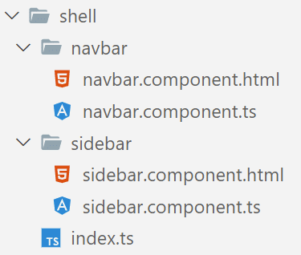
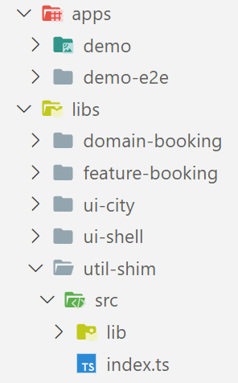
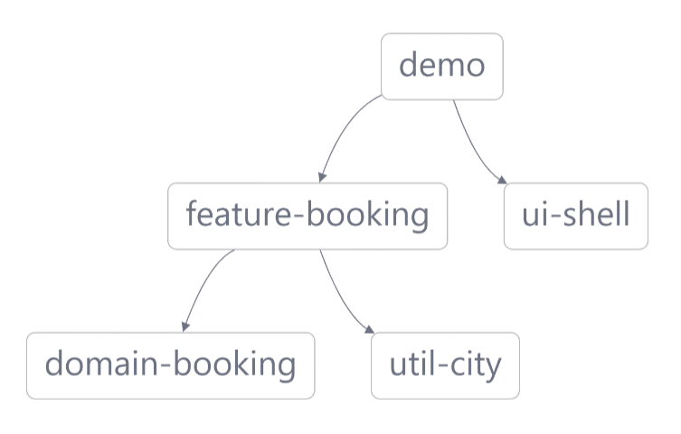

# Архитектура с автономными компонентами

В прошлой главе я показал, как автономные компоненты сделают наши приложения Angular более легковесными в будущем. В этой части я расскажу о том, как улучшить архитектуру с их помощью.

> **Исходный код** для этого можно найти в виде традиционного [Angular CLI workspace](https://github.com/manfredsteyer/standalone-example-cli) и в виде [Nx workspace](https://github.com/manfredsteyer/standalone-example-nx), который использует библиотеки вместо NgModules.

## Группировка строительных блоков {#leanpub-auto-grouping-building-blocks}

К сожалению, примеры, показанные до сих пор, не могут удовлетворить один аспект NgModules. А именно, возможность группировки строительных блоков, которые обычно используются вместе.

Очевидно, что самый простой подход к группировке вещей, которые используются вместе, - это использование папок. Однако вы можете пойти еще дальше, используя бочки: Бочка - это файл EcmaScript, который экспортирует связанные элементы.

Эти файлы часто называются `public-api.ts` или `index.ts`. Используемый пример проекта содержит такой `index.ts` для группировки двух навигационных компонентов из папки shell:



Сама бочка реэкспортирует два компонента:

```ts
export { NavbarComponent } from './navbar/navbar.component';
export { SidebarComponent } from './sidebar/sidebar.component';
```

Самое лучшее - это реальная модульность: Все, что эксперты бочки могут использовать в других частях вашего приложения. Все остальное - ваш секрет. Вы можете изменять эти секреты по своему усмотрению, пока публичный API, определенный вашей бочкой, остается обратно совместимым.

Чтобы использовать бочку, просто укажите на нее с помощью `import`:

```ts
import {
    NavbarComponent,
    SidebarComponent,
} from './shell/index';

@Component({
    standalone: true,
    selector: 'app-root',
    imports: [
        RouterOutlet,
        NavbarComponent,
        SidebarComponent,
    ],
    templateUrl: './app.component.html',
    styleUrls: ['./app.component.css'],
})
export class AppComponent {
    /* [...] */
}
```

Если вы назовете свой бочонок `index.ts`, то имя файла можно даже не указывать, поскольку `index` - это имя по умолчанию при настройке компилятора TypeScript на использование соглашений, основанных на Node.js. То же самое происходит и в мире Angular и CLI:

```ts
import { NavbarComponent, SidebarComponent } from './shell';

@Component({
    standalone: true,
    selector: 'app-root',
    imports: [
        RouterOutlet,
        NavbarComponent,
        SidebarComponent,
    ],
    templateUrl: './app.component.html',
    styleUrls: ['./app.component.css'],
})
export class AppComponent {
    /* [...] */
}
```

## Импорт целых бочек {#leanpub-auto-importing-whole-barrels}

В предыдущем разделе `NavbarComponent` и `SidebarComponent` были частью общедоступного API оболочки. Тем не менее. Angular не предоставляет возможности импортировать сразу все, что предоставляет бочка.

В большинстве случаев это совершенно нормально. Автоимпорты, предоставляемые вашей IDE, в любом случае добавят необходимые элементы. Кроме того, явное указание на то, что вам нужно, помогает избежать древовидных изменений.

Однако в некоторых случаях, когда вы знаете, что некоторые строительные блоки **всегда** идут вместе, например, из-за сильной взаимной зависимости, помещение их в массив может облегчить нам жизнь. Например, подумайте обо всех директивах, предоставляемых модулем FormsModule. Обычно мы даже не знаем ни их точных названий, ни того, какие из них работают вместе.

Следующий пример демонстрирует эту идею:

```ts
import { NavbarComponent } from './navbar/navbar.component';
import { SidebarComponent } from './sidebar/sidebar.component';

export { NavbarComponent } from './navbar/navbar.component';
export { SidebarComponent } from './sidebar/sidebar.component';

export const SHELL = [NavbarComponent, SidebarComponent];
```

Интересно, что такие массивы напоминают нам раздел `exports` в NgModules. Обратите внимание, что ваш массив должен быть константой. Это необходимо, потому что компилятор Angular использует его уже во время компиляции.

Такие массивы можно сразу поместить в массив `imports`. Распределять их не нужно:

```ts
import { SHELL } from './shell';

/* [...] */

@Component({
    standalone: true,
    selector: 'app-root',
    imports: [
        RouterOutlet,

        // NavbarComponent,
        // SidebarComponent,
        SHELL,
    ],
    templateUrl: './app.component.html',
    styleUrls: ['./app.component.css'],
})
export class AppComponent {
    /* [...] */
}
```

Еще раз хочу подчеркнуть, что этот стиль, основанный на массивах, следует использовать только с осторожностью. Хотя он позволяет группировать вещи, которые всегда идут вместе, он также делает ваш код менее устойчивым к деревьям.

## Бочки с красивыми именами: Сопоставления путей {#leanpub-auto-barrels-with-pretty-names-path-mappings}

Простое использование операторов `import`, которые напрямую указывают на другие части вашего приложения, часто приводит к длинным относительным и запутанным путям:

```ts
import { SHELL } from `../../../../shell`;

@Component({
    standalone: true,
    selector: `app-my-cmp`,
    imports: [
        SHELL,
        /* [...] */
    ],
})
export class MyComponent {}
```

Чтобы обойти это, вы можете определить сопоставление путей для бочек, из которых вы импортируете, в конфигурации TypeScript (`tsconfig.json` в корне проекта):

```ts
"paths": {
	"@demo/shell": ["src/app/shell/index.ts"],
  	/* [...] */
}
```

Это позволяет получить прямой доступ к бочке, используя четко определенное имя, без необходимости беспокоиться об относительных путях - иногда чрезмерных:

```ts
// Import via mapped path:
import { SHELL } from '@demo/shell';

@Component({
    standalone: true,
    selector: 'app-root',
    imports: [
        SHELL,
        /* [...] */
    ],
})
export class MyComponent {}
```

## Библиотеки рабочей области и Nx {#leanpub-auto-workspace-libraries-and-nx}

Эти сопоставления путей можно, конечно, создать вручную. Однако с расширением CLI [Nx](https://nx.dev/), которое автоматически генерирует такие сопоставления путей для каждой библиотеки, созданной в рабочем пространстве, дело обстоит немного проще. Библиотеки в любом случае кажутся лучшим решением, особенно потому, что они больше подразделяют его, а Nx не позволяет обойти бочку библиотеки.

Это означает, что каждая библиотека состоит из публичной - фактически опубликованной - и приватной части. Здесь же указываются публичный и приватный API библиотеки. Все, что библиотека экспортирует через свою бочку, является публичным. Остальное - приватно и, следовательно, является "секретом" библиотеки, к которому другие части приложения не могут получить доступ.

Именно такие "секреты" являются простым, но эффективным ключом к стабильным архитектурам, тем более что все, что не опубликовано, может быть легко изменено впоследствии. Публичный API, с другой стороны, следует изменять только с осторожностью, тем более что неполноценное изменение может привести к проблемам в других частях проекта.

Nx-проект (рабочее пространство), представляющий отдельные области решения Angular в виде библиотек, может иметь следующую структуру:



Каждая библиотека получает бочку, которая отражает публичный API. Префиксы в названиях библиотек отражают категоризацию, рекомендованную командой Nx. Например, библиотеки функций содержат умные компоненты, знающие сценарии использования, а библиотеки пользовательского интерфейса - многократно используемые немые компоненты. Библиотека домена содержит клиентское представление нашей доменной модели и сервисов, работающих на ней, а библиотеки утилит - общие вспомогательные функции.

На основе таких категорий Nx позволяет определять правила линтинга, которые предотвращают нежелательный доступ между библиотеками. Например, можно указать, что библиотека домена должна иметь доступ только к библиотекам утилит и не иметь доступа к библиотекам пользовательского интерфейса:


Кроме того, Nx позволяет визуализировать зависимости между библиотеками:



Если вы хотите увидеть все это в действии, не стесняйтесь взглянуть на Nx-версию примера, используемого здесь. Вы можете найти [Исходный код на GitHub](https://github.com/manfredsteyer/demo-nx-standalone).

Помимо обеспечения соблюдения границ модулей, Nx также обладает несколькими дополнительными важными возможностями: Он позволяет осуществлять инкрементный CI/CD, который перестраивает и перепроверяет только те части монорепо, которые были реально затронуты изменением кода. Кроме того, вместе с Nx Cloud он позволяет автоматически распараллеливать весь процесс CI/CD. Кроме того, он поставляется с интеграцией в несколько полезных инструментов, таких как Storybook, Cypress или Playwright.

## Границы модулей с Sheriff {#leanpub-auto-module-boundaries-with-sheriff}

Как и Nx, проект с открытым исходным кодом [Sheriff](https://github.com/softarc-consulting/sheriff) также позволяет устанавливать границы модулей. Однако вместо библиотек для определения модулей он использует папки. Это делает структуру приложения более легковесной.

Технически Sheriff используется как плагин eslint. Он работает как с традиционными проектами Angular CLI, так и с Nx. Мы часто комбинируем его с Nx, чтобы получить лучшее из двух миров: инкрементальный CI/CD, предоставляемый Nx, и легкие границы модулей на основе папок, предоставляемые Sheriff.

## Заключение {#leanpub-auto-conclusion-1}

Автономные компоненты делают будущее Angular-приложений более легковесным. Нам больше не нужны NgModules. Вместо них мы просто используем модули EcmaScript. Это делает решения Angular более простыми и снижает входной барьер в мир фреймворка. Благодаря ментальной модели, которая рассматривает отдельные компоненты как комбинацию компонента и NgModule, эта новая форма разработки остается совместимой с существующим кодом.

Для группировки связанных строительных блоков простые бочки идеально подходят для небольших решений. Для более крупных проектов переход к монорепозициям, предлагаемым CLI-расширением Nx, представляется следующим логическим шагом. Библиотеки подразделяют общее решение на части и предлагают публичные API на основе бочек. Кроме того, зависимости между библиотеками можно визуализировать и избегать с помощью линтинга.
