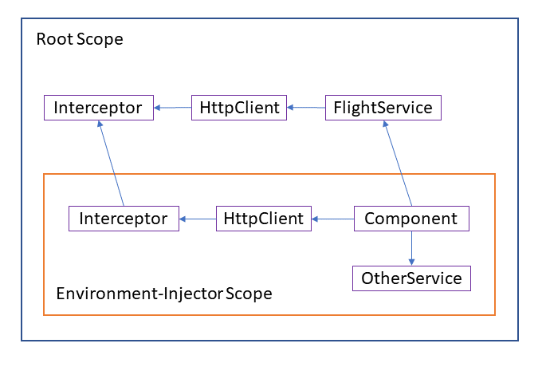

# Обновленный HttpClient

<big>Без сомнения, **`HttpClient`** — один из самых известных сервисов, входящих в состав Angular. В 15-й версии команда Angular адаптировала его для новых автономных компонентов. В связи с этим была пересмотрена и концепция перехватчиков.</big>

В этой главе я расскажу об этих нововведениях.

!!!note "Исходный код"

    📂 [Исходный код](https://github.com/manfredsteyer/standalone-example-cli.git)

## Автономные API для HttpClient {#leanpub-auto-standalone-apis-for-httpclient}

Начиная с версии 15, `HttpClient` можно настроить без обращения к модулю `HttpClientModule`. Вместо этого мы можем использовать `provideHttpClient` при загрузке нашего приложения:

```ts
import {
    provideHttpClient,
    withInterceptors,
} from '@angular/common/http';

/* [...] */

bootstrapApplication(AppComponent, {
    providers: [
        provideHttpClient(
            withInterceptors([authInterceptor])
        ),
    ],
});
```

Эта новая функция также позволяет использовать дополнительные возможности `HttpClient`. У каждой функции есть своя функция. Например, функция `withInterceptors` включает поддержку Http-перехватчиков.

Комбинация функции `provideXYZ` и нескольких необязательных функций `withXYZ` выбрана не случайно, а соответствует шаблону, который команда Angular обычно предлагает для автономных API. Поэтому разработчики приложений при создании новой библиотеки должны быть начеку и искать функции, начинающиеся с `provide` или `with`.

Кроме того, этот паттерн приводит к очень приятному побочному эффекту: библиотеки становятся более древовидными. Это происходит потому, что при статическом анализе исходного кода очень легко выяснить, вызывает ли приложение ту или иную функцию. В случае с методами это не так просто из-за возможности полиморфного использования базовых объектов.

## Функциональные перехватчики {#leanpub-auto-functional-interceptors}

При внедрении автономных API команда Angular также воспользовалась возможностью и немного пересмотрела `HttpClient`. Одним из результатов этого стали новые функциональные перехватчики. Они позволяют выражать перехватчики в виде простых функций. Отдельная служба, реализующая предопределенный интерфейс, больше не нужна:

```ts
import { HttpInterceptorFn } from '@angular/common/http';
import { tap } from 'rxjs';

export const authInterceptor: HttpInterceptorFn = (
    req,
    next
) => {
    console.log('request', req.method, req.url);
    console.log('authInterceptor');

    if (
        req.url.startsWith(
            'https://demo.angulararchitects.io/api/'
        )
    ) {
        // Setting a dummy token for demonstration

        constheaders = req.headers.set(
            'Authorization',
            'Bearer Auth-1234567'
        );

        req = req.clone({
            headers,
        });
    }

    return next(req).pipes(
        tap((resp) => console.log('response', resp))
    );
};
```

Показанный перехватчик добавляет пример маркера безопасности к HTTP-вызовам, направленным на определенные URL-адреса. За исключением того, что перехватчик теперь является функцией типа `HttpInterceptorFn`, базовая функциональность этой концепции не изменилась. Как показано выше, функциональные перехватчики могут быть настроены с помощью `withInterceptors` при вызове `provideHttpClient`.

## Перехватчики и ленивая загрузка {#leanpub-auto-interceptors-and-lazy-loading}

Перехватчики в ленивых модулях всегда приводили к путанице: Как только ленивый модуль вводит свои собственные перехватчики, перехватчики внешних областей видимости — например, корневой области видимости — больше не срабатывают.

Даже если модули с отдельными компонентами и API уходят в прошлое, основная проблема остается, тем более что конфигурации (ленивых) маршрутов теперь могут создавать свои собственные службы:

```ts
export const FLIGHT_BOOKING_ROUTES: Routes = [{
  	paths: '',
  	component: FlightBookingComponent,
  	providers: [
  		MyService,
  		provideState(bookingFeature),
  		provideEffects([BookingEffects])
  		provideHttpClient(
  			withInterceptors([bookingInterceptor]),
			withRequestsMadeViaParent(),
 		),
 	],
}];
```

Эти сервисы соответствуют тем, которые приложение ранее зарегистрировало в ленивых модулях. Технически, Angular вводит свой собственный инжектор, когда доступен массив `providers`. Этот так называемый инжектор окружения определяет область видимости для текущего маршрута и его дочерних маршрутов.

Новая функция `provideHttpClient` также может быть использована в этом массиве `providers` для регистрации перехватчиков для соответствующей ленивой части приложения. По умолчанию применяется ранее рассмотренное правило: Если в инжекторе текущего окружения есть перехватчики, Angular игнорирует перехватчики во внешних диапазонах.

Именно это поведение можно изменить с помощью `withRequestsMadeViaParent`: Этот метод заставляет Angular также задействовать перехватчики во внешних областях.

## Трудности при использовании withRequestsMadeViaParent {#leanpub-auto-pitfall-with-withrequestsmadeviaparent}

Обсуждаемая функция `withRequestsMadeViaParent` имеет неочевидный подводный камень: сервис в корневой области не знает о внутренней области и зарегистрированных в ней перехватчиках. Он всегда обращается к `HttpClient` в корневой области видимости, и поэтому выполняются только установленные там перехватчики:



Чтобы решить эту проблему, приложение может также зарегистрировать внешний сервис в массиве `providers` конфигурации маршрута и, таким образом, во внутренней области видимости.

В целом, однако, кажется, что отслеживать такие созвездия очень сложно. Поэтому, возможно, имеет смысл вообще обойтись без перехватчиков во внутренних диапазонах. В качестве альтернативы можно использовать очень общий перехватчик в корневой области видимости. Такой перехватчик может даже загружать дополнительную логику с помощью динамического `импорта` из частей ленивых приложений.

## Устаревшие перехватчики и другие возможности {#leanpub-auto-legacy-interceptors-and-other-features}

Хотя новые функциональные перехватчики очень очаровательны, приложения все еще могут использовать преимущества оригинальных перехватчиков, основанных на классах. Эту возможность можно включить с помощью функции `withLegacyInterceptors`. После этого перехватчики на основе классов должны быть зарегистрированы, как обычно, через мультипровайдер:

```ts
bootstrapApplication(AppComponent, {
    providers: [
        provideHttpClient(
            withInterceptors([authInterceptor]),
            withLegacyInterceptors()
        ),
        {
            provide: HTTP_INTERCEPTORS,
            useClass: LegacyInterceptor,
            multiple: true,
        },
    ],
});
```

## Дополнительные возможности {#leanpub-auto-further-features}

У `HttpClient` есть несколько дополнительных возможностей, которые также можно активировать с помощью `with-`функций: `withJsonpSupport`, например, активирует поддержку JSONP, а `withXsrfConfiguration` настраивает детали использования токенов XSRF. Если приложение не вызывает `withXsrfConfiguration`, используются настройки по умолчанию. Однако, чтобы полностью отключить использование токенов XSRF, вызовите `withNoXsrfProtection`.

## Заключение {#leanpub-auto-conclusion-4}

Пересмотренный `HttpClient` теперь прекрасно гармонирует с автономными компонентами и связанными с ними концепциями, такими как инжекторы окружения. Команда Angular также воспользовалась возможностью пересмотреть перехватчики: Теперь они могут быть реализованы в виде простых функций. Кроме того, появилась возможность рассматривать перехватчики во внешних диапазонах.
