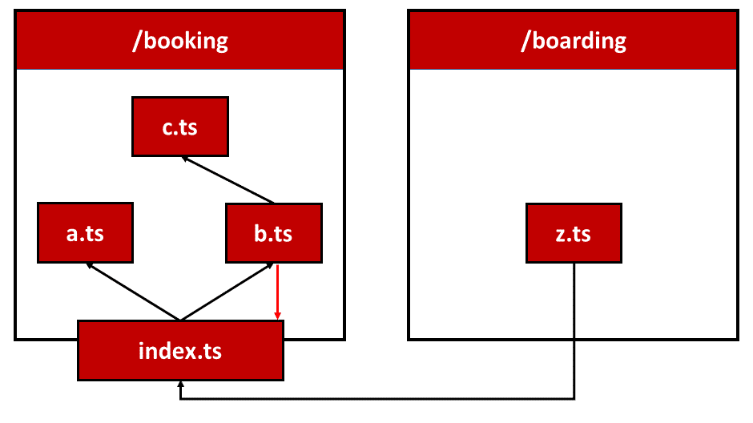
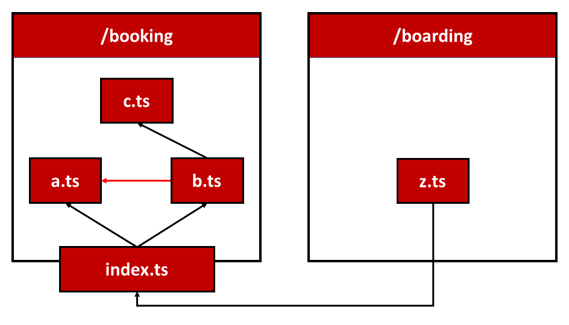
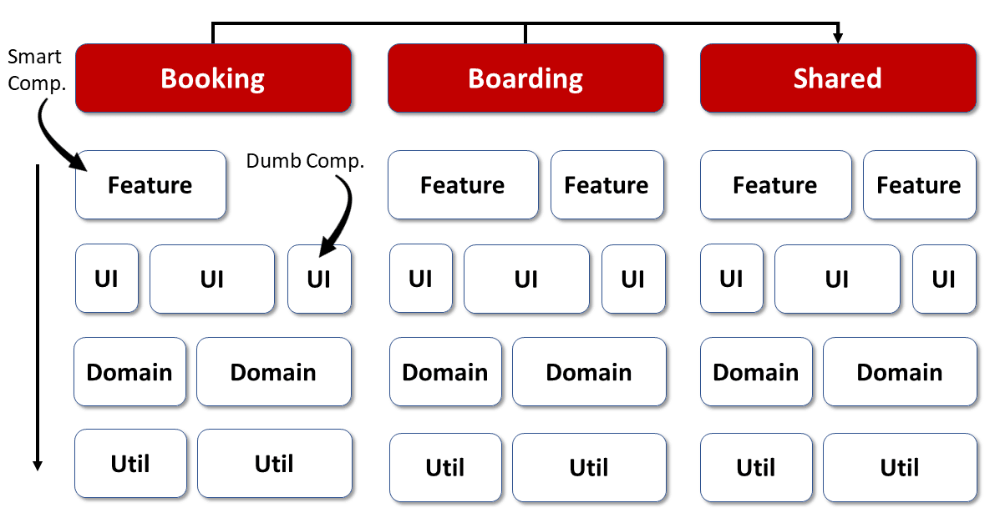
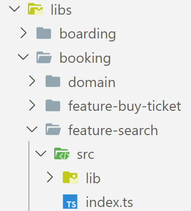
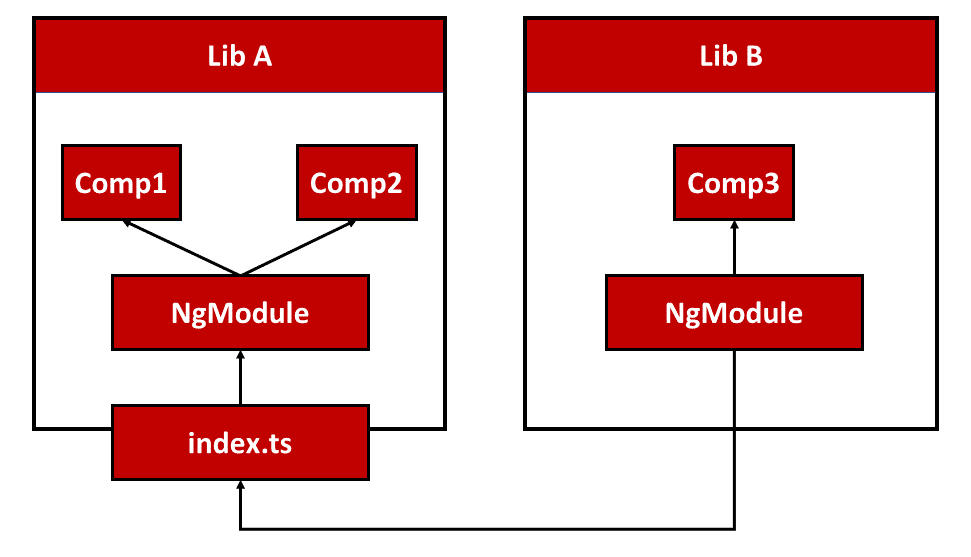
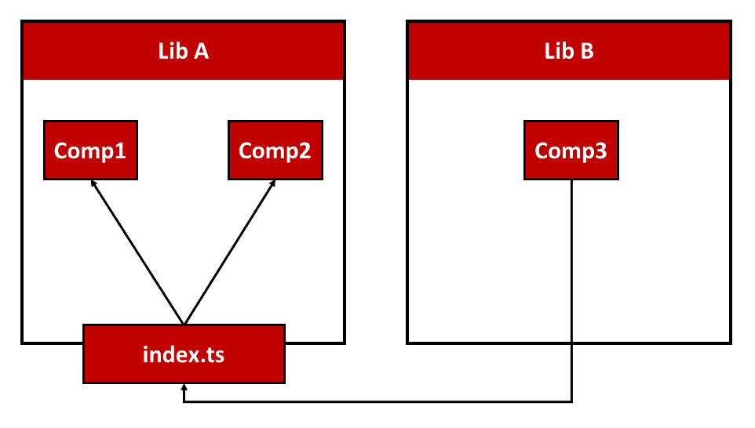

# Как подготовиться к Standalone Components?

<big>После начала работы с Standalone Components возникает вопрос, как перенести существующее решение Angular в будущее без модулей Angular. В этой главе я покажу четыре варианта, как это сделать.</big>

## Вариант 1: стратегия страуса {#leanpub-auto-option-1-ostrich-strategy}

Начнем с самого простого варианта — стратегии страуса. Засуньте голову в песок и игнорируйте все вокруг:


Даже если это звучит самодовольно, на самом деле в этом нет ничего плохого. Никто не заставляет нас переводить приложения на Standalone Components. Angular будет продолжать поддерживать модули Angular. В конце концов, вся экосистема основана на них. Поэтому вы можете спокойно игнорировать Standalone Components или использовать эту новую опцию только в новых приложениях или частях приложений.

## Вариант 2: Просто выбросить модули Angular {#leanpub-auto-option-2-just-throw-away-angular-modules}

Эта стратегия также кажется самодовольной на первый взгляд: Вы просто удаляете все модули Angular из своего исходного кода. Но это не обязательно делать одним махом, потому что Standalone Components прекрасно сочетаются с модулями Angular. Модули Angular можно импортировать в Standalone Components и наоборот.

Например, в следующем листинге показано, как автономный компонент импортирует дальнейшие модули NgModules:

```ts
import { Component, OnInit } from '@angular/core';
import { TicketsModule } from '../tickets/tickets.module';

@Component({
    selector: 'app-next-flight',
    standalone: true,
    imports: [
        // Existing NgModule imported
        // in this standalone component
        TicketsModule,
    ],
    /* [...] */
})
export class NextFlightComponent implements OnInit {
    /* [...] */
}
```

Чтобы проиллюстрировать обратную сторону, в этом листинге показан NgModule, импортирующий Standalone Component:

```ts
@NgModule({
    imports: [
        CommonModule,

        // Imported Standalone Component:
        FlightCardComponent,
        /* [...] */
    ],
    declarations: [MyTicketsComponent],
    /* [...] */
})
export class TicketsModule {}
```

Такая взаимная совместимость возможна благодаря [ментальной модели](https://www.angulararchitects.io/en/aktuelles/angulars-future-without-ngmodules-lightweight-solutions-on-top-of-standalone-components/), лежащей в основе автономных компонентов.

Соответственно, автономный компонент — это комбинация компонента и модуля. Даже если в реальной технической реализации нет выделенных модулей Angular, эта идея помогает преодолеть разрыв между двумя мирами. Она также объясняет, почему модули Angular и автономные компоненты могут импортировать друг друга.

Если вы используете эту стратегию, вам нужно импортировать контекст компиляции непосредственно в автономный компонент, используя его массив `imports`. Мне нравится думать об этом контексте компиляции как о соседе компонента: он содержит все другие автономные компоненты, автономные директивы и автономные пайпы, а также NgModules, которые нужны данному компоненту.

## Вариант 2a: Автоматическая миграция на Standalone {#leanpub-auto-option-2a-automatic-migration-to-standalone}

Angular CLI помогает перенести существующую базу кода на Standalone Components. В следующей главе мы подробно рассмотрим этот вариант.

## Вариант 3: Заменить модули Angular на бочки {#leanpub-auto-option-3-replace-angular-modules-with-barrels}

Бочки — это файлы EcmaScript, которые (ре)экспортируют связанные строительные блоки:

```ts
import { NavbarComponent } from './navbar/navbar.component';
import { SidebarComponent } from './sidebar/sidebar.component';
```

Пользователь теперь может импортировать все, что поставляет бочка:

```ts
import { NavbarComponent, SidebarComponent } as shell from '../shell';
```

Если бочка называется `index.ts`, достаточно импортировать только папку с бочкой. Помимо группировки, преимущество такого подхода заключается в том, что бочки можно использовать для определения **общедоступных API**: Все строительные блоки, экспортируемые бочкой, могут быть использованы другими частями приложения. Им просто нужно импортировать их из бочки. Все остальное считается деталями реализации, которые не должны быть доступны другим частям приложения. Следовательно, такие детали реализации можно легко изменить, не внося ломающих изменений в другие части приложения. Это простая, но эффективная мера для создания стабильных архитектур программного обеспечения.

На следующем этапе каждый бочонок может также получить отображение пути в `tsconfig.json`. В этом случае приложение может обращаться к бочке, используя красивые имена, похожие на имена пакетов npm:

```ts
import {
    NavbarComponent,
    SidebarComponent,
} from '@demo/shell';
```

Однако бочки несут в себе и проблемы: Например, они часто становятся причиной **циклических зависимостей**:



Здесь `b.ts`, с одной стороны, ссылается на бочку `index.ts`, а с другой — обращается к ней.

Этой проблемы можно избежать с самого начала с помощью двух простых правил, которые должны соблюдаться последовательно:

-   Бочка может публиковать только элементы из своей "области". Область" распространяется на папку бочки, а также на ее подпапки.
-   Внутри каждой "области" файлы ссылаются друг на друга, используя относительные пути без использования бочки.

Хотя на первый взгляд эти правила звучат несколько абстрактно, реализовать их проще, чем кажется:



Здесь `b.ts` напрямую обращается к `a.ts`, расположенному в той же "области", чтобы избежать цикла, показанного ранее. При этом обходной путь обходится стороной.

Другим недостатком является то, что каждая часть программы может обойти указанные бочки — и, соответственно, созданный с их помощью публичный API. Для этого достаточно относительных путей к частным частям соответствующих "областей".

Эту проблему можно решить с помощью линтинга. Правило линтинга должно обнаруживать и осуждать несанкционированный доступ. Популярный инструмент [Nx](https://www.angulararchitects.io/en/aktuelles/tutorial-first-steps-with-nx-and-angular-architecture/) поставляется с таким правилом, которое также может быть использовано для предотвращения других нежелательных доступов. В следующем разделе мы рассмотрим эту идею.

## Вариант 4: Рабочее пространство Nx с библиотеками и правилами линтинга {#leanpub-auto-option-4-nx-workspace-with-libraries-and-linting-rules}

Популярный инструмент [Nx](https://www.angulararchitects.io/en/aktuelles/tutorial-first-steps-with-nx-and-angular-architecture/) основан на Angular CLI и предоставляет массу удобств для разработки решений корпоративного масштаба. Nx позволяет разбить большой проект на различные приложения и библиотеки. Каждая библиотека имеет публичный API, который определяет бочку с именем `index.ts`. Nx также обеспечивает сопоставление путей для всех библиотек. Кроме того, Nx предлагает правило линтинга, которое предотвращает обход бочки, а также допускает другие ограничения.

Это правило линтинга позволяет применять фиксированную архитектуру фронтенда. Например, команда Nx рекомендует разделить большое приложение по вертикали по предметным областям и по горизонтали по категориям технических библиотек:



Библиотеки функций содержат интеллектуальные компоненты, реализующие сценарии использования, в то время как библиотеки пользовательского интерфейса содержат многократно используемые компоненты дампа. Библиотеки доменов инкапсулируют модель домена на стороне клиента и сервисы, которые работают с ней, а библиотеки утилит группируют общие функции утилит.

С помощью упомянутых правил линтинга можно гарантировать, что каждый слой может обращаться только к слоям, расположенным ниже него. Доступ к другим доменам также может быть предотвращен. Поэтому библиотекам из области _Booking_ не разрешается обращаться к библиотекам в _Boarding_. Если вы хотите использовать определенные конструкции в разных доменах, их следует поместить, например, в общую область.

Если кто-то нарушает одно из этих правил, линтер дает мгновенную обратную связь:


Структура папок, используемая для этого в Nx, отражает архитектурную матрицу, показанную на рисунке:



Вложенные папки в libs представляют собой домены. Библиотеки, находящиеся в них, получают префикс типа `feature-` или `domain-`. Эти префиксы отражают технические категории и, соответственно, слои.

Этот четвертый вариант хорош тем, что он давно зарекомендовал себя во взаимодействии с модулями Angular для структурирования больших решений:



Благодаря Standalone Components модули Angular теперь можно не использовать:



В этом случае для структурирования используются только библиотеки: их бочки группируют связанные строительные блоки, такие как Standalone Components, и благодаря упомянутым правилам линтинга мы можем применять наши архитектуры.

## Вариант 4a: Границы модулей на основе папок с помощью Sheriff {#leanpub-auto-option-4a-folder-based-module-boundaries-with-sheriff}

Как уже говорилось в одной из предыдущих глав, инструмент с открытым исходным кодом Sheriff позволяет проводить границы модулей на основе отдельных папок. Это делает структуру приложения более легкой. Его можно использовать не только с Angular CLI, но и с Nx, чтобы получить лучшее из двух миров.

## Заключение {#leanpub-auto-conclusion-7}

Несмотря на то что Standalone Component стали предпочтительным способом использования компонентов, традиционный стиль, основанный на NgModule, по-прежнему является гражданином первого класса. Следовательно, нам не нужно сразу же переносить существующий код.

Поскольку оба варианта хорошо сочетаются друг с другом, мы можем комбинировать их. Например, мы можем использовать NgModules для существующего кода и писать новый код с помощью автономных компонентов.

В качестве замены NgModule можно использовать Barrels и Libraries. Они позволяют скрыть детали реализации, независимо от того, основаны они на Angular или нет. С помощью таких инструментов, как Nx или Sheriff, мы можем предотвратить использование таких деталей реализации и определить, какие части приложения могут обращаться к другим частям.
