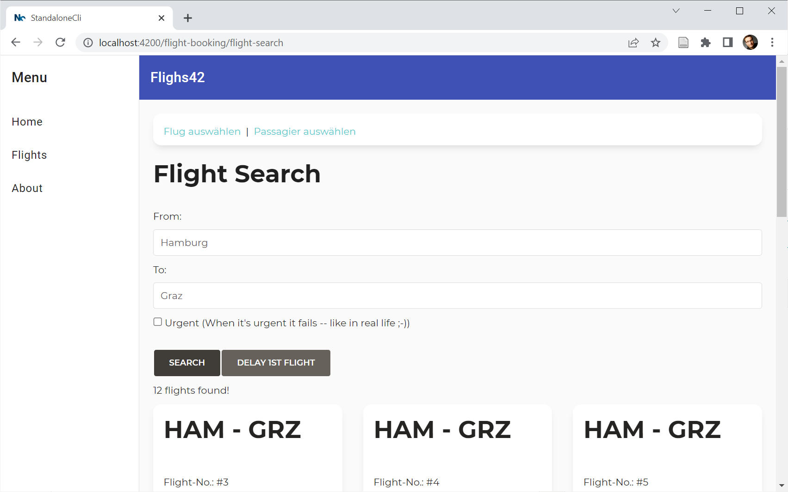
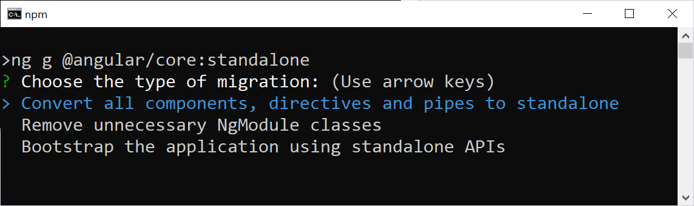
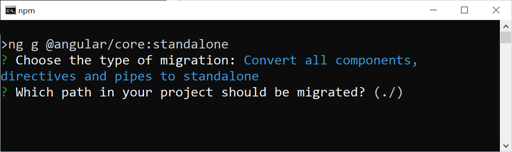
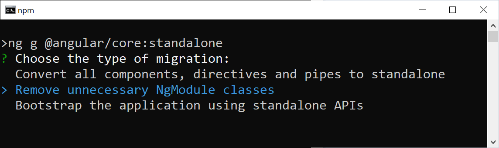
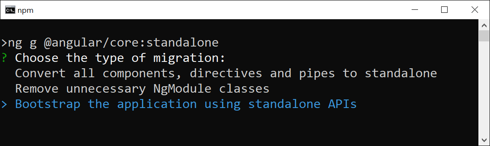

# Автоматическая миграция на автономные компоненты

Хотя новые автономные компоненты могут прекрасно сочетаться с традиционным кодом Angular на основе NgModule, люди могут захотеть полностью перенести свои проекты в новый автономный мир. Начиная с версии Angular 15.2, существует схема, автоматизирующая эту задачу. Она преобразует проекты в 3 шага. После каждого шага мы можем проверить текущий прогресс и вручную позаботиться о деталях, с которыми не справился автоматический процесс.

В этом коротком руководстве я собираюсь пройти эти 3 шага вместе с вами и мигрировать наше демо-приложение.

Если вы хотите воспроизвести эти шаги, вы можете найти начальную ситуацию, основанную на NgModule, в нашем учебнике здесь:

📂 <https://github.com/manfredsteyer/standalone-example-cli> <br />(**Branch** `ngmodules`)

## Первый взгляд на мигрируемое приложение {#leanpub-auto-a-first-look-at-the-application-to-migrate}

После проверки ветки `ngmodules` (!) вышеупомянутого проекта, возможно, будет хорошей идеей немного порыться в исходном коде. Вы должны узнать следующие модули NgModules:

```
    +----> SharedModule < --------+
    |                             |
AppModule --- (lazy) ---> FlightBookingModule
```

Также запустите приложение, чтобы получить первое впечатление о нем:

```shell
ng serve -o
```



## Шаг 1 {#leanpub-auto-step-1}

Теперь давайте запустим схему миграции, доступную в Angular 15.2:

```sh
ng g @angular/core:standalone
```

Когда нас спрашивают о типе миграции, мы выбираем первый вариант (ведь это такая милая традиция - "начинать с начала"...).



На вопрос о пути для миграции мы выбираем значение по умолчанию, нажимая клавишу ++enter++:



Значение по умолчанию `./` указывает на корень проекта. Таким образом, весь проект будет перенесен сразу. Для малых и средних приложений это вполне подходит. Однако для больших приложений может быть интересно переносить проект постепенно.

После этого первого шага вам следует взглянуть на исходный код и проверить, все ли в порядке. В случае с этим примером проекта вам не нужно беспокоиться. Схемы отлично справляются со своей задачей!

## Шаг 2 {#leanpub-auto-step-2}

Теперь давайте снова запустим схему для второго шага:



Вывод показывает, что `SharedModule` был удален, а остальные модули были обновлены. Нет ничего страшного в том, что `AppModule` все еще на месте - он будет удален на 3-м шаге. Однако все остальные модули NgModules уже должны быть удалены. К сожалению, модуль `FlightBookingModule` все еще здесь:

```ts
// src/app/booking/flight-booking.module.ts

@NgModule({
    imports: [
        CommonModule,
        FormsModule,
        StoreModule.forFeature(bookingFeature),
        EffectsModule.forFeature([BookingEffects]),
        RouterModule.forChild(FLIGHT_BOOKING_ROUTES),
        FlightCardComponent,
        FlightSearchComponent,
        FlightEditComponent,
        PassengerSearchComponent,
    ],
    exports: [],
    providers: [],
})
export class FlightBookingModule {}
```

Как видно из этого листинга, модуль `FlightBookingModule` больше ничего не делает. Однако есть несколько вызовов методов в секции `imports`. Эти методы предназначены для настройки маршрутизатора и хранилища NGRX. Поскольку они довольно специфичны для библиотеки, схема не смогла преобразовать их в вызовы эквивалентных Standalone API. Поэтому нам придется позаботиться об этом вручную.

`RouterModule.forChild` устанавливает несколько дочерних маршрутов, которые загружаются вместе с `FlightBookingModule`. Однако в автономном мире нам больше не нужны NgModules для настройки дочерних маршрутов. Вместо этого конфигурация родительской маршрутизации может **прямо** указывать на дочерние маршруты. Поэтому давайте перейдем в файл `app.routes.ts` и обновим маршрут, запускающий ленивую загрузку:

```ts
// src/app/app.routes.ts

{
    path: 'flight-booking',
    canActivate: [() => inject(AuthService).isAuthenticated()],
    loadChildren: () =>
        import('./booking/flight-booking.routes')
                .then(m => m.FLIGHT_BOOKING_ROUTES)
},
```

Обратите внимание, что `import` теперь напрямую импортирует маршруты бронирования авиабилетов. Больше нет перенаправления через `FlightBookingModule`. Есть даже возможность сократить это еще больше: Если файл `flight-booking.routes.ts` экспортирует маршруты как **default export**, мы можем пропустить последующий вызов `then`:

```ts
{
    path: 'flight-booking',
    canActivate: [() => inject(AuthService).isAuthenticated()],
    loadChildren: () =>
        import('./booking/flight-booking.routes')
},
```

Чтобы убедиться, что хранилище NGRX инициализировано для этой ленивой части приложения, мы можем зарегистрировать соответствующих провайдеров непосредственно для ленивых дочерних маршрутов:

```ts
// src/app/booking/flight-booking.routes.ts
import { importProvidersFrom, inject } from '@angular/core';
/* [...] */

export const FLIGHT_BOOKING_ROUTES: Routes = [
    {
        path: '',
        component: FlightBookingComponent,
        canActivate: [
            () => inject(AuthService).isAuthenticated(),
        ],
        providers: [
            importProvidersFrom(
                StoreModule.forFeature(bookingFeature)
            ),
            importProvidersFrom(
                EffectsModule.forFeature([BookingEffects])
            ),
        ],
        children: [
            /* [...] */
        ],
    },
];
```

Этот новый массив провайдеров устанавливает сервисы, необходимые только для данного маршрута и его дочерних элементов. Функция `importProvidersFrom` перебрасывает мост в мир NgModules и позволяет получить их провайдеров.

Теперь мы можем удалить модуль `FlightBookingModule` (`src/app/booking/flight-booking.module.ts`).

## Шаг 3 {#leanpub-auto-step-3}

Запустим нашу схему миграции в 3-й раз:



Это удаляет `AppModule` и обновляет файл `main.ts` для прямой загрузки `AppComponent`. После этого шага приложение должно работать как прежде:

```sh
ng serve -o
```

## Бонус: переход на автономные API {#leanpub-auto-bonus-moving-to-standalone-apis}

Заглянув в `main.ts`, мы увидим, что он по-прежнему ссылается на несколько модулей с помощью `importProvidersFrom`:

```ts
bootstrapApplication(AppComponent, {
    providers: [
        importProvidersFrom(
            BrowserModule,
            LayoutModule,
            LoggerModule.forRoot({
                level: LogLevel.DEBUG,
                appenders: [DefaultLogAppender],
                formatter: (level, cat, msg) =>
                    [level, cat, msg].join(';'),
            }),
            StoreModule.forRoot(reducer),
            EffectsModule.forRoot(),
            StoreDevtoolsModule.instrument(),
            MatToolbarModule,
            MatButtonModule,
            MatSidenavModule,
            MatIconModule,
            MatListModule
        ),
        {
            provide: HTTP_INTERCEPTORS,
            useClass: LegacyInterceptor,
            multi: true,
        },
        provideAnimations(),
        provideHttpClient(withInterceptorsFromDi()),
        provideRouter(
            APP_ROUTES,
            withPreloading(PreloadAllModules)
        ),
    ],
});
```

Кроме того, существует традиционный класс-перехватчик `HttpInterceptor`, о котором `HttpClient` узнает с помощью вызова `withInterceptorsFromDi`. Переход на автономные API позволяет улучшить эту ситуацию:

```ts
bootstrapApplication(AppComponent, {
    providers: [
        provideLogger({
            level: LogLevel.DEBUG,
            appenders: [DefaultLogAppender],
            formatter: (level, cat, msg) =>
                [level, cat, msg].join(';'),
        }),

        provideStore(reducer),
        provideEffects(),
        provideStoreDevtools(),

        provideAnimations(),

        provideHttpClient(
            withInterceptors([authInterceptor])
        ),
        provideRouter(
            APP_ROUTES,
            withPreloading(PreloadAllModules)
        ),

        importProvidersFrom(
            LayoutModule,
            MatToolbarModule,
            MatButtonModule,
            MatSidenavModule,
            MatIconModule,
            MatListModule
        ),
    ],
});
```

Эта модификация решает следующие задачи:

-   Удаление импорта `BrowserModule`, который не нужно явно импортировать при загрузке Standalone Component.
-   Установка пользовательской библиотеки Logger с помощью `provideLogger`.
-   Настройка магазина NGRX с помощью `provideStore`, `provideEffects` и `provideStoreDevtools`.
-   Замена традиционного `HttpInterceptor` на [функциональный перехватчик](https://www.angulararchitects.io/en/aktuelles/the-refurbished-httpclient-in-angular-15-standalone-apis-and-functional-interceptors/), который теперь передается в `withInterceptors`. Чтобы облегчить этот шаг, функциональный аналог уже был частью кодовой базы с самого начала.

Более подробную информацию о [пользовательских Standalone API](https://www.angulararchitects.io/en/aktuelles/patterns-for-custom-standalone-apis-in-angular/), таких как provideLogger, можно найти [здесь](https://www.angulararchitects.io/en/aktuelles/patterns-for-custom-standalone-apis-in-angular/).

NGRX ожидает, что его Standalone API будут использоваться полностью или не будут использоваться вообще. Следовательно, нам также нужно вернуться к `flight-booking.routes.ts` и заменить вызов `importProvidersFrom` на вызовы `provideState` и `provideEffects`:

```ts
export const FLIGHT_BOOKING_ROUTES: Routes = [
    {
        path: '',
        component: FlightBookingComponent,
        canActivate: [
            () => inject(AuthService).isAuthenticated(),
        ],
        providers: [
            provideState(bookingFeature),
            provideEffects(BookingEffects),
        ],
        children: [
            /* [...] */
        ],
    },
];
```

Обратите внимание, что в то время как мы вызываем `provideStore` в `main.ts` для настройки магазина, нам нужно вызвать `provideState` (!) в дальнейших частях приложения, чтобы настроить для них дополнительные фрагменты функций. Однако `provideEffects` можно вызвать в обоих местах, чтобы установить эффекты не только для корневого уровня, но и для функциональных срезов.

После этой модификации приложение переносится на Standalone Components and APIs. Запустите его через

```sh
ng serve -o
```

## Заключение {#leanpub-auto-conclusion-8}

Новые схемы автоматизируют переход на Standalone Components. В три шага все приложение или только его часть переходит на новый облегченный способ работы с Angular. После каждого шага мы можем проверить выполненную модификацию и вмешаться.
