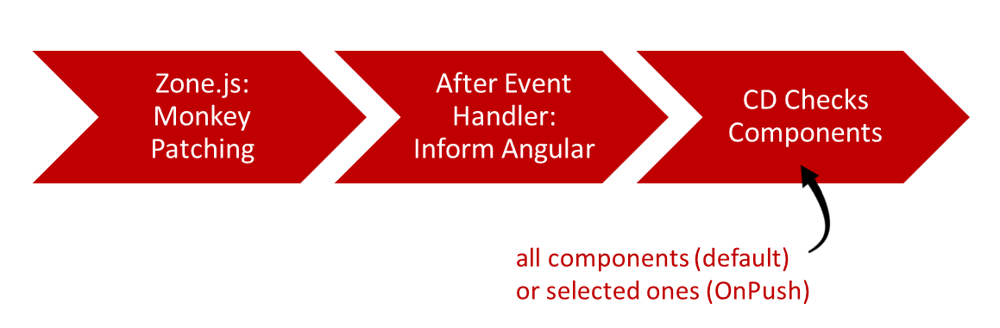
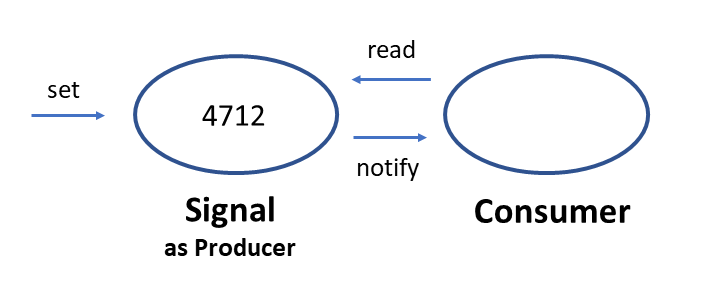

# Сигналы: будущее обнаружения изменений

Сара Драснер, директор по инженерным вопросам Google, рассказала в Twitter о ренессансе Angular. В принципе, так оно и есть, потому что за последние несколько релизов несколько нововведений сделали Angular чрезвычайно привлекательным. Вероятно, самые важные из них — это автономные компоненты и автономные API.

Далее команда Angular позаботилась об обновлении системы обнаружения изменений. Оно должно стать более легким и мощным. Для этого Angular будет опираться на реактивный механизм под названием Signals, который уже переняли несколько других фреймворков.

Сигналы будут доступны начиная с Angular 16. Как и самостоятельные компоненты, они изначально поставляются в виде предварительной версии для разработчиков, чтобы ранние пользователи могли получить начальный опыт.

В этой главе я расскажу об этом новом механизме и покажу, как его можно использовать в приложении Angular.

📂 [Исходный код](https://github.com/manfredsteyer/standalone-example-cli)(см. **branches** `signals` и `signal-rxjs-interop`)

## Обнаружение изменений сегодня: Zone.js {#leanpub-auto-change-detection-today-zonejs}

В настоящее время Angular предполагает, что любой обработчик событий теоретически может изменить любые связанные данные. По этой причине после выполнения обработчиков событий фреймворк по умолчанию проверяет все привязки во всех компонентах на предмет изменений. В более мощном режиме OnPush, который опирается на Immutables и Observables, Angular может значительно сократить количество проверяемых компонентов.

Независимо от того, используем ли мы поведение по умолчанию или OnPush, Angular необходимо знать, когда обработчики событий были запущены. Это непросто, поскольку обработчики событий запускает браузер, а не фреймворк. Здесь на помощь приходит Zone.js: Используя обезьяний патч, он расширяет объекты JavaScript, такие как `window` или `document`, и прототипы, такие как `HtmlButtonElement`, `HtmlInputElement` или `Promise`. Модифицируя такие стандартные конструкции, Zone.js может определить, когда обработчик события был запущен. Затем он уведомляет Angular о том, что он позаботился об обнаружении изменений:



Хотя этот подход хорошо зарекомендовал себя в прошлом, он все же имеет несколько недостатков:

-   Патчи Zone.js monkey — это магия. Объекты браузера изменяются, и ошибки трудно диагностировать.
-   Накладные расходы Zone.js составляют около 100 КБ. Хотя для больших приложений это незначительно, при развертывании легковесных веб-компонентов это является решающим фактором.
-   Zone.js не может исправлять `async` и `await`, поскольку они являются ключевыми словами. Поэтому CLI по-прежнему преобразует эти утверждения в обещания, даже несмотря на то, что все поддерживаемые браузеры уже поддерживают `async` и `await` нативно.
-   При внесении изменений всегда проверяются все компоненты, включая их предшественников, в дереве компонентов. В настоящее время невозможно напрямую определить измененные компоненты или просто обновить измененные части компонента.

Именно эти недостатки теперь компенсируются с помощью Signals.

## Обнаружение изменений завтра: Сигналы {#leanpub-auto-change-detection-tomorrow-signals}

Сигнал — это простой реактивный строительный блок: он содержит значение, которое могут считывать потребители. В зависимости от характера сигнала, значение может быть изменено, после чего сигнал уведомляет всех потребителей:



Если потребителем является шаблон, он может уведомлять Angular об изменении привязок. В терминологии команды Angular этот сигнал выступает в роли так называемого производителя. Как описано ниже, существуют и другие строительные блоки, которые могут выполнять эту роль.

## Использование сигналов {#leanpub-auto-using-signals}

Для использования сигналов с привязкой данных свойства, которые необходимо привязать, выражаются в виде сигналов:

```ts
@Component(/* […] */)
export class FlightSearchComponent {
    private flightService = inject(FlightService);

    from = signal('Hamburg');
    to = signal('Graz');
    flights = signal<Flight[]>([]);

    /* […] */
}
```

Следует отметить, что сигнал всегда имеет значение по определению. Поэтому в функцию `signal` должно быть передано значение по умолчанию. Если тип данных не может быть получен из этого, то в примере он указывается явно через параметр `type`.

Геттер Signal используется для чтения значения сигнала. Технически это означает, что сигнал вызывается как функция:

```ts
async search(): Promise<void> {
    if (!this.from() || !this.to()) {
        return;
    }
    const flights = await this.flightService.findAsPromise(
		this.from(),
		this.to()
	);
    this.flights.set(flights);
}
```

Для установки значения сигнал предлагает явный сеттер в виде метода `set`. В приведенном примере этот сеттер используется для хранения загруженных рейсов. Геттер также используется для привязки данных в шаблоне:

```html
<div *ngIf="flights().length > 0">
    {{flights().length}} flights found!
</div>

<div class="row">
    <div *ngFor="let f of flights()">
        <flight-card [item]="f" />
    </div>
</div>
```

В прошлом вызовы методов в шаблонах не одобрялись, особенно потому, что они могли привести к снижению производительности. Однако это, как правило, не относится к несложным процедурам, таким как геттеры. Кроме того, шаблон будет выступать здесь в качестве потребителя, и, как таковой, он может быть уведомлен об изменениях.

На момент написания этой статьи `ngModel` не поддерживает двустороннее связывание данных. Однако это можно сделать вручную, настроив привязку свойства, считывающего сигнал, и привязку события, обновляющего сигнал текущим значением поля:

```html
<form #form="ngForm">
    <div class="form-group">
        <label>From:</label>
        <input
            [ngModel]="from()"
            (ngModelChange)="from.set($event)"
            name="from"
            class="form-control"
        />
    </div>

    <div class="form-group">
        <label>To:</label>
        <input
            [ngModel]="to()"
            (ngModelChange)="to.set($event)"
            name="to"
            class="form-control"
        />
    </div>

    <div class="form-group">
        <button class="btn btn-default" (click)="search()">
            Search
        </button>
        <button class="btn btn-default" (click)="delay()">
            Delay
        </button>
    </div>
</form>
```

В будущей версии команда Angular адаптирует обработку форм к сигналам.

## Обновление сигналов {#leanpub-auto-updating-signals}

В дополнение к сеттеру, показанному ранее, сигналы также предоставляют метод `update` для проецирования текущего значения на новое:

```ts
this.flights.update((f) => {
    const flight = f[0];
    const date = addMinutes(flight.date, 15);
    const updated = { ...flight, date };

    return [updated, ...f.slice(1)];
});
```

## Сигналы должны быть неизменяемыми {#leanpub-auto-signals-need-to-be-immutable}

По умолчанию содержимое сигнала должно быть неизменяемым. По этой причине простого обновления даты вылета в предыдущем разделе будет недостаточно. Вместо этого мы должны клонировать измененные части, чтобы они получили новую ссылку на объект.

Сравнивая эти ссылки, стратегия обнаружения изменений OnPush в Angular может эффективно определить измененные части объекта, управляемого сигналом. В предыдущем разделе массив и первый рейс получают новую ссылку на объект. Остальные рейсы не изменяются и, следовательно, просто копируются с помощью `slice`. В результате они сохраняют свою объектную ссылку.

## Вычисленные значения, побочные эффекты и утверждения {#leanpub-auto-calculated-values-side-effects-and-assertions}

Некоторые значения являются производными от существующих. Для этого Angular предоставляет вычисляемые сигналы:

```ts
flightRoute = computed(
    () => this.from() + ' to ' + this.to()
);
```

Такой сигнал доступен только для чтения и выступает в роли как потребителя, так и производителя. Как потребитель, он получает значения используемых сигналов — здесь `from` и `to` — и информируется об изменениях. Как производитель, он возвращает вычисленное значение.

Если вы хотите потреблять сигналы программно, вы можете использовать функцию `effect`:

```ts
constructor() {
    effect(() => {
        console.log('from:', this.from());
        console.log('route:', this.flightRoute());
    });
}
```

Функция `effect` выполняет переданное лямбда-выражение и регистрирует себя как потребителя используемых сигналов. Когда один из этих сигналов изменяется, эффект запускается снова.

Если сигнал меняется несколько раз подряд или если несколько сигналов меняются один за другим, могут возникнуть нежелательные промежуточные результаты. Представим, что мы изменили поисковый фильтр `Гамбург — Грац` на `Лондон — Париж`:

```ts
setTimeout(() => {
    this.from.set('London');
    this.to.set('Paris');
}, 2000);
```

Здесь `Лондон — Грац` может появиться сразу после установки `from` в `Лондон`. Как и многие другие реализации Signal, реализация Angular предотвращает подобные случаи. В [readme](https://github.com/angular/angular/blob/71d5cdae195f916e345d977f1f23f9490e09482e/packages/core/src/signals/README.md) команды Angular, где также объясняется используемый алгоритм push/pull, эта желаемая гарантия названа "безглючной".

## Эффектам нужен контекст инъекции {#leanpub-auto-effects-need-an-injection-context}

Существенным ограничением эффектов является то, что они могут быть использованы только в контексте инъекции. Это везде, где разрешен `inject`: в конструкторе, в качестве значений по умолчанию полей класса и в фабриках провайдеров. Кроме того, для запуска кода в контексте инъекции можно использовать функцию `runInInjectionContext`.

Следовательно, эффект, заданный в конструкторе выше, не сработает, если его поместить в `ngOnInit` или в другой метод:

```ts
ngOnInit(): void {
    // Effects are not allowed here.
    // Hence, this will fail:
    effect(() => {
        console.log('route:', this.flightRoute());
    });
}
```

В этом случае вы получите следующую ошибку:

> ERROR Ошибка: NG0203: effect() может использоваться только в контексте инъекции, таком как конструктор, фабричная функция,

Техническая причина заключается в том, что эффекты используют `inject` для получения текущего `DestroyRef`. Этот сервис, предоставляемый с Angular 16, помогает узнать о сроке жизни текущего строительного блока, например, текущего компонента или сервиса. Эффект использует `DestroyRef`, чтобы "отписаться", когда этот строительный блок будет уничтожен.

По этой причине вы обычно настраиваете свои эффекты в конструкторе, как показано в предыдущем разделе. Если вы действительно хотите установить эффект в другом месте, вы можете использовать функцию `runInInjectionContext`. Однако ей нужна ссылка на `Injector`:

```ts
injector = inject(Injector);

ngOnInit(): void {
    runInInjectionContext(this.injector, () => {
        effect(() => {
            console.log('route:', this.flightRoute());
        });
    });
}
```

## Запись сигналов в эффектах {#leanpub-auto-writing-signals-in-effects}

Если эффект записывает сигнал, то может возникнуть цикл. Представьте себе эффект, который читает Сигнал `a` и обновляет Сигнал `b`, а другой эффект делает то же самое в обратном направлении. Чтобы предотвратить такие ситуации, эффектам запрещено писать Сигналы. Например, предположим, что эффект синхронизирует наши сигналы `from` и `to`:

```ts
effect(() => {
    // Writing into signals is not allowed here:
    this.to.set(this.from());
});
```

Этот эффект приведет к следующей ошибке:

> ERROR Error: NG0600: Запись в сигналы не разрешена в `computed` или `effect` по умолчанию. Используйте `allowSignalWrites` в `CreateEffectOptions`, чтобы разрешить это внутри эффектов.

В качестве альтернативы следует рассмотреть использование `computed`. Если это не работает или если вы **действительно** хотите писать в сигнал, установка свойства `allowSignalWrites` в true деактивирует это средство защиты детей:

```ts
effect(
    () => {
        this.to.set(this.from());
    },
    { allowSignalWrites: true }
);
```

## Сигналы и обнаружение изменений {#leanpub-auto-signals-and-change-detection}

Подобно Observable, привязанному к шаблону с помощью пайпа `async`, привязанный Signal запускает обнаружение изменений. Это также работает в более эффективном режиме `OnPush`:

```ts
@Component({
    /* […] */
    changeDetection: ChangeDetectionStrategy.OnPush,
})
export class FlightSearchComponent {
    /* […] */
}

/* […] */

@Component({
    /* […] */
    changeDetection: ChangeDetectionStrategy.OnPush,
})
export class FlightCardComponent {
    /* […] */
}
```

Однако для того, чтобы Angular в режиме `OnPush` также узнавал о дочерних компонентах, на которые нужно обратить внимание, необходимо использовать Immutables, о чем говорилось выше.

## RxJS Interop {#leanpub-auto-rxjs-interop}

На первый взгляд, сигналы очень похожи на механизм, который Angular использует уже долгое время, а именно на RxJS Observables. Однако сигналы намеренно упрощены.

Если вам нужна мощь RxJS и его операторов, вы можете преобразовать их в Observables. Пространство имен `@angular/core/rxjs-interop` содержит функцию `toObservable`, преобразующую Signal в Observable, и функцию `toSignal` для обратного преобразования. Они позволяют использовать простоту сигналов с мощью RxJS.

Следующий листинг иллюстрирует использование этих двух методов, расширяя показанный пример до дебаггированного type-ahead:

```ts
@Component(/* […] */)
export class FlightSearchComponent {
    private flightService = inject(FlightService);

    from = signal('Hamburg');
    to = signal('Graz');
    basket = signal<Record<number, boolean>>({ 1: true });
    flightRoute = computed(
        () => this.from() + ' to ' + this.to()
    );

    from$ = toObservable(this.from);
    to$ = toObservable(this.to);

    flights$ = combineLatest({
        from: this.from$,
        to: this.to$,
    }).pipe(
        filter(
            (c) => c.from.length >= 3 && c.to.length >= 3
        ),
        debounceTime(300),
        switchMap((c) =>
            this.flightService.find(c.from, c.to)
        )
    );

    flights = toSignal(this.flights$, {
        initialValue: [],
    });
}
```

Пример преобразует сигналы `from` и `to` в наблюдаемые `from$` и `to$` и объединяет их с помощью `combineLatest`. Как только одно из значений меняется, происходит фильтрация и дебаггинг, прежде чем `switchMap` запустит запрос к бэкенду. Одним из преимуществ операторов сплющивания, таких как `switchMap`, являются гарантии асинхронности. Эти гарантии помогают избежать условий гонки.

Значение `initialValue`, передаваемое в `toSignal`, необходимо, потому что сигналы всегда имеют значение. Напротив, Observables могут вообще не выдавать значения. Если вы уверены, что у вашего Observable есть начальное значение, например, потому что это `BehaviorSubject` или из-за использования оператора `startsWith`, вы также можете установить `requireSync` в `true`:

```ts
flights = toSignal(this.flights, {
    requireSync: true,
});
```

Если вы не задали ни `initialValue`, ни `requireSync`, тип возвращаемого Signal также поддерживает тип `undefinied`, позволяя иметь начальное значение `undefined`. В показанном примере это привело бы к появлению `Signal<Flight[] | undefinied>` вместо `Signal<Flight[]>`. Следовательно, ваш код должен проверять и `undefined`.

## NGRX и другие хранилища? {#leanpub-auto-ngrx-and-other-stores}

До сих пор мы непосредственно создавали и управляли сигналами. Однако такие магазины, как NGRX, предоставляют некоторые дополнительные удобства. Например, начиная с NGRX 16, магазин будет поставляться с методом `selectSignal`:

```ts
store = inject(Store);
flights = this.store.selectSignal(selectFlights);
```

В других реализациях магазинов будут приняты аналогичные меры.

## Заключение {#leanpub-auto-conclusion-9}

Сигналы делают Angular легче и указывают путь в будущее без Zone.js. Они позволяют Angular напрямую узнавать о компонентах, которые нуждаются в обновлении.

Команда Angular остается верна себе: Сигналы не прячутся в подструктуре или за прокси, а становятся явными. Поэтому разработчики всегда знают, с какой структурой данных они имеют дело. Кроме того, сигналы — это просто опция. Никому не нужно менять унаследованный код, и можно будет сочетать традиционное обнаружение изменений с обнаружением изменений на основе сигналов.

В целом, следует отметить, что Signals все еще находится на ранней стадии и будет поставляться с Angular 16 в виде предварительной версии для разработчиков. Это позволит ранним пользователям опробовать концепцию и оставить свои отзывы. Этим команда Angular также доказывает, что для них важна стабильность экосистемы — важная причина, по которой многие крупные корпоративные проекты полагаются на фреймворк, написанный Google.
