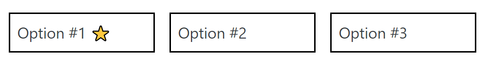
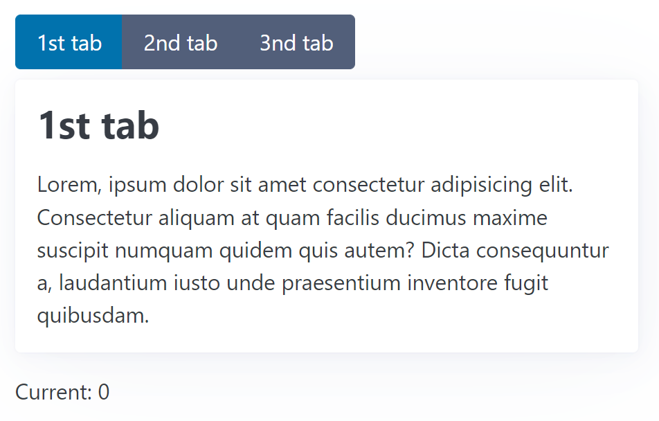
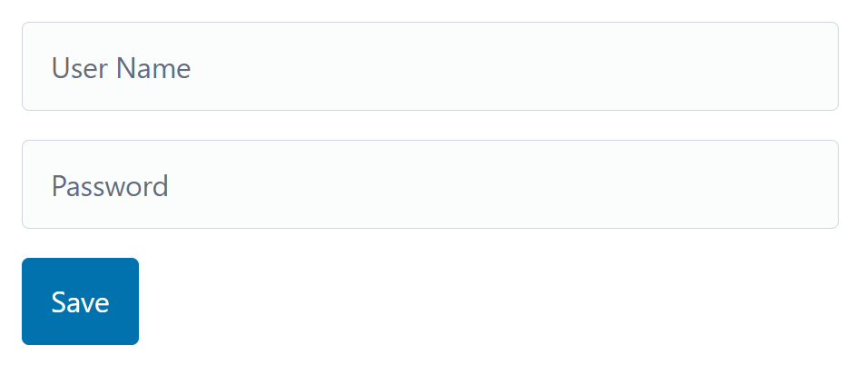
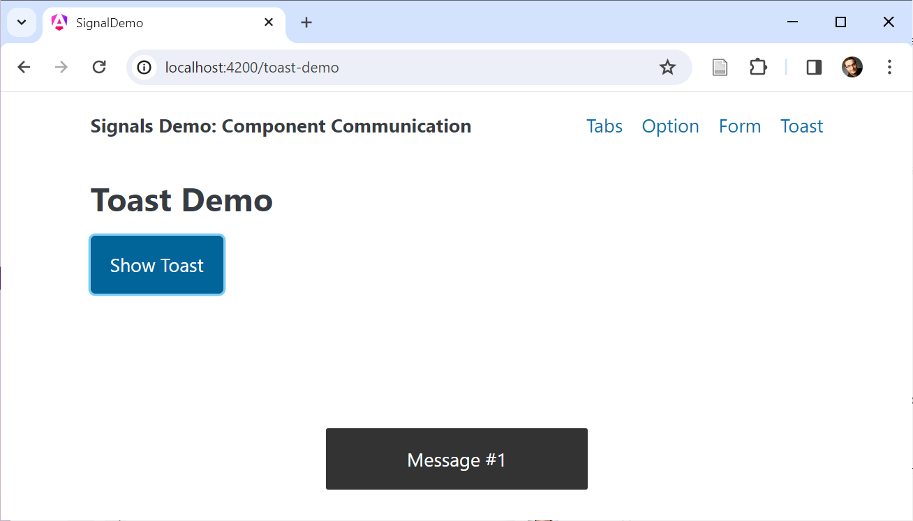
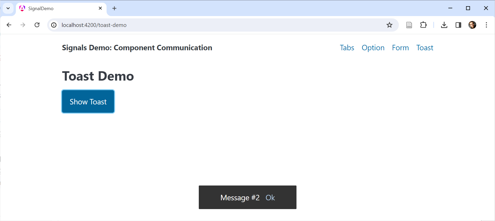

# Общение компонентов с помощью сигналов

Сигналы определяют будущее Angular. Однако сама концепция Signals - это лишь одна часть общей истории. Нам также нужен способ взаимодействия с (суб)компонентами через сигналы. В Angular 17.1 появились входные сигналы, а в Angular 17.2 мы получили двустороннее связывание на основе сигналов и поддержку запросов к контенту и представлению. В дополнение к входным сигналам в версии 17.3 появился новый API вывода.

В этой главе я покажу, как использовать эти новые возможности.

📁 [Исходный код](https://github.com/manfredsteyer/signals-component-communication) (см. разные ветки)

## Входные сигналы {#leanpub-auto-input-signals}

Входные сигналы позволяют нам получать данные через привязки свойств в виде сигналов. Для описания использования сигнальных входов я использую простой `OptionComponent`, представляющий - для простоты - невыбираемую опцию. Здесь представлены три таких компонента:



### Определение входного сигнала

Входные сигналы - это аналог традиционного декоратора `@Input`:

```ts
@Component({
	selector: 'app-option',
	standalone: true,
	imports: [],
    template: `
		<div class="option">
			{{ label() }}
		</div>
    `,
    /* styles: [...] */,
})
export class OptionComponent {
	label = input.required<string>();
}
```

Эта функция `input` подхватывается компилятором Angular и выдает исходный код для привязки свойств. Поэтому использовать ее следует только вместе со свойствами. Другие концепции взаимодействия, рассмотренные здесь, также используют эту технику.

Наличие функции вместо декоратора позволяет сообщить TypeScript о правильном типе и о том, включает ли она `undefined`. В примере, показанном ранее, `label` становится `InputSignal<string>` - входным сигналом, предоставляющим `string`. Значение `undefined` невозможно, так как `input.required` определяет обязательное свойство.

Сигнал `InputSignal` всегда доступен только для чтения и может использоваться как сигнал `Signal`. Например, шаблон выше запрашивает его текущее значение, вызывая геттер (`label()`).

### Привязка к входному сигналу

В случае с нашим `InputSignal<string>` вызывающий должен передать `string`:

```html
<app-option label="Option #1">
    <app-option [label]="myStringProperty"></app-option
></app-option>
```

Если эта строка приходит из Signal, мы должны прочитать ее в шаблоне:

```html
<app-option [label]="mySignalProperty()"></app-option>
```

### Вычисляемые сигналы и эффекты как замена крючкам жизненного цикла

Все изменения переданного Сигнала будут отражены `InputSignal` в компоненте. Внутри компонента оба сигнала связаны через граф, который поддерживает Angular. Хуки жизненного цикла, такие как `ngOnInit` и `ngOnChanges`, теперь могут быть заменены на `computed` и `effect`:

```ts
markDownTitle = computed(() => '# ' + this.label())

constructor() {
	effect(() => {
		console.log('label updated', this.label());
		console.log('markdown', this.markDownTitle());
	});
}
```

### Опции для входных сигналов

Вот некоторые дополнительные опции для настройки `InputSignal`:

| Исходный код                                                          | Описание                                                                                                                         |
| --------------------------------------------------------------------- | -------------------------------------------------------------------------------------------------------------------------------- |
| `label = input<string>();`                                            | Необязательное свойство, представленное <code>InputSignal&lt;string &verbar; undefined&gt;</code>                                |
| `label = input(‘Hello’);`                                             | Необязательное свойство, представленное `InputSignal<string>` with an initial value of `Hello`                                   |
| <code>label = input&lt;string &verbar; undefined&gt;(‘Hello’);</code> | Необязательное свойство, представленное <code>InputSignal&lt;string &verbar; undefined&gt;</code> с начальным значением `Hello`. |

### Требуемые входы не могут иметь значение по умолчанию!

По определению, `input.required` не может иметь значение по умолчанию. На первый взгляд это логично, однако здесь есть подводный камень: Если вы попытаетесь прочитать значение требуемого ввода до того, как он будет привязан, Angular выбросит исключение.

Следовательно, вы не можете напрямую получить доступ к нему в конструкторе. Вместо этого можно использовать `ngOnInit` или `ngOnChanges`. Кроме того, использование входов внутри `computed` или `effect` всегда безопасно, так как они впервые срабатывают только после инициализации компонента:

```ts
@Component(/* [...] */)
export class OptionComponent implements OnInit, OnChanges {
    label = input.required<string>();

    // safe
    markDownTitle = computed(() => '# ' + this.label());

    constructor() {
        // this would cause an exception,
        // as data hasn't been bound so far
        console.log('label', this.label);

        effect(() => {
            // safe
            console.log('label', this.label);
        });
    }

    ngOnInit() {
        // safe
        console.log('label', this.label);
    }

    ngOnChanges() {
        // safe
        console.log('label', this.label);
    }
}
```

### Псевдонимы для входных сигналов

И `input`, и `input.require` также принимают объект-параметр, который позволяет определить `alias`:

```ts
label = input.required({ alias: 'title' });
```

В этом случае вызывающая сторона должна привязаться к имени свойства, определенного псевдонимом:

```html
<app-option title="Option #1">
    <app-option [title]="myStringProperty">
        <app-option
            [title]="mySignalProperty()"
        ></app-option>
    </app-option>
</app-option>
```

В большинстве случаев следует избегать использования псевдонимов, поскольку они создают ненужную непрямую связь. Часто встречающееся исключение из этого правила - переименование одного из свойств директивы в соответствии с настроенным селектором атрибутов.

### Трансформатор для входных сигналов

Трансформаторы уже были доступны для традиционных `@Inputs`. Они позволяют преобразовать значение, переданное через привязку свойства. В следующем случае используется трансформатор `booleanAttribute`, который можно найти в `angular/core`:

```ts
@Component({
    selector: 'app-option',
    standalone: true,
    imports: [],
    template: `
        <div class="option">
            {{ label() }} @if (featured()) { ⭐ }
        </div>
    `,
    styles: [
        /* ... */
    ],
})
export class OptionComponent {
    label = input.required<string>();
    featured = input.required({
        transform: booleanAttribute,
    });
}
```

Этот трансформатор преобразует строки в булевы значения:

```html
<app-option label="Option #1" featured="true"></app-option>
```

Также, если атрибут присутствует, но ему не было присвоено значение, предполагается `true`:

```html
<app-option label="Option #1" featured></app-option>
```

Тип этого сигнала - `InputSignal<boolean, unknown>`. Первый параметр типа (`boolean`) представляет собой значение, полученное от трансформатора; второй (`unknown`) - это значение, связанное в шаблоне вызывающей стороны и переданное трансформатору. Кроме `booleanAttribute`, `@angular/core` также предоставляет трансформатор `numberAttribute`, который преобразует переданные строки в числа.

Если вы хотите реализовать собственный трансформатор, просто предоставьте функцию, принимающую связанное значение и возвращающую значение, которое должно быть использовано вызываемым компонентом:

```ts
function boolTranformer(value: unknown): boolean {
    return value !== 'no';
}
```

Затем зарегистрируйте эту функцию в вашем `input`:

```ts
@Component(/* [...] */)
export class OptionComponent {
    label = input.required<string>();
    featured = input.required({
        transform: boolTranformer,
    });
}
```

## Двустороннее связывание данных с помощью сигналов модели {#leanpub-auto-two-way-data-binding-with-model-signals}

Входные сигналы доступны только для чтения. Если вы хотите передать сигнал, который может быть обновлен вызываемым компонентом, вам нужно создать так называемый модельный сигнал. Чтобы продемонстрировать это, я использую простой `TabbedPaneComponent`:



Вот как потребитель может использовать этот компонент:

```html
<app-tabbed-pane [(current)]="current">
    <app-tab title="1st tab">
        Lorem, ipsum dolor sit amet ...
    </app-tab>
    <app-tab title="2nd tab">
        Sammas ergo gemma, ipsum dolor ...
    </app-tab>
    <app-tab title="3nd tab">
        Gemma ham ipsum dolor sit ...
    </app-tab>
</app-tabbed-pane>

<p class="current-info">Current: {{ current() }}</p>
```

Ему передается несколько `TabComponent`. Кроме того, сигнал `current` привязывается через двустороннее связывание. Для этого `TabbedPaneComponent` должен предоставить сигнал модели, используя `model`:

```ts
@Component(/* [...] */)
export class TabbedPaneComponent {
    current = model(0);
    /* [...] */
}
```

Здесь `0` - это начальное значение. Опции аналогичны опциям для ввода: `model.required` определяет обязательное свойство, и вы можете указать псевдоним через объект options. Однако трансформатор не может быть определен.

Если этот компонент обновляет сигнал модели, новое значение распространяется до сигнала, связанного в шаблоне:

```ts
current.set(1);
```

### Двусторонняя привязка данных как комбинация входа и выхода

Как обычно в Angular, двусторонние привязки на основе сигналов могут быть определены с входом (только для чтения) и соответствующим выходом. Имя `Output` должно быть именем `Input` с суффиксом `Change`. Таким образом, для `current` нам нужно определить `currentChange`:

```ts
@Component(/* [...] */)
export class TabbedPaneComponent {
    current = input(0);
    currentChange = output<number>();
}
```

Для настройки вывода мы используем новый API вывода. Для запуска события приложение должно вызвать метод `emit` выхода:

```html
<button [...] (click)="currentChange.emit($index)">
    {{tab.title()}}
</button>
```

## Запросы содержимого с помощью сигналов {#leanpub-auto-content-queries-with-signals}

Представленный в предыдущем разделе `TabbedPaneComponent` также позволяет нам продемонстрировать еще один вариант: Запросы содержимого, которые получают проецируемые компоненты или директивы.

Как показано выше, в `TabbedPaneComponent` передается несколько `TabComponents`. Они проецируются в представление `TabbedPaneComponent`. Однако в данный момент мы хотим отображать только один из них. Следовательно, `TabbedPaneComponent` должен получить программный доступ к своим `TabComponents`. Это можно сделать с помощью новой функции `contentChildren`:

```ts
@Component({
    selector: 'app-tabbed-pane',
    standalone: true,
    imports: [],
    template: `
        <div class="pane">
            <div class="nav" role="group">
                @for(tab of tabs(); track tab) {
                <button
                    [class.secondary]="tab !== currentTab()"
                    (click)="activate($index)"
                >
                    {{ tab.title() }}
                </button>
                }
            </div>
            <article>
                <ng-content></ng-content>
            </article>
        </div>
    `,
    styles: [
        /* ... */
    ],
})
export class TabbedPaneComponent {
    current = model(0);
    tabs = contentChildren(TabComponent);
    currentTab = computed(
        () => this.tabs()[this.current()]
    );

    activate(active: number): void {
        this.current.set(active);
    }
}
```

Функция `contentChildren` является аналогом традиционного декоратора @ContentChildren. Так как `TabComponent` был передан в качестве так называемого `locator`, он возвращает Сигнал с Массивом, содержащим все спроецированные `TabComponent`.

Наличие проецируемых узлов в виде сигнала позволяет нам реактивно проецировать их с помощью `computed`. В приведенном примере эта опция используется для получения сигнала `currentTab`.

Проецируемый `TabComponent` использует этот сигнал, чтобы узнать, должен ли он быть видимым:

```ts
@Component({
    selector: 'app-tab',
    standalone: true,
    imports: [],
    template: `
        @if(visible()) {
        <div class="tab">
            <h2>{{ title() }}</h2>
            <ng-content></ng-content>
        </div>
        }
    `,
})
export class TabComponent {
    pane = inject(TabbedPaneComponent);

    title = input.required<string>();

    visible = computed(
        () => this.pane.currentTab() === this
    );
}
```

Для этого нам нужно знать, что мы можем получить всех родителей, расположенных в DOM, с помощью инъекции зависимостей. Сигнал `visible` является производным от сигнала `currentTab`.

Эта процедура обычна для реактивного мира: Вместо того, чтобы императивно задавать значения, они декларативно выводятся из других значений.

### Запросы содержимого для потомков

По умолчанию запрос содержимого раскрывает только прямые дочерние элементы содержимого. «Внуки», как на 3-й вкладке ниже, игнорируются:

```html
<app-tabbed-pane [(current)]="current">
    <app-tab title="1st tab">
        Lorem, ipsum dolor sit amet ...
    </app-tab>
    <app-tab title="2nd tab">
        Sammas ergo gemma, ipsum dolor ...
    </app-tab>

    <div class="danger-zone">
        <app-tab title="3nd tab">
            Here, you can delete the whole internet!
        </app-tab>
    </div>
</app-tabbed-pane>
```

Чтобы также получить информацию о таких узлах, мы можем установить опцию `descendants` в значение `true`:

```ts
tabs = contentChildren(TabComponent, { descendants: true });
```

## API вывода {#leanpub-auto-output-api}

Для обеспечения симметричности API в Angular 17.3 появился новый API вывода. Как уже было показано ранее, функция `output` теперь используется для определения события, предоставляемого компонентом. Как и в случае с новым API ввода, компилятор Angular подхватывает вызов `output` и выдает соответствующий код. Для запуска события используется метод `emit` возвращаемого `OutputEmitterRef`:

```ts
@Component(/* [...] */)
export class TabbedPaneComponent {
    current = model(0);
    tabs = contentChildren(TabComponent);
    currentTab = computed(
        () => this.tabs()[this.current()]
    );

    tabActivated = output<TabActivatedEvent>();

    activate(active: number): void {
        const previous = this.current();
        this.current.set(active);
        this.tabActivated.emit({ previous, active });
    }
}
```

### Предоставление Observables в качестве выходов

Помимо этого простого способа настройки выходов, вы можете использовать `Observable` в качестве источника для выхода. Для этого в RxJS interop layer есть функция `outputFromObservable`:

```ts
import {
    outputFromObservable,
    toObservable,
} from '@angular/core/rxjs-interop';
/* [...] */

@Component(/* [...] */)
export class TabbedPaneComponent {
    current = model(0);
    tabs = contentChildren(TabComponent);
    currentTab = computed(
        () => this.tabs()[this.current()]
    );

    tabChanged$ = toObservable(this.current).pipe(
        scan(
            (acc, active) => ({
                active,
                previous: acc.active,
            }),
            { active: -1, previous: -1 }
        ),
        skip(1)
    );

    tabChanged = outputFromObservable(this.tabChanged$);

    activate(active: number): void {
        this.current.set(active);
    }
}
```

Функция `outputFromObservable` преобразует Observable в `OutputEmitterRef`. В показанном примере оператор `scan` запоминает предыдущую активированную вкладку, а `skip` гарантирует, что при первоначальной установке `current` не будет выдано событие. Последнее обеспечивает равенство возможностей с показанным ранее примером.

## Запросы просмотра с сигналами {#leanpub-auto-view-queries-with-signals}

В то время как запрос содержимого возвращает проецируемые узлы, запрос вида возвращает узлы из своего собственного представления. Это узлы, найденные в шаблоне соответствующего компонента. В большинстве случаев предпочтительным решением является использование привязки данных. Однако в некоторых ситуациях необходимо получить программный доступ к дочернему представлению.

Чтобы продемонстрировать, как запрашивать дочерние элементы представления, я использую простую форму для установки имени пользователя и пароля:



Оба поля `input` помечены как `required`. Если при нажатии `Save` валидация не проходит, то фокус должно получить первое поле с ошибкой валидации. Для этого нам нужен доступ к директиве `NgForm`, которую `FormModule` добавляет к нашему тегу `form`, а также к узлам DOM, представляющим поля `input`:

```ts
@Component({
    selector: 'app-form',
    standalone: true,
    imports: [FormsModule, JsonPipe],
    template: `
        <h1>Form Demo</h1>
        <form autocomplete="off">
            <input
                [(ngModel)]="userName"
                placeholder="User Name"
                name="userName"
                #userNameCtrl
                required
            />
            <input
                [(ngModel)]="password"
                placeholder="Password"
                type="password"
                name="password"
                #passwordCtrl
                required
            />
            <button (click)="save()">Save</button>
        </form>
    `,
    styles: `
     form {
       max-width: 600px;
     }
   `,
})
export class FormDemoComponent {
    form = viewChild.required(NgForm);

    userNameCtrl = viewChild.required<
        ElementRef<HTMLInputElement>
    >('userNameCtrl');
    passwordCtrl = viewChild.required<
        ElementRef<HTMLInputElement>
    >('passwordCtrl');

    userName = signal('');
    password = signal('');

    save(): void {
        const form = this.form();

        if (form.controls['userName'].invalid) {
            this.userNameCtrl().nativeElement.focus();
            return;
        }

        if (form.controls['password'].invalid) {
            this.passwordCtrl().nativeElement.focus();
            return;
        }

        console.log(
            'save',
            this.userName(),
            this.password()
        );
    }
}
```

Оба действия выполняются с помощью функции `viewChild`. В первом случае в качестве локатора в примере передается тип `NgForm`. Однако простое определение местоположения полей с типом не работает, так как может быть несколько дочерних полей с этим типом. Поэтому входы помечаются хендлами (`#userName` и `#password`), а в качестве локатора передается имя соответствующего хендла.

Дочерние элементы представления могут быть представлены различными типами: Тип соответствующего компонента или директивы, `ElementRef`, представляющий его узел DOM, или `ViewContainerRef`. Последний тип используется в следующем разделе.

Нужный тип можно указать с помощью опции `read`, использованной в предыдущем примере.

## Запросы и ViewContainerRef {#leanpub-auto-queries-and-viewcontainerref}

Бывают ситуации, когда необходимо динамически добавить компонент в `placeholder`. Примером могут служить модальные диалоги или тосты. Простой способ добиться этого - использовать директиву `*ngComponentOutlet`. Более гибким способом является запрос к `ViewContainerRef` плацдарма.

Контейнер представлений можно рассматривать как невидимый контейнер вокруг каждого компонента и статического HTML. Завладев им, вы можете добавлять другие компоненты или шаблоны.

Чтобы продемонстрировать это, я использую простой пример, показывающий тост:



В примере используется `ng-container` в качестве заполнителя:

```ts
@Component({
    selector: 'app-dynamic',
    standalone: true,
    imports: [],
    template: `
        <h2>Toast Demo</h2>
        <button (click)="show()">Show Toast</button>
        <ng-container #placeholder></ng-container>
    `,
    styles: [
        /* ... */
    ],
})
export class ToastDemoComponent {
    counter = 0;
    placeholder = viewChild.required('placeholder', {
        read: ViewContainerRef,
    });

    show() {
        const ref = this.placeholder()?.createComponent(
            ToastComponent
        );
        this.counter++;
        ref?.setInput('label', 'Message #' + this.counter);
        setTimeout(() => ref?.destroy(), 2000);
    }
}
```

Свойство `read` дает понять, что мы хотим читать не компонент-плейсхолдер, а его `ViewContainerRef`. Метод `createComponent` инстанцирует и добавляет `ToastComponent`. Возвращаемый `ComponentRef` используется для установки свойства `label` нового компонента. Для этого используется его метод `setInput`. Через две секунды метод `destroy` снова удаляет тост.

Для простоты здесь был жестко закодирован компонент `ToastComponent`. В более общих реальных сценариях используемый компонент можно настроить, например, вызвав сервисный метод, приняв тип Компонента и уведомив другой Компонент, который добавит Компонент этого типа в placeholder.

### Программная настройка вывода

В предыдущем примере для присвоения значения входу `title` компонента `ToastComponent` была вызвана функция `setInput`. Здесь я хочу обсудить, как определить обработчики событий для таких динамически добавляемых компонентов.

Предположим, что `ToastComponent` показывает ссылку подтверждения:



При нажатии на эту ссылку он выдает событие `confirmed`:

```ts
@Component(/* [...] */)
export class ToastComponent {
    label = input.required<string>();
    confirmed = output<string>();

    confirm(): void {
        this.confirmed.emit(this.label());
    }
}
```

Чтобы создать обработчик этого события, мы можем напрямую использовать свойство `instance` возвращаемого `ComponentRef`. Оно указывает на добавленный экземпляр компонента и, следовательно, предоставляет доступ ко всем его свойствам:

```ts
@Component(/* [...] */)
export class ToastDemoComponent {
    counter = 0;
    placeholder = viewChild.required('placeholder', {
        read: ViewContainerRef,
    });

    show() {
        const ref = this.placeholder()?.createComponent(
            ToastComponent
        );
        this.counter++;
        const title = 'Message #' + this.counter;
        ref.setInput('label', title);

        // Event handler for confirm output
        ref.instance.confirmed.subscribe((title) => {
            ref?.destroy();
            console.log('confirmed', title);
        });

        setTimeout(() => ref?.destroy(), 5000);
    }
}
```

Метод `OutputEmitterRef` `subscribe` позволяет определить обработчик события. В нашем случае он просто удаляет тост с помощью `destroy` и записывает полученную строку в консоль.

Однако в этом примере есть небольшая ошибка. Независимо от того, нажмет пользователь на ссылку подтверждения или нет, пример вызывает `destroy` через 5 секунд. Следовательно, тост может быть удален дважды: один раз после подтверждения, а другой раз после отображения в течение 5 секунд.

К счастью, уничтожение компонента дважды не приводит к ошибке. Чтобы решить эту проблему, мы можем ввести флаг `destroyed`. В следующем разделе показан более мощный подход: Потребление выходов как `Observables`.

### Потребление выходов в качестве `Observables`

Несмотря на то, что `OutputEmitterRef` предоставляет метод `subscribe`, он не является `Observable`. Однако оригинальный `EventEmitter`, используемый вместе с декоратором `@Output`, был таковым. Чтобы вернуть все возможности, связанные с выводами на основе `Observable`, вы можете использовать функцию `outputToObservable`, которая является частью RxJS interop layer:

```ts
import { outputToObservable } from '@angular/core/rxjs-interop';
/* [...] */

@Component(/* [...] */)
export class ToastDemoComponent {
    counter = 0;
    placeholder = viewChild.required('placeholder', {
        read: ViewContainerRef,
    });

    show() {
        const ref = this.placeholder()?.createComponent(
            ToastComponent
        );
        this.counter++;
        const title = 'Message #' + this.counter;
        ref.setInput('label', title);

        const confirmed$ = outputToObservable(
            ref.instance.confirmed
        ).pipe(
            map((title) => ({
                trigger: 'confirmed',
                title,
            }))
        );

        const timer$ = timer(5000).pipe(
            map(() => ({ trigger: 'timeout', title }))
        );

        race(confirmed$, timer$).subscribe((action) => {
            ref?.destroy();
            console.log('action', action);
        });
    }
}
```

Функция `outputToObservable` преобразует `OutputEmitterRef` в `Observable`. В приведенном примере она используется для выражения события подтверждения и 5 секундного тайм-аута как наблюдаемых. Оператор `race` гарантирует, что будет использован только тот `Observable`, который первым выдал значение.

`Observable`, возвращаемый оператором `outputToObservable`, завершается, когда Angular уничтожает компонент вывода. По этой причине нет необходимости отписываться вручную.

## Паритет между запросами к содержимому и представлению {#leanpub-auto-feature-parity-between-content-and-view-queries}

До сих пор мы работали с `contentChildren` для запроса нескольких проектируемых дочерних элементов и `viewChild` для получения одного узла в представлении. Однако у обеих концепций есть паритет возможностей: Например, существует функция `contentChild` и `viewChildren`.

Кроме того, все опции, которые мы использовали выше для запросов к представлению или содержимому, такие как использование дескрипторов в качестве локаторов или использование свойства `read`, работают для обоих типов запросов.

## Заключение {#leanpub-auto-conclusion-10}

Несколько новых функций заменяют декораторы свойств и помогают настроить концепции связывания данных. Эти функции подхватываются компилятором Angular и выдают соответствующий код.

Функция `input` определяет входы для привязки свойств, `model` определяет входы для двухсторонней привязки данных, а `contentChild(ren)` и `viewChild(ren)` заботятся о запросах к содержимому и виду. Использование этих функций приводит к появлению сигналов, которые могут быть спроецированы с помощью `computed` и использованы в эффектах.
