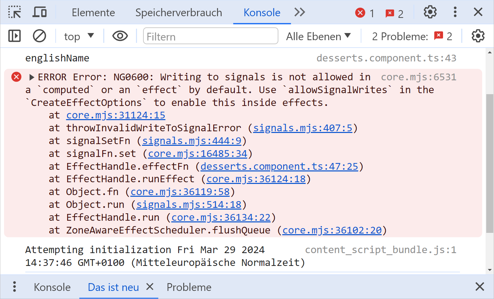
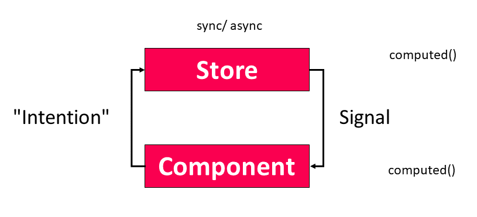

# Успех с сигналами в Angular - 3 эффективных правила для вашей архитектуры

Неоспоримо, что сигналы определят будущее Angular. На первый взгляд, они очень просты в использовании: Сеттеры принимают новые значения, геттеры передают текущие значения, а шаблоны и Effects получают уведомления об изменениях.

Теперь у вас может возникнуть соблазн обращаться с Сигналами как с обычными переменными. В принципе, это работает и может быть практичным вариантом при переносе существующего кода. Однако в этом случае преимущества Сигналов и реактивных систем проявляются лишь в ограниченной степени. Есть и подводные камни, и код получается не таким простым и, следовательно, не таким удобным для сопровождения, как мог бы быть.

Чтобы предотвратить подобные ситуации, в этой главе я хотел бы привести три простых правила, которые позволят использовать сигналы максимально идиоматично.

📁 [Исходный код](https://github.com/manfredsteyer/desserts.git) (смотрите разные ветки!)

> Большая благодарность [Алексу Рикабо](https://twitter.com/synalx) из Angular за отличную дискуссию, которая привела к идее этой главы, и за обратную связь.

## Начальный пример с некоторыми возможностями для улучшения {#leanpub-auto-initial-example-with-some-room-for-improvement}

Я хотел бы обсудить три обещанных правила на примере простого приложения Angular:


Первая рассмотренная реализация не является реактивной и также предлагает некоторые возможности для улучшения:

```ts
@Component(/* [...] */)
export class DessertsComponent implements OnInit {
    #dessertService = inject(DessertService);
    #ratingService = inject(RatingService);
    /* [...] */

    originalName = '';
    englishName = '';
    loading = false;

    desserts: Dessert[] = [];

    ngOnInit(): void {
        this.search();
    }

    search(): void {
        const filter: DessertFilter = {
            originalName: this.originalName,
            englishName: this.englishName,
        };

        this.loading = true;

        this.#dessertService.find(filter).subscribe({
            next: (desserts) => {
                this.desserts = desserts;
                this.loading = false;
            },
            error: (error) => {
                /* [...] */
            },
        });
    }

    toRated(
        desserts: Dessert[],
        ratings: DessertIdToRatingMap
    ): Dessert[] {
        return desserts.map((d) =>
            ratings[d.id]
                ? { ...d, rating: ratings[d.id] }
                : d
        );
    }

    loadRatings(): void {
        this.loading = true;

        this.#ratingService.loadExpertRatings().subscribe({
            next: (ratings) => {
                const rated = this.toRated(
                    this.desserts,
                    ratings
                );
                this.desserts = rated;
                this.loading = false;
            },
            error: (error) => {
                /* [...] */
            },
        });
    }
    /* [...] */
}
```

Поскольку связываемые свойства не являются ни Observables, ни Signals, стратегия `OnPush` не может быть использована для повышения производительности связывания данных. При ближайшем рассмотрении мы также замечаем, что метод `loadRatings` обновляет массив `desserts`, хотя его фактическая задача - загрузка рейтингов - не имеет к нему никакого отношения.

Кроме того, разработчики должны помнить, что после любых изменений в рейтингах массив `desserts` также должен быть изменен. Именно это может привести к сложному в обслуживании коду и скрытым ошибкам - особенно когда и `desserts`, и `ratings` изменяются в разные моменты. Все становится еще сложнее, когда в этих вычислениях необходимо учитывать дополнительные структуры данных. Первое правило, представленное здесь, решает эту проблему.

## Правило 1: Выводите состояние синхронно везде, где это возможно {#leanpub-auto-rule-1-derive-state-synchronously-wherever-possible}

Упомянутые ранее недостатки можно компенсировать с помощью Сигналов. Поскольку введение сигналов делает компонент реактивным, теперь можно активировать `OnPush`. Кроме того, компонент может синхронно выводить свое состояние из отдельных Сигналов с помощью `computed`:

```ts
@Component({
    changeDetection: ChangeDetectionStrategy.OnPush,
})
export class DessertsComponent implements OnInit {
    #dessertService = inject(DessertService);
    #ratingService = inject(RatingService);

    originalName = signal('');
    englishName = signal('');
    loading = signal(false);

    desserts = signal<Dessert[]>([]);
    ratings = signal<DessertIdToRatingMap>({});
    ratedDesserts = computed(() =>
        this.toRated(this.desserts(), this.ratings())
    );

    /* [...] */

    loadRatings(): void {
        this.loading.set(true);

        this.#ratingService.loadExpertRatings().subscribe({
            next: (ratings) => {
                this.ratings.set(ratings);
                this.loading.set(false);
            },
            error: (error) => {
                /* [...] */
            },
        });
    }

    /* [...] */
}
```

Это делает код гораздо более простым: Метод `loadRatings` просто загружает рейтинги и помещает их в сигнал. Сигнал `computed` `ratedDesserts` заботится об объединении `десертов` и `рейтингов`. Независимо от того, когда и где приложение обновляет `desserts` или `ratings`, `ratedDesserts` всегда будет актуальным.

> Основной сценарий использования Signals: реактивная привязка значений к представлению.

Применяя этот паттерн, важно отметить, что `computed` в настоящее время может получать состояние только синхронно. Это связано с основным сценарием использования Signals: реактивная привязка значений к представлению. Возможно, со временем команда Angular расширит Signals до асинхронных сценариев. Однако на данный момент необходимо прибегать к другим средствам. Правило 3 предлагает прямой подход к этому.

## Правило 2: Избегайте эффектов для передачи состояния {#leanpub-auto-rule-2-avoid-effects-for-propagating-state}

Эффекты - это правильный выбор, когда представление значений не может быть достигнуто с помощью привязки данных. Однако при их использовании для распространения изменений возникают некоторые подводные камни. В следующих разделах я подробно расскажу об этом.

### Правильное использование эффектов

В большинстве случаев сигналы привязываются в шаблоне. Однако бывает так, что желаемая форма вывода не может быть достигнута через привязку данных. Примером может служить вывод Сигнала в консоль для отладки. Другой пример - тосты, которые могут быть активированы через сервисы и предназначены для представления значения Сигнала. Для таких случаев в Angular предусмотрены эффекты:

```ts
/* [...] */
constructor() {
    effect(() => {
        console.log('originalName', this.originalName());
        console.log('englishName', this.englishName());
    });

    effect(() => {
        this.#toastService.show(this.desserts().length + ' desserts loaded!');
    });
}
/* [...] */
```

### Сигналы без глюков

При написании кода, как в предыдущем разделе, необходимо помнить, что сигналы не имеют глюков. Это означает, что если вы измените сигнал несколько раз подряд (в пределах стекового фрейма), то потребитель, например, эффект, увидит только последнее изменение:

```ts
@Component(/* [...] */)
export class AboutComponent {
    constructor() {
        const signal1 = signal('A');
        const signal2 = signal('B');

        effect(() => {
            console.log('signal1', signal1());
            console.log('signal2', signal2());
        });

        signal1.set('C');
        signal1.set('D');

        signal1.set('E');

        signal2.set('F');
    }
}
```

В этом случае мы увидим в консоли только значения `E` и `F`. Промежуточные значения пропускаются.

Это показывает, что сигналы предназначены не для моделирования событий, а для данных, которые мы хотим привязать к представлению. В последнем случае нам нужно только текущее значение, а привязка промежуточных значений была бы непродуктивной. По этой причине эффекты, показанные в предыдущем разделе, срабатывают только один раз, даже если подряд происходит несколько изменений.

В случаях, когда мы хотим выразить события, лучше использовать Observables, так как они не имеют такой гарантии отсутствия сбоев по своей конструкции.

### Проблемное использование эффектов

Даже при использовании Эффектов сигналы в основном используются для передачи нужных данных в представление. Однако теоретически Эффекты можно использовать и для передачи состояния другим Сигналам:

```ts
effect(() => {
    this.originalName.set(this.englishName());
});
```

Однако такие подходы имеют ряд недостатков, поэтому Angular по умолчанию запрещает писать сигналы внутри Эффектов:



Один из этих недостатков - возникновение неуправляемых каскадов изменений и, как следствие, сложностей с сопровождением кода и циклических зависимостей. Поскольку Эффекты неявно регистрируются со всеми используемыми Сигналами, связанные с ними проблемы могут быть даже не заметны на первый взгляд. Если вы все же хотите использовать Эффекты для записи, вы можете заставить Angular смириться с этим, установив `allowSignalWrites`:

```ts
// Try hard to avoid this
effect(
    () => {
        this.originalName.set(this.englishName());
    },
    { allowSignalWrites: true }
);
```

> Код приложения должен использовать `allowSignalWrites` только в крайнем случае.

По общему мнению сообщества, прикладной код должен использовать `allowSignalWrites` только в крайнем случае. С другой стороны, библиотеки вроде NGRX используют эту опцию внутри себя. Однако в этом случае авторы библиотеки отвечают за ее правильное использование, поэтому разработчикам приложений не стоит об этом беспокоиться.

Также важно отметить, что сам Эффект регистрируется в Сигналах в вызываемых методах. Например, следующий Эффект срабатывает при изменении Сигналов в `search`:

```ts
// Try hard to avoid this
effect(
    () => {
        this.search();
    },
    { allowSignalWrites: true }
);
```

Это приводит к дальнейшему увеличению сложности. По крайней мере, эта проблема может быть решена с помощью встроенных функций:

```ts
// Try hard to avoid this
effect(() => {
    const originalName = this.originalName();
    const englishName = this.englishName();
    untracked(() => {
        this.load(originalName, englishName);
    });
});
```

Функция `untracked` позволяет избежать перетекания текущего реактивного контекста в вызываемый метод `search`. Angular теперь и сам использует этот паттерн в [выбранных случаях](https://github.com/angular/angular/pull/54614). Примером может служить инициирование событий в подкомпонентах, чтобы обработчик события не выполнялся в реактивном контексте кода, вызвавшего событие. Другие популярные библиотеки, использующие эту технику, - NGRX, NGRX Signal Store или ngextensions.

### Стратегии предотвращения эффектов с сигнальными записями

Эффекты, распространяющие данные с помощью записи сигналов, во многих случаях можно предотвратить, используя следующие подходы:

-   Последовательное выведение состояния с помощью `computed` (см. правило 1, выше).
-   Прямое использование событий, вызвавших изменение сигнала.

Вместо вызова `search`, как указано выше, в Эффекте, приложение может использовать событие изменения полей ввода для фильтров поиска. В качестве источника для таких действий можно также использовать наблюдаемые объекты. Например, метод `поиска` может быть вызван наблюдаемой `valueChanges` в `FormGroup`. В случаях, когда у вас есть только сигналы, их можно преобразовать в Observables с помощью RxJS Interop, предлагаемого Angular:

```ts
@Component(/* [...] */)
export class DessertsComponent {
    #dessertService = inject(DessertService);
    #ratingService = inject(RatingService);
    #toastService = inject(ToastService);

    originalName = signal('');
    englishName = signal('Cake');
    loading = signal(false);

    originalName$ = toObservable(this.originalName);
    englishName$ = toObservable(this.englishName);

    desserts$ = combineLatest({
        originalName: this.originalName$,
        englishName: this.englishName$,
    }).pipe(
        filter(
            (c) =>
                c.originalName.length >= 3 ||
                c.englishName.length >= 3
        ),
        debounceTime(300),
        tap(() => this.loading.set(true)),
        switchMap((c) => this.findDesserts(c)),
        tap(() => this.loading.set(false))
    );

    desserts = toSignal(this.desserts$, {
        initialValue: [],
    });

    ratings = signal<DessertIdToRatingMap>({});
    ratedDesserts = computed(() =>
        this.toRated(this.desserts(), this.ratings())
    );

    findDesserts(c: DessertFilter): Observable<Dessert[]> {
        return this.#dessertService.find(c).pipe(
            catchError((error) => {
                this.#toastService.show(
                    'Error loading desserts!'
                );
                console.error(error);
                return of([]);
            })
        );
    }
    /* [...] */
}
```

> Операторы выравнивания, предлагаемые RxJS, обеспечивают гарантии перекрытия асинхронных действий и, таким образом, предотвращают условия гонки.

Использование Observables имеет несколько преимуществ: - В отличие от Signals, Observables также подходят для запуска асинхронных действий. - Функция `toObservable` вырезает текущий реактивный контекст с помощью `untracked`. - RxJS поставляется с большим количеством мощных операторов, таких как `debounceTime`. - Операторы сглаживания, предлагаемые RxJS, обеспечивают гарантии перекрытия асинхронных действий и, таким образом, предотвращают условия гонки. В приведенном примере `switchMap` гарантирует, что при наложении поисковых запросов будет использоваться только результат последнего из них, а все остальные будут отменены.

Во многих случаях можно утверждать, что вместо преобразования сигнала в Observable целесообразнее использовать непосредственно событие, которое привело к изменению сигнала, как было предложено выше. С другой стороны, по мере того как в Angular API все чаще применяются подходы, основанные на сигналах, их прямое использование, вероятно, станет более удобным и интуитивно понятным. Таким образом, это, по-видимому, серая зона, в которой мы должны помнить о последствиях, например о тех, которые связаны с гарантией отсутствия сбоев при использовании Сигналов.

## Правило 3: Магазины упрощают реактивный поток данных {#leanpub-auto-rule-3-stores-simplify-reactive-data-flow}

Такие хранилища, как классическое NGRX Store или облегченное NGRX Signal Store, не только заботятся об управлении состоянием, но и помогают поддерживать реактивный поток данных управляемым:



Приложение передает свои намерения в хранилище как часть события. На данном этапе я использую термин «намерение» в абстрактном, технологически нейтральном смысле, тем более что разные хранилища реализуют этот аспект по-разному. В Redux, а значит, и при использовании классического хранилища NGRX приложение отправляет действие в хранилище, которое пересылает его в Reducer и Effects. Для облегченных хранилищ, таких как NGRX Signal Store, приложение вместо этого делегирует метод, предлагаемый хранилищем.

> Передача асинхронных операций хранилищу также компенсирует тот факт, что сигналы в настоящее время предназначены только для синхронных действий.

Затем магазин принимает меры и инициирует синхронные или асинхронные операции. Если приложение использует для этого RxJS, гоночных условий можно избежать с помощью операторов сглаживания, как упоминалось выше. Передача асинхронных операций в хранилище также компенсирует тот факт, что сигналы в настоящее время предназначены только для синхронных действий.

Результат этих операций приводит к изменению состояния, управляемого хранилищем. Это состояние может быть выражено Сигналами, которые могут быть сопоставлены с другими Сигналами с помощью вычислений (см. правило 1). Такие сопоставления могут происходить как в хранилище, так и в компоненте (или в другом потребителе хранилища). Это зависит от того, насколько локальным или глобальным является хранилище и данные, которые необходимо получить.

Суть в том, что последовательное использование этого подхода поддерживает так называемый однонаправленный поток данных, что делает поведение системы более понятным. Следующий листинг демонстрирует это с точки зрения компонента, который полагается на NGRX Signal Store.

```ts
@Component(/* [...] */)
export class DessertsComponent {
    #store = inject(DessertStore);

    originalName = this.#store.filter.originalName;
    englishName = this.#store.filter.englishName;

    ratedDesserts = this.#store.ratedDesserts;
    loading = this.#store.loading;

    constructor() {
        this.#store.loadDesserts();
    }

    search(): void {
        this.#store.loadDesserts();
    }

    loadRatings(): void {
        this.#store.loadRatings();
    }

    updateRating(id: number, rating: number): void {
        this.#store.updateRating(id, rating);
    }

    updateFilter(filter: DessertFilter): void {
        this.#store.updateFilter(filter);
    }
}
```

Поскольку компонент должен только делегировать полномочия магазину, это очень просто.

## Заключение {#leanpub-auto-conclusion-11}

Чтобы по-настоящему использовать преимущества сигналов, приложение должно быть спроектировано как реактивная система. Это означает, в частности, что следует отказаться от записи значений в пользу получения значений из существующих. Это упрощает программный код, тем более что производные значения автоматически обновляются.

Сигналы в настоящее время используются в основном для передачи данных в представление. Эффекты используются, когда для этого необходимы вызовы API, например, при отображении тоста. Текущая реализация Signals не предназначена для запуска асинхронных действий. Вместо этого следует использовать классические события или наблюдаемые объекты. Хранилища, которые также могут обрабатывать асинхронные операции, помогают организовать однонаправленный поток данных и делают реактивные приложения более управляемыми.
