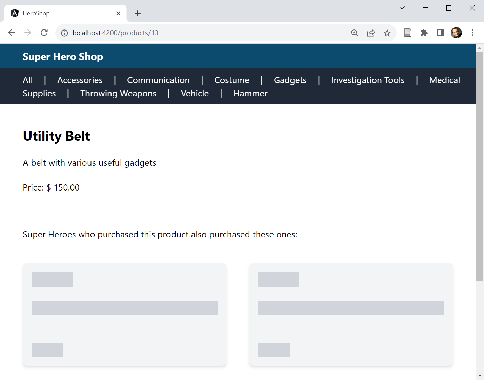
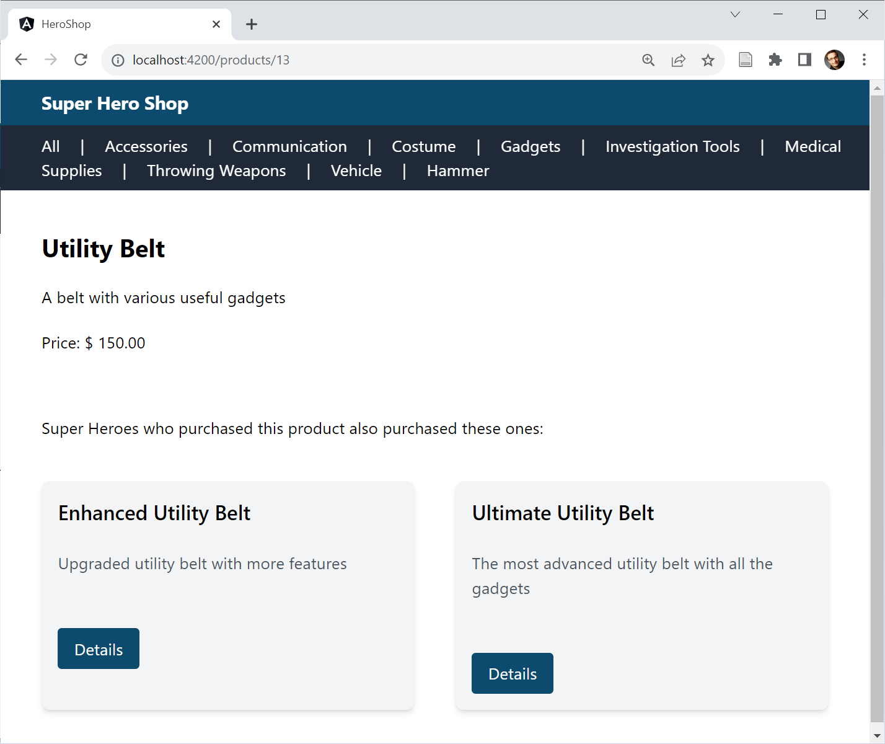

# Встроенный поток управления и откладываемые представления

В Angular 17 появился новый синтаксис шаблонов для блоков потока управления. Этот же синтаксис используется для создания откладываемых представлений. Это лениво загружаемые части страницы, которые помогают улучшить производительность начальной загрузки.

## Новый синтаксис для потока управления в шаблонах {#leanpub-auto-new-syntax-for-control-flow-in-templates}

С первых дней своего существования Angular использовал структурные директивы типа `*ngIf` или `*ngFor` для потока управления. Поскольку поток управления в любом случае должен быть пересмотрен, чтобы обеспечить возможность тонкого обнаружения изменений и в конечном итоге перехода на беззонный режим, команда Angular решила поставить его на новую основу. Результатом стал новый встроенный поток управления, который четко выделяется на фоне отрисованной разметки:

```ts
@for (product of products(); track product.id) {
    <div class="card">
        <h2 class="card-title">{{product.productName}}</h2>
        /* […] */
    </div>
}
@empty {
    <p class="text-lg">No Products found!</p>
}
```

Стоит отметить новый блок `@empty`, который Angular отображает, когда итерируемая коллекция пуста.

Хотя сигналы были драйвером для этого нового синтаксиса, они не являются обязательным условием для его использования. Новые блоки потока управления также можно использовать с классическими переменными или с наблюдаемыми в сочетании с пайпом `async`.

Обязательное выражение `track` позволяет Angular идентифицировать отдельные элементы, которые были перемещены в итерируемой коллекции. Это позволяет Angular (точнее, новому алгоритму согласования Angular) значительно сократить усилия по рендерингу и повторно использовать существующие узлы DOM. По информации команды Angular, при итерации над коллекциями примитивных типов, например, массивами с числами или строками, `track` может указывать на псевдопеременную `$index`:

```ts
@for (group of groups(); track $index) {
    <a (click)="groupSelected(group)">{{group}}</a>
    @if (!$last) {
        <span class="mr-5 ml-5">|</span>
    }
}
```

В дополнение к `$index`, другие значения, известные из `*ngFor`, также доступны через псевдопеременные: `$count`, `$first`, `$last`, `$even`, `$odd`. При необходимости их значения также можно хранить в переменных шаблона:

```ts
@for (group of groups(); track $index; let isLast = $last) {
    <a (click)="groupSelected(group)">{{group}}</a>
    @if (!isLast) {
        <span class="mr-5 ml-5">|</span>
    }
}
```

Новый `@if` упрощает формулировку ветвей `else`/`else-if`:

```ts
@if (product().discountedPrice && product().discountMinCount) {
    /* […] */
}
@else if (product().discountedPrice && !product().discountMinCount) {
    /* […] */
}
@else {
    /* […] */
}
```

Кроме того, различные случаи можно различать с помощью `@switch`:

```ts
@switch (mode) {
    @case ('full') {
    	/* […] */
    }
    @case ('small') {
    	/* […] */
    }
    @default {
    	/* […] */
    }
}
```

В отличие от `ngSwitch` и `*ngSwitchCase`, новый синтаксис безопасен для типов. В примере, показанном выше, отдельные блоки `@case` должны иметь строковые значения, поскольку переменная `mode`, передаваемая в `@switch`, также является строкой.

Новый синтаксис потока управления уменьшает необходимость использования структурных директив, которые являются мощными, но иногда неоправданно сложными. Тем не менее, фреймворк будет продолжать поддерживать структурные директивы. С одной стороны, для них есть несколько подходящих случаев использования, а с другой - несмотря на множество интересных нововведений, фреймворк необходимо сделать обратно совместимым.

## Автоматическая миграция на встроенный поток управления {#leanpub-auto-automatic-migration-to-build-in-control-flow}

Если вы хотите автоматически перевести свой программный код на новый синтаксис потока управления, то теперь вы найдете схему для этого в пакете `@angular/core`:

```sh
 ng g @angular/core:control-flow
```

## Отложенная загрузка {#leanpub-auto-delayed-loading}

Как правило, не все области страницы одинаково важны. Страница товара в первую очередь посвящена самому товару. Предложения о похожих товарах имеют второстепенное значение. Однако все внезапно меняется, как только пользователь прокручивает предложения товаров в видимую область окна браузера, так называемый порт просмотра.

Для особо критичных к производительности веб-приложений, таких как интернет-магазины, имеет смысл отложить загрузку менее важных частей страницы. Это означает, что действительно важные элементы будут доступны быстрее. До сих пор каждый, кто хотел реализовать эту идею в Angular, должен был делать это вручную. Angular 17 также значительно упрощает эту задачу благодаря новому блоку `@defer`:

```ts
@defer (on viewport) {
    <app-recommentations [productGroup]="product().productGroup">
        </app-recommentations>
}
@placeholder {
    <app-ghost-products></app-ghost-products>
}
```

Использование `@defer` откладывает загрузку вложенной части страницы до наступления определенного события. В качестве замены ему представляется элемент-призрак, указанный в поле `@placeholder`. В демонстрационном приложении, используемом здесь, элементы-призраки сначала представлены для предложений товаров:



После загрузки `@defer` меняет элементы-призраки на реальные предложения:



В рассмотренном примере используется событие _on viewport_. Оно происходит после того, как плагин прокручивается в поле зрения. Кроме этого события, есть еще несколько вариантов:

| Триггеры                     | Описание                                                                              |
| ---------------------------- | ------------------------------------------------------------------------------------- |
| при бездействии              | Браузер сообщает, что критических задач нет (по умолчанию).                           |
| в области просмотра          | Заполнитель загружается в видимую область страницы.                                   |
| при взаимодействии           | Пользователь начинает взаимодействовать с плагином.                                   |
| при наведении                | Курсор мыши перемещается над плагином.                                                |
| при немедленном появлении    | Как можно скорее после загрузки страницы.                                             |
| on timer( продолжительность) | Через определенное время, например, on timer(5s) для запуска загрузки через 5 секунд. |
| по условию                   | Когда выполняется указанное условие, например, когда (`userName !=== null`)           |

По умолчанию _на области просмотра_, _на взаимодействии_ и _на наведении_ заставляют указывать блок `@placeholder`. В качестве альтернативы они могут ссылаться на другие части страницы, на которые можно ссылаться через переменную шаблона:

```ts
<h1 #recommentations>Recommentations</h1>
@defer (on viewport(recommentations)) {
    <app-recommentations /* […] */ />
}
```

Кроме того, можно указать `@defer` на предварительную загрузку пакета в более раннее время. Как и в случае с предварительной загрузкой маршрутов, такой подход гарантирует, что пакеты будут доступны, как только они вам понадобятся:

```ts
@defer(on viewport; prefetch on immediate) { /* […] */ }
```

В дополнение к `@placeholder`, `@defer` также предлагает два других блока: `@loading` и `@error`. Первый отображается в Angular во время загрузки пакета, второй - в случае ошибки. Чтобы избежать мерцания, `@placeholder` и `@loading` можно настроить на минимальную продолжительность отображения. Свойство _minimum_ задает желаемое значение:

```ts
@defer ( /* […] */ ) {
    /* […] */
}
@loading (after 150ms; minimum 150ms) {
    /* […] */
}
@placeholder (minimum 150ms) {
    /* […] */
}
```

Свойство _after_ также указывает, что индикатор загрузки должен отображаться только в том случае, если загрузка длится более 150 мс.

## Заключение {#leanpub-auto-conclusion-12}

Новые встроенные блоки потока управления визуально выделяются из разметки шаблона. Они также открывают путь к инкрементальному обновлению компонентов. Откладываемые представления используют тот же синтаксис и позволяют откладывать загрузку определенных элементов страницы для улучшения времени загрузки.
