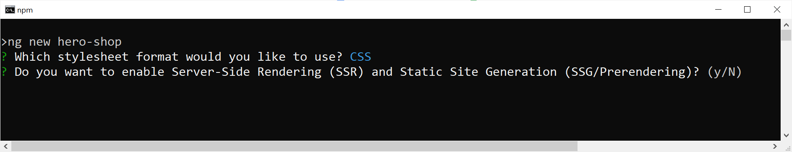
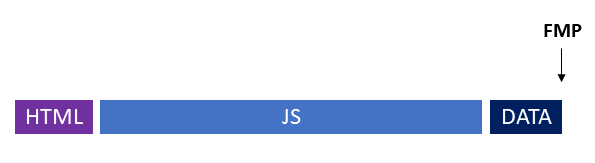
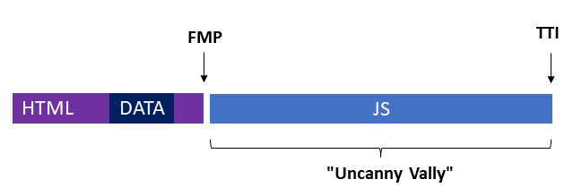
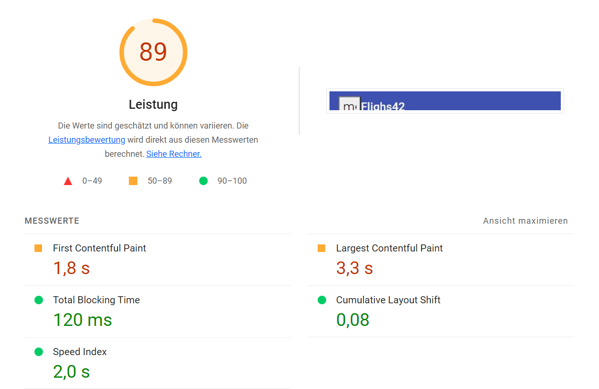
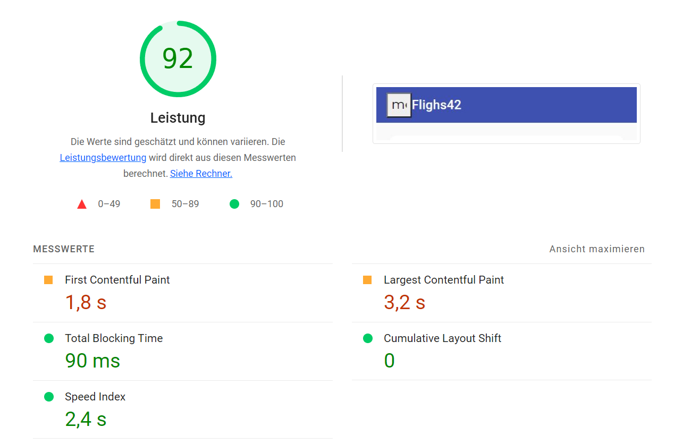

# esbuild и новый конструктор приложений

<big>Новая поддержка esbuild обеспечивает более быструю сборку. Появившийся `ApplicationBuilder` упрощает использование SSR.</big>

## Производительность сборки с esbuild {#leanpub-auto-build-performance-with-esbuild}

Изначально Angular CLI использовал webpack для генерации пакетов. Однако в настоящее время webpack вытеснен новыми инструментами, которые проще в использовании и намного быстрее. [esbuild](https://esbuild.github.io) — один из таких инструментов, который, имея более 20 000 загрузок в неделю, имеет замечательное распространение.

Команда CLI работает над интеграцией с esbuild уже несколько релизов. В Angular 16 эта интеграция уже была включена в предварительную версию для разработчиков. Начиная с Angular 17, эта реализация стабильна и используется по умолчанию для новых проектов Angular через _Application Builder_, описанный ниже.

Для существующих проектов стоит рассмотреть возможность перехода на esbuild. Для этого обновите запись `builder` в файле `angular.json`:

```
"builder" : "@angular-devkit/build-angular:browser-esbuild"
```

Другими словами: `-esbuild` должен быть добавлен в конце. В большинстве случаев `ng serve` и `ng build` должны вести себя как обычно, но быть намного быстрее. Первый использует [vite](https://vitejs.dev/) dev-сервер для ускорения работы, собирая пакеты npm только тогда, когда это необходимо. Кроме того, команда CLI интегрировала несколько дополнительных оптимизаций производительности.

Вызов `ng build` также значительно ускоряется за счет использования esbuild. Фактор от 2 до 4 часто упоминается как диапазон.

## SSR без усилий с новым конструктором приложений {#leanpub-auto-ssr-without-effort-with-the-new-application-builder}

Поддержка рендеринга на стороне сервера (SSR) также была радикально упрощена в Angular 17. При генерации нового проекта с помощью _ng new теперь доступен ключ -ssr_. Если он не используется, CLI спрашивает, следует ли настроить SSR:



Чтобы включить SSR позже, достаточно добавить пакет `@angular/ssr`:

```sh
ng add @angular/ssr
```

Приставка _@angular_ дает понять, что этот пакет разработан непосредственно командой Angular. Он является преемником проекта сообщества Angular Universal. Чтобы напрямую учитывать SSR во время _ng build_ и _ng serve_, команда CLI предоставила новый билдер. Этот так называемый конструктор приложений использует упомянутую выше интеграцию esbuild и создает пакеты, которые можно использовать как в браузере, так и на стороне сервера.

Вызов _ng serve_ также запускает сервер разработки, который осуществляет рендеринг на стороне сервера и доставляет пакеты для работы в браузере. Вызов _ng build -ssr_ также позаботится о пакетах для обоих миров, а также построит простой сервер на базе Node.js, исходный код которого использует схемы, упомянутые выше.

Если вы не можете или не хотите запускать Node.js-сервер, вы можете использовать _ng build -prerender_ для пререндеринга отдельных маршрутов приложения во время сборки.

## Больше, чем SSR: Неразрушающее гидрирование {#leanpub-auto-more-than-ssr-non-destructive-hydration}

Одностраничные приложения (SPA) обеспечивают хорошую производительность во время выполнения. Однако начальная загрузка страницы обычно занимает на несколько секунд больше времени, чем в классических веб-приложениях. Это связано с тем, что браузеру приходится загружать большое количество кода JavaScript в дополнение к собственно HTML-странице, прежде чем он сможет ее отрисовать. Так называемый первый значимый рисунок (First Meaningful Paint, FMP) происходит только через несколько секунд:



Если для бизнес-приложений эти несколько секунд вряд ли являются проблемой, то для публичных веб-решений, таких как интернет-магазины, они действительно представляют проблему. Здесь важно сохранить низкий процент отказов, а этого можно добиться, в частности, сократив время ожидания до минимума.

Поэтому обычно SPA для таких сценариев создаются на стороне сервера, чтобы он уже мог предоставить готовую HTML-страницу. Таким образом, вызывающая сторона быстро получает страницу. После загрузки пакетов JavaScript страница также становится интерактивной. Следующее изображение иллюстрирует это: Первый значимый рисунок (FMP) теперь происходит раньше. Однако интерактивным сайт станет только позже (Time to Interactive, TTI).



Для поддержки решений, в которых важна начальная загрузка страницы, Angular с первых дней своего существования предлагает рендеринг на стороне сервера (SSR). Однако в прошлом поведение этой реализации SSR было «деструктивным». Это означает, что загруженный JavaScript-код перерисовывал всю страницу. Вся разметка, отрисованная на стороне сервера, заменялась разметкой, отрисованной на стороне клиента. К сожалению, это также сопровождается небольшой задержкой и мерцанием. Метрики показывают, что это снижает производительность при запуске.

Angular 16 также решает эту проблему, повторно используя уже отрисованную на стороне сервера разметку из пакетов JavaScript, загружаемых в браузер. Мы говорим о неразрушающей гидратации. Слово «гидратация» описывает процесс, который делает загруженную страницу интерактивной с помощью JavaScript.

Чтобы использовать эту новую возможность, сначала установите пакет `@nguniversal/express-engine` для поддержки SSR:

```sh
ng add @nguniversal/express-engine
```

После этого неразрушающая гидратация включается с помощью отдельного API `provideClientHydration`:

```ts
// app.config.ts
export const appConfig: ApplicationConfig = {
    providers: [provideClientHydration()],
};
```

В приведенном листинге об этом заботится файл `app.config.ts`. Опубликованная там структура типа `ApplicationConfig` используется в файле `main.ts` при загрузке приложения. Кстати, файл `app.config.ts` создается CLI, когда новое приложение устанавливается с помощью ключа `--standalone`.

Для отладки приложения, которое полагается на SSR или hydration, при использовании схем устанавливается npm-скрипт `ssr:dev`:

```sh
npm run ssr:dev
```

За ним стоит сервер разработки, созданный очаровательным австрийским коллегой, который запускает приложение в режиме отладки как на стороне сервера, так и на стороне клиента.

## Более подробная информация о гидратации в Angular {#leanpub-auto-more-details-on-hydration-in-angular}

Если SPA обращается к веб-интерфейсам по протоколу HTTP во время рендеринга на стороне сервера, полученные ответы также автоматически отправляются в браузер через JSON-фрагмент внутри рендерируемой страницы. При гидратации `HttpClient` в браузере использует этот фрагмент вместо того, чтобы делать тот же запрос снова. Таким образом, Angular ускоряет процесс гидратации. Если такое поведение нежелательно, его можно отключить с помощью функции `withNoHttpTransferCache`:

```ts
provideClientHydration(
    withNoHttpTransferCache()
),
```

Чтобы неразрушающая гидратация работала, разметка, отображаемая на стороне сервера, должна совпадать с разметкой на стороне клиента. Это не всегда можно гарантировать, особенно при использовании сторонних компонентов или библиотек, которые напрямую манипулируют DOM. Однако в этом случае неразрушающую гидратацию можно отключить для отдельных компонентов с помощью атрибута `ngSkipHydration`:

```html
<app-flight-card
    ngSkipHydration
    [item]="f"
    [(selected)]="basket()[f.id]"
/>
```

Angular не разрешает привязку данных для этого атрибута. Кроме того, Angular ожидает, что `ngSkipHydration` будет либо нулевым, либо `true`. Если вы хотите вообще исключить гидратацию для компонента, вы можете установить этот атрибут через привязку к хосту:

```ts
@Component({
    host: { 'ngSkipHydration': 'true' }
})
```

Если на одной стороне параллельно работают несколько приложений Angular, Angular должен уметь различать их с помощью идентификатора. Для этого используется токен `APP_ID`:

```js
{ provide: APP_ID, useValue: 'myApp' },
```

Результат новой неразрушающей гидратации весьма впечатляет. На следующих двух рисунках показаны некоторые метрики Lighthouse для примера, используемого в данном приложении. Первый относится к классическому SSR, а второй — к новой неразрушающей гидратации.





Кроме создания производственной сборки и включения HTTP-сжатия в веб-сервере на базе узла, отвечающего за рендеринг на стороне сервера, никаких оптимизаций не было произведено.

## Заключение {#leanpub-auto-conclusion-13}

Новый `ApplicationBuilder`, основанный на esbuild, заметно ускоряет процесс сборки и напрямую поддерживает серверный рендеринг (SSR). Вместе с Hydration, SSR улучшает время запуска страницы.
